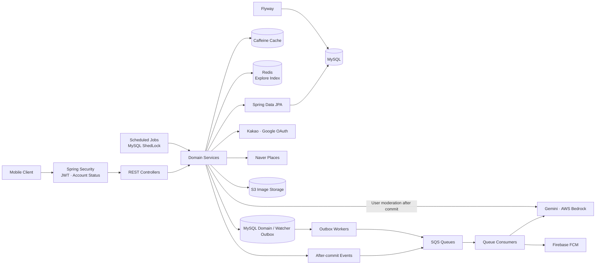
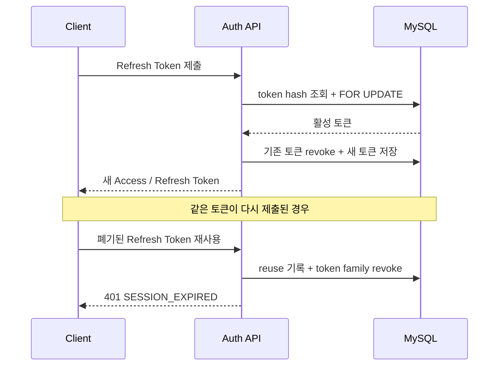
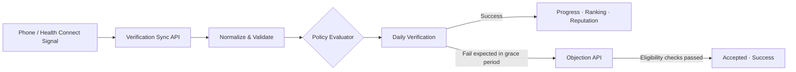

# RuleUp Backend

> 목표를 만드는 데서 끝나지 않고, 실제 행동을 인증하고 함께 완주하도록 돕는 챌린지 플랫폼

RuleUp은 사용자가 루틴을 챌린지로 만들고 여러 사람과 함께 실천하는 모바일 서비스입니다. 백엔드는 OAuth 로그인부터 챌린지 생성·운영, 센서 기반 활동 인증, 랭킹·추천, 알림과 운영 배치까지 서비스의 전체 도메인을 REST API로 제공합니다.

단순 CRUD보다 다음 세 가지 문제에 집중했습니다.

- 휴대폰·Health Connect 신호를 신뢰 가능한 일별 인증 결과로 바꾸는 방법
- 동시 참여, 자동 강퇴, 탈퇴와 종료가 얽힌 그룹 챌린지의 일관성을 지키는 방법
- 외부 OAuth와 LLM이 느리거나 실패해도 핵심 요청을 안정적으로 처리하는 방법

## 프로젝트 한눈에 보기

| 구분 | 내용 |
| --- | --- |
| 서비스 | 함께 목표를 실천하고 자동·수동 인증으로 완주하는 챌린지 플랫폼 |
| 백엔드 범위 | 로그인·회원, 챌린지, 인증, 추천, 랭킹, 알림, 감시자, 신고·검수, 배치 |
| API | 도메인별 REST API, 환경·기능 플래그에 따른 활성 경로는 Swagger 참고 |
| 데이터 관리 | MySQL(운영 8.0 · 로컬/CI 8.4), Flyway V1~V11 베이스라인 + 후속 마이그레이션, JPA `ddl-auto: none` |
| 품질 관리 | 단위·통합·계약 테스트, Testcontainers, JaCoCo 커버리지 게이트 |
| 문서화 | Swagger UI, OpenAPI JSON, 도메인별 기술 스펙 |
| 배포 | Docker, GitHub Actions, Amazon ECR/ECS |

테스트 결과와 커버리지는 CI 및 로컬 빌드 리포트에서 확인할 수 있습니다.

## 핵심 기능

### 1. 챌린지 생성과 운영

- AI 프롬프트, 루틴 템플릿, 기존 챌린지 복제로 초안 생성
- 카테고리·기간·반복 일정·인증 방법을 조합한 챌린지 생성
- 인기·카테고리·참여자·완주율 등 조건을 활용한 탐색
- 초대 링크, 참여·탈퇴, 정책에 따른 자동 강퇴(부정행위·권한 공백·연속 실패)
- 방 안 역할은 `OWNER`·`MEMBER`이며, 방장 이탈 시 BOT으로 전환. 공동 관리자·수동 강퇴·위임·승계는 현행 범위에서 제외
- `UPCOMING → ACTIVE → COMPLETED` 라이프사이클 자동 전환

### 2. 활동 인증

- 휴대폰·Health Connect 신호 일괄 동기화
- GPS 방문·회피, 걸음·거리, 수면, 스크린타임 등 정책 판정
- 수동 챌린지는 당일 셀프 체크로 즉시 성공 처리
- 자동 인증의 실패 예상 건은 다음 날 유예 기간에 이의 제기 가능. 본인·상태·기한·사유 길이 조건을 충족하면 자동 인용하며 사진은 선택 자료
- 사용자가 설정해야 하는 위치·앱·권한 상태를 API로 안내

### 3. 참여를 유지하는 피드백

- 챌린지 방, 인증 이벤트 피드, 방별·챌린지 간 랭킹
- 활동 캘린더, 통계 리포트, 연속 달성 기록
- 일별 판정과 주간 사이클 마감을 반영하는 점수·티어(BRONZE~RUBY)
- 사용자 세그먼트와 행동 결과를 반영한 루틴 추천
- 인앱 알림, FCM 푸시, 회원 감시자 초대·인앱 수락·알림

### 4. 서비스 안전장치

- 닉네임·프로필은 제출 커밋 후 동기 검수, 실패 건은 배치로 재시도
- 챌린지 콘텐츠 검수는 SQS 기반 비동기 처리
- 사용자·챌린지 신고와 차단
- 앱 최소 버전과 약관 버전을 서버에서 통제
- 계정 상태별 API 접근 제어와 개인정보 암호화

## 시스템 아키텍처



애플리케이션은 도메인별 패키지 구조를 사용합니다. 각 도메인에 controller, service, repository, domain, dto를 가깝게 두고, 공통 응답·예외·이미지·검증 코드는 `common`으로 분리했습니다.

## 주요 기술 과제와 해결

### 1. Refresh Token 동시 재발급과 재사용 탐지

**문제**

- Access Token 만료 시 여러 API가 동시에 401을 받으면 같은 Refresh Token이 거의 동시에 제출될 수 있습니다.
- 회전 대상 토큰을 일반 조회하면 두 요청이 모두 활성 토큰으로 판단해 새로운 토큰을 중복 발급할 가능성이 있습니다.
- 재사용 탐지 뒤 예외를 던질 때 트랜잭션이 롤백되면 보안 흔적과 token family 폐기가 사라질 수 있습니다.

**해결**

- Refresh Token 원문은 저장하지 않고 SHA-256 해시만 저장합니다.
- 재발급 조회에 비관적 쓰기 잠금(`PESSIMISTIC_WRITE`)을 적용해 동일 토큰의 회전을 직렬화했습니다.
- 선행 요청이 토큰을 회전하면 후행 요청은 폐기 상태를 읽고 재사용 탐지 경로로 이동합니다.
- 인증 예외와 별개로 `reuse_detected_at`과 family revoke가 커밋되도록 트랜잭션 경계를 설계했습니다.
- 일반 만료·폐기 토큰과 보안 감사 대상 토큰의 보관 기간을 분리하고, 작은 DELETE batch로 정리해 장시간 DB lock을 피했습니다.



### 2. OAuth 외부 지연을 서버 장애와 분리

**문제**

- OAuth 로그인은 provider의 토큰 교환과 사용자 조회를 직렬로 수행하므로 외부 지연이 로그인 응답 시간에 그대로 더해집니다.
- 커넥션 풀 대기, TCP 연결, 응답 대기에 상한이 없으면 provider 장애가 서버 요청 스레드 고갈로 번질 수 있습니다.

**해결**

- Apache HttpClient 5 기반 전용 connection pool을 구성해 TCP·TLS 연결을 재사용합니다.
- pool 획득, connect, response timeout을 각각 분리하고 환경 변수로 조정할 수 있게 했습니다.
- provider host·HTTP method·결과별 `oauth_http_client_duration` Timer를 수집해 어느 단계가 느린지 관측할 수 있게 했습니다.
- 토큰·인가 코드·전체 URI는 metric tag에서 제외해 민감정보 노출과 high cardinality를 방지했습니다.
- transport 실패와 provider 4xx/5xx를 분리해 클라이언트가 재로그인과 일시 장애를 구분할 수 있도록 했습니다.

### 3. 다양한 신호를 하나의 인증 모델로 통합

**문제**

- GPS, 걸음 수, 수면, 앱 사용시간은 데이터 형태와 성공 조건이 모두 다릅니다.
- 모바일이 성공 여부까지 결정하면 클라이언트 버전마다 정책이 달라지고 조작에 취약해집니다.

**해결**

- 클라이언트는 신호 수집과 동기화만 담당하고, 성공 여부는 서버 정책이 판정하는 `client-initiated + server-policy` 구조를 사용합니다.
- 외부 입력인 Config와 내부 판정 단위인 Signal을 분리하고 타입별 evaluator로 확장 지점을 만들었습니다.
- 도달형과 제약형 조건을 같은 polarity 모델로 표현하고, 일별 결과를 하나의 인증 상태로 집계합니다.
- 자동 인증은 신호를 정책으로 평가하고, 실패 예상 건은 D+1 유예 기간에 이의를 접수합니다. D+2 00:00 KST 전에 본인·상태·10자 이상 사유 조건을 충족하면 자동 인용합니다. 수동 셀프 체크는 수동 챌린지 전용입니다.



### 4. 챌린지 상태와 운영 권한의 일관성

**문제**

- 챌린지는 시간 상태, 검수 상태, 인증 설정 상태가 독립적으로 변합니다.
- 가입·탈퇴·자동 삭제·자동 강퇴를 단순 CRUD로 처리하면 경계 시점의 중복 처리와 잘못된 권한 변경이 발생하기 쉽습니다.

**해결**

- 라이프사이클, 검수, 인증 준비 상태를 서로 다른 축으로 모델링해 한 enum에 복잡도를 몰아넣지 않았습니다.
- 참여 한도, 재가입 제한, 종료 후 변경 금지 같은 규칙을 service의 단일 진입점에서 검사합니다.
- 활성화·완료 등 scheduler는 DB의 현재 상태를 조건으로 갱신하며, MySQL ShedLock으로 다중 인스턴스 중복 실행을 제어합니다.
- 이벤트 기반 counter 갱신 뒤 reconciliation batch를 수행해 비동기 처리 누락이나 운영 오차를 보정합니다.

### 5. 느린 부가 작업을 핵심 요청에서 분리

**문제**

- LLM·이미지 검수와 FCM 전송은 응답 속도가 일정하지 않고 실패할 수 있습니다.
- 생성·수정 트랜잭션 안에서 처리하면 외부 장애가 사용자 요청 실패로 이어집니다.

**해결**

- 회원·프로필 검수는 제출 트랜잭션 커밋 후 동기로 수행합니다. 실패하면 PENDING을 유지하고 매일 05:00 KST 스캔이 SQS로 재발행합니다.
- 챌린지 검수는 커밋 후 이벤트에서 SQS로 발행하고, 신고 검토는 비동기 listener로 처리합니다.
- 인앱 알림은 DB에 먼저 기록하고 푸시 작업은 SQS로 전송합니다. 감시자 통지와 도메인 후속 작업은 outbox에서 재처리합니다.
- LLM은 Gemini 단독, Bedrock 단독, Gemini 우선 후 Bedrock fallback을 설정으로 선택할 수 있습니다.
- 추천·카테고리처럼 반복 조회되는 결과는 Caffeine에 캐시합니다. 추천 입력은 배치로 갱신하며 탐색 카테고리 개수는 Redis에서 별도로 관리합니다.

## 기술 선택과 이유

| 선택 | 이유 |
| --- | --- |
| Spring Boot + 도메인 패키지 | 기능 경계를 코드 구조에 반영하고, 관련 계층을 한 위치에서 탐색하기 위해 |
| MySQL + JPA | 회원·참여·토큰 회전처럼 트랜잭션 일관성이 중요한 관계형 도메인을 처리하기 위해 |
| Flyway | 개발·CI·운영의 스키마 변경 이력을 동일하게 재현하기 위해 |
| 비관적 잠금 | 동일 Refresh Token의 경쟁처럼 충돌은 드물지만 발생 시 보안 영향이 큰 구간을 직렬화하기 위해 |
| Caffeine | 현재 운영 규모에서 네트워크 캐시 의존성 없이 읽기 비용을 줄이기 위해 |
| Redis(탐색 인덱스) | 인스턴스마다 순위가 달라지면 커서 페이징이 깨지므로, 정렬 결과를 인스턴스 밖 한 곳에 두기 위해 |
| Rule-based 추천 | 행동 데이터가 적은 초기 서비스에서 결과를 설명하고 정책을 빠르게 조정하기 위해 |
| Event + Outbox + SQS | 커밋 후 처리, 영속 후속 작업, 검수·푸시 큐를 각 용도에 맞게 분리하기 위해 |
| MySQL ShedLock | 여러 인스턴스에서 예약 작업의 동시 실행을 제어하기 위해 |
| Testcontainers | H2 대체 동작이 아닌 실제 MySQL 8.4의 enum, lock, native query를 검증하기 위해 |

## 보안과 데이터 보호

- Stateless JWT 인증과 Spring Security filter chain
- 기본 TTL: Access Token 30분, Refresh Token 7일, Signup Token 30분(`SIGNUP_TOKEN_TTL=1800`, 초 단위 설정 가능)
- Signup Token은 별도 서명 키와 DB 소모 기록으로 1회 사용 보장
- Refresh Token rotation과 reuse detection
- 외부 OAuth access/refresh token AES-GCM 암호화 저장
- `LOCKED` 계정은 읽기 전용, `BANNED` 계정은 허용된 종료 경로 외 접근 차단
- 로그인 기기·설치 기준 활성 세션 정책
- 환경 변수와 Secret 기반 DB·JWT·OAuth·FCM 자격증명 주입

## 테스트와 품질 관리

```bash
./gradlew clean build
```

- JUnit 5 단위·통합·API 계약 테스트
- Testcontainers로 로컬과 CI에서 MySQL 8.4 사용
- 인증·OAuth·회원·약관·검수·점수·온보딩·보안 범위 instruction coverage 80% gate
- Flyway migration을 포함한 Spring context 기동 검증
- Swagger/OpenAPI에 공통 응답과 오류 계약 문서화
- GitHub Actions에서 PR과 주요 branch push마다 전체 build 수행

JaCoCo HTML 리포트는 `build/reports/jacoco/test/html/index.html`에 생성됩니다.

## API 구성

일반 JSON 업무 API는 성공과 실패에 같은 envelope를 사용하며 HTTP 상태 코드는 실제 결과를 유지합니다. 약관 HTML, 이미지 응답·리다이렉트, OAuth 콜백 리다이렉트는 별도 형식입니다.

```json
{
  "success": true,
  "data": {},
  "error": null
}
```

| 영역 | 주요 경로 |
| --- | --- |
| 인트로·앱 정책 | `GET /api/v1/intro` |
| OAuth·세션 | `/api/v1/auth/**` |
| 회원·프로필 | `/api/v1/users/me`, `/api/v1/profile` |
| 챌린지·탐색 | `/api/v1/challenges/**` |
| 인증 | `/api/v1/verifications/**`, `/api/v1/challenges/{id}/verifications`, `/api/v1/challenges/{id}/verifications/today` |
| 룸·랭킹 | `/api/v1/challenges/{id}/room`, `/api/v1/challenges/{id}/ranking`, `/api/v1/challenges/{id}/threads`, `/api/v1/rankings/challenges` |
| 추천·마이 | `/api/v1/recommendations/**`, `/api/v1/me/**` |
| 알림·푸시 | `/api/v1/notifications/**`, `/api/v1/devices` |
| 신고·감시자 | `/api/v1/reports`, `/api/v1/watchers/**` |
| 운영자 공지 | `/api/v1/admin/notices` (운영자 전용) |

- Swagger UI: `http://localhost:8080/swagger-ui.html`
- OpenAPI JSON: `http://localhost:8080/v3/api-docs`

## 기술 스택

| 구분 | 기술 |
| --- | --- |
| Language | Java 25 |
| Framework | Spring Boot 4.1, Spring MVC, Spring Security, Spring Data JPA |
| Database | MySQL(운영 8.0 · 로컬/CI 8.4), Flyway |
| Cache · Index | Caffeine(JVM 로컬), Redis(탐색 파생 인덱스) |
| Auth | JWT, Kakao OAuth, Google OAuth, AES-GCM |
| Storage | Amazon S3(이미지), 로컬 파일 시스템(로컬 프로필) |
| External API | Apache HttpClient 5, Naver Search, Firebase FCM |
| AI | Google Gemini, AWS Bedrock Nova |
| Observability | Spring Boot Actuator, Micrometer, OSHI |
| Test | JUnit 5, Testcontainers, JaCoCo |
| Messaging · Jobs | Amazon SQS, Spring Scheduler, MySQL ShedLock |
| Infra | Gradle, Docker, GitHub Actions, Amazon ECR/ECS/ElastiCache |
| API Docs | springdoc OpenAPI, Swagger UI |

## 로컬 실행

JDK 25와 Docker가 필요합니다.

```bash
cp .env.example .env
```

먼저 `.env`의 DB 접속 정보와 JWT 키를 설정합니다. Compose는 `ruleup` 데이터베이스를 생성합니다. JWT 키에는 `openssl rand -base64 32` 등으로 생성한 충분히 긴 난수를 사용합니다.

```dotenv
DB_URL=jdbc:mysql://localhost:3306/ruleup?serverTimezone=UTC&characterEncoding=UTF-8&rewriteBatchedStatements=true
JWT_SECRET=replace_with_at_least_32_random_bytes
```

설정을 저장한 다음 실행합니다.

```bash
docker compose up -d mysql redis
SPRING_PROFILES_ACTIVE=local ./gradlew bootRun
```

Redis는 탐색 파생 인덱스(정렬 ZSET·표시 HASH) 저장소입니다. Redis 미기동·장애·워밍업 미완료 또는 `EXPLORE_REDIS_ENABLED=false`이면 탐색 목록·인기는 503을 반환합니다. 카테고리 개수 조회만 원천 DB로 폴백합니다. Redis 헬스체크는 기본적으로 꺼져 있으므로 애플리케이션 health 정상과 탐색 가용성은 별도로 확인해야 합니다.

`local` 프로필은 실제 Kakao·Google 서버 대신 Mock OAuth client를 사용합니다. 전체 환경 변수 예시는 [.env.example](./.env.example), 기본값과 운영 튜닝 항목은 [application.yaml](./src/main/resources/application.yaml)에서 확인할 수 있습니다.

## 프로젝트 구조

```text
src/main/java/com/ruleup/ruleup_backend/
├── auth, oauth, security         # 로그인, JWT, 세션, 보안 필터
├── user, onboarding, agreement   # 회원, 온보딩, 약관 동의 상태
├── challenge                     # 생성, 탐색, 참여, 운영, 라이프사이클
├── routine, verification         # 루틴 템플릿, 신호 수집, 인증 판정
├── room, recommendation          # 룸, 인증 피드, 랭킹, 개인화 추천
├── me, profile, score            # 홈, 캘린더, 프로필, 점수·티어
├── notification, push            # 운영자 공지, 인앱 알림, FCM 전송
├── watcher, invitation           # 회원 감시자, 초대 코드
├── report, moderation, sanction  # 신고, 차단, 콘텐츠 검수, 제재
├── admin                         # 백오피스 조회·조치
├── intro, applink, devtoken      # 앱 진입 정책, 딥링크, 개발용 토큰
├── places, llm                   # 외부 API와 AI provider
├── observability                 # 애플리케이션·시스템 지표
├── common                        # 공통 응답, 오류, 이미지, outbox, 검증
└── config                        # Security, OpenAPI, Cache, S3, HTTP 설정
```

V1~V11은 도메인별 베이스라인이며, 참조 대상 테이블을 먼저 생성합니다. 이후 변경은 후속 마이그레이션으로 적용하며 이미 배포된 파일은 수정하지 않습니다. 일부 상세 문서의 V57~V62 등은 베이스라인 통합 전 이력 번호입니다.

```text
src/main/resources/db/migration/
├── V1__identity.sql              # 계정, 인증, 약관 — 모든 도메인이 users를 가리킴
├── V2__routine_catalog.sql       # 루틴 템플릿 카탈로그
├── V3__challenge.sql             # 챌린지와 멤버십
├── V4__room.sql                  # 랭킹·활동 로그, 구 방 공지·댓글(V18에서 제거)
├── V5__verification.sql          # 인증·판정과 원본 신호
├── V6__score.sql                 # 점수·티어 원장
├── V7__notification.sql          # 알림과 발송 큐
├── V8__watcher.sql               # 감시자 관계와 응원
├── V9__safety.sql                # 신고, 차단, 제재
├── V10__admin.sql                # 운영 콘솔과 CS
├── V11__platform.sql             # 아웃박스, 멱등키, 시스템 지표
├── V12__drop_concurrent_join_counter.sql
├── V13__verification_integrity_repair.sql
├── V14__notification_created_at_utc.sql
├── V15__frequency_period_counter_repair.sql
├── V16__verification_score_version.sql
├── V17__shedlock.sql
└── V18__drop_room_notices_and_comments.sql
```

V18은 사용자(방장)가 작성하던 `Notice`·`NoticeRead`·`room_comments`만 제거합니다. 운영자 공지 `announcements`, 인앱 `notifications`, 감시자 `watcher_notices`, 범용 `RoomActivityLog`는 유지합니다. 방 홈·스레드의 `pinnedNotice`는 호환을 위해 계속 `null`로 응답합니다.

## 현재 한계와 확장 방향

| 현재 선택 | 확장 시 고려할 점 |
| --- | --- |
| JVM local Caffeine cache(탐색 인덱스 제외) | 다중 인스턴스 간 즉시 일관성이 필요해지면 Redis 또는 event 기반 invalidation 도입 |
| S3 presigned GET 302 이미지 서빙 | 트래픽이 늘면 CloudFront 같은 CDN을 앞에 두고 원본 요청 수를 줄임 |
| Redis 탐색 인덱스가 준비되지 않으면 목록·인기는 503 | 「서버 간 순위 동일」이 계약이라 다른 저장소로 대신 내리지 않는다. Redis 복구 후 5분 스윕이 워밍업을 재시도한다 |
| DB 상태 기반 멱등 scheduler + MySQL ShedLock | 작업 시간·락 만료를 관측하고 필요하면 별도 job orchestrator로 확장 |
| 규칙 기반 추천 | 충분한 행동 데이터가 쌓이면 offline evaluation을 거쳐 학습 기반 ranking과 혼합 |
| 검수·푸시 SQS + 도메인 outbox, 일부 `@Async` | 재시도·중복 처리·DLQ를 관측하고 남은 메모리 내 작업의 내구성 요구를 검토 |

현재 구조가 전제하는 운영 규모를 명확히 두고, 복잡한 인프라를 먼저 도입하기보다 데이터와 트래픽이 요구하는 시점에 확장할 수 있도록 경계를 분리했습니다.

## 상세 설계 문서

- [챌린지 생성 및 라이프사이클](./docs/challenge/챌린지%20생성%20및%20라이프사이클.md)
- [활동 인증 설계](./docs/check/인증구현.md)
- [챌린지 룸·랭킹·스레드](./docs/manage/챌린지공지_방내부기능_테크스펙.md)
- [프로필·캘린더](./docs/profile/마이프로필_캘린더_테크스펙.md)
- [루틴 카테고리 추천](./docs/recommend/추천%20시스템%20-%20루틴%20카테고리%20추천.md)
- [점수·티어 현행 정합화](./docs/score/spec-alignment.md)
- [챌린지 탐색](./docs/search/챌린지탐색%20테크스펙.md)
- [소셜 로그인·가입 토큰](./docs/auth/onboarding-spec-alignment.md)
- [방 내부 현행 정합화](./docs/room/spec-alignment.md)
- [프로필 현행 정합화](./docs/profile/spec-alignment.md)
- [감시자 현행 정합화](./docs/watcher/spec-alignment.md)
- [알림·운영자 공지](./docs/notification/spec-alignment.md)

API 요청·응답 계약은 실행 중인 Swagger와 현재 코드를 기준으로 합니다.
