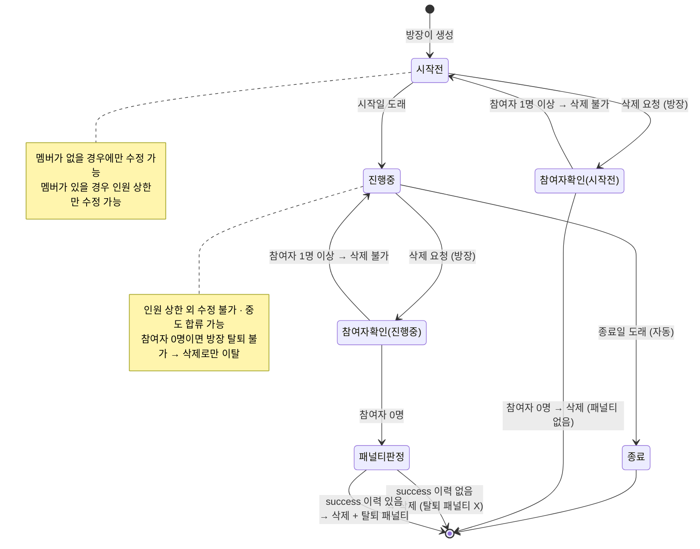
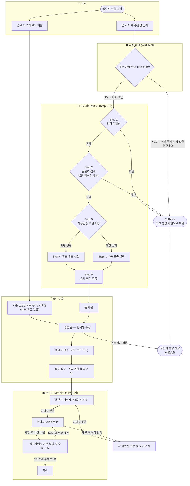
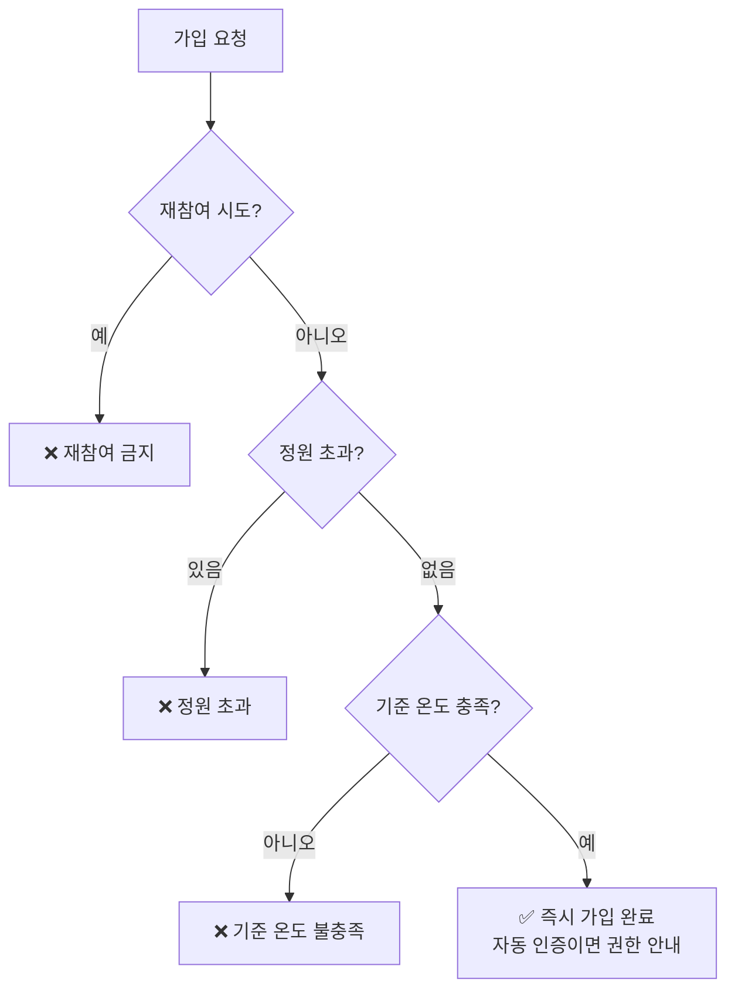
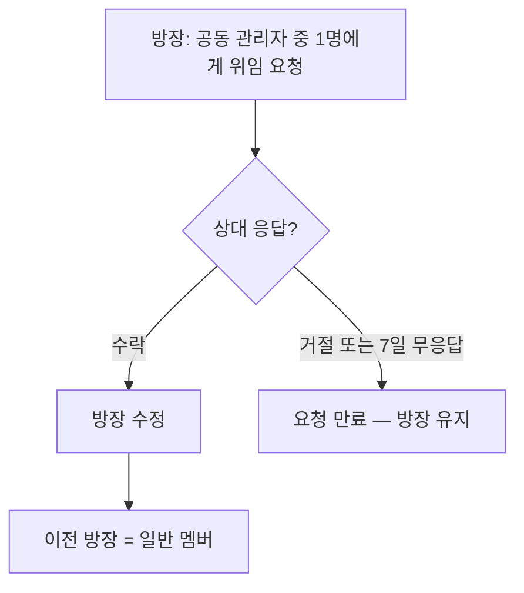
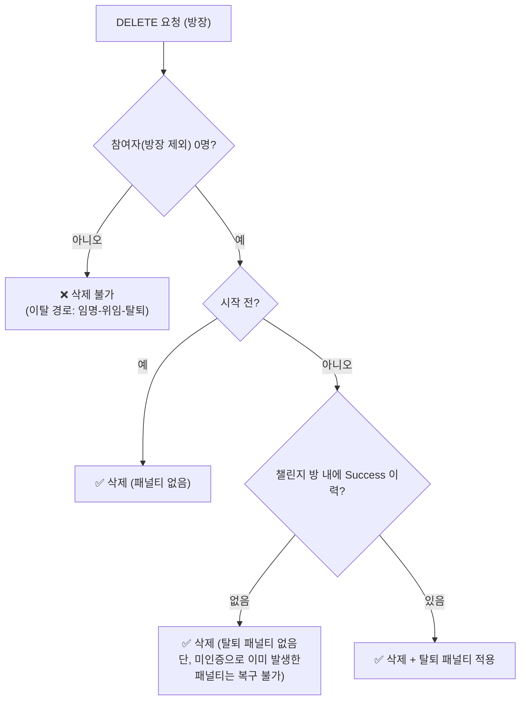

# 챌린지 생성 및 라이프사이클

마감 기한: 2026년 6월 4일 → 2026년 6월 8일
담당자: 성은 이, 준혁
상태: 진행 중
QA 마감 기한: 2026년 6월 8일
개발 마감 기한: 2026년 6월 7일
디자인 마감 기한: 2026년 6월 3일
테크 스펙 마감 기한: 2026년 6월 4일
테크스펙 피드백 마감 기한: 2026년 6월 5일

[챌린지 생성 및 라이프사이클 (이전 버전)](https://app.notion.com/p/38ead4145fb680d8aac1e7a5e50130d6?pvs=21)

# 챌린지 생성 및 라이프사이클 통합 테크 스펙

7.20 수정본

---

## 요약 (Summary)

사용자가 **카테고리 버튼** 또는 **LLM 프롬프트(제목/설명 입력)** 두 경로로 챌린지를 생성하고, 생성된 챌린지는 **시작 전 → 진행 중 → 종료**의 3단계 라이프사이클을 갖는다.

LLM 경로는 5-Step 파이프라인(입력 적합성 → 콘텐츠 검수 → 자동인증 루틴 매칭 → 인증 방식 결정 → 형식 검증)으로 별도 모더레이션 시스템을 대체하며, Step 1·2 차단 시 최초 생성 화면으로 fallback한다. 

단, 챌린지 이미지가 있을 경우 이에 대한 모더레이션은 진행한다.

입장 게이트는 **최대 참여 인원(정원)과 가입 기준 온도** 둘로 운영한다(탈퇴자 재참여 금지). 삭제는 **"멤버 0명"에서만** 방장이 삭제 가능하다.

---

## 배경 (Background)

- RuleUp의 진입 장벽은 "챌린지 설정 항목이 많다"는 것이다. 기본 템플릿을 깔아주고 사용자는 다듬기만 하게 해 생성 전환율을 높인다. AI 추천은 오로지 **초안만 제공하**며, 사용자 확인 및 수정 후 생성 요청에 담긴 값이 최종 값이다.
- 챌린지는 자동 인증·평판(온도)의 **단위**다. 챌린지가 생성돼야 이후 인증·패널티·평판이 검증 가능하다.
- 그동안 생성·수정·삭제·참여·탈퇴·권한 정책이 문서 여러 건에 흩어져 있었고, 구 생성 스펙(리쿠르팅·승인제 가입·비동기 모더레이션·7일 잠금 중도 삭제·소프트 삭제)과 이후 회의에서 확정된 정책이 서로 충돌했다. 이 문서는 **2026-07-20 기준으**로 충돌을 정리한 통합본이다.

---

## 디자인


## 목표 (Goals)

- 카테고리 버튼을 누르면 **LLM 호출 없이** 기본 템플릿이 깔린 생성 폼으로 즉시 진입할 수 있게 한다.
- 제목/설명 입력 시 LLM 파이프라인으로 폼을 채우고, **부적절 입력은 Step 1·2에서 차단해 별도 모더레이션 시스템을 대체**한다. 차단 시 **최초 생성 화면 fallback**으로 처리한다.
- 챌린지 이미지에 대한 모더레이션은 구현한다.
- 자동인증 가능한 루틴 테이블과 매칭해 **매칭되면 자동 인증, 없으면 수동 인증**으로 설정값을 자동 결정한다.
- **최대 참여 인원(방장만 설정·수정)** 내에서 시작 전부터 종료 전까지 **언제든 합류**할 수 있게 한다.
- 진행 중에는 **최대 참여 인원만** 수정 가능하게 하고, 그 외 설정은 "시작 전 + 멤버 0명"에서만 수정 가능하게 한다.
- 삭제는 **"멤버 0명"에서만** 방장이 할 수 있게한다.
- 탈퇴 패널티는 **본인 success 기록 유무**로 판정한다 — 없으면 탈퇴 패널티 없음(단, 미인증으로 이미 발생한 패널티는 유지), 있으면 탈퇴 온도 패널티(루틴을 오래 진행했을수록 적은 패널티 — 매너 온도 스펙에 적용). **탈퇴한 챌린지에는 재참여할 수 없게** 한다.
- LLM 호출 전 **동기 사전 차단(rate limit)** 으로 남용을 막고 호출 비용을 절감한다.
- 방장 위임(공동 관리자에게만, 수락 시점 성립, 7일 만료)과 공동 관리자 권한(공지 + 이의 제기 처리)을 구현한다.
- 짧은 챌린지뿐 아니라 **전체적으로 평생 가능한 루틴/챌린지**도 생성 가능하게 한다. (이 경우 탈퇴할 때 루틴을 오래 진행했다면 온도 점수가 안 깎이게 구현한다) → 이 부분은 매너 온도 스펙에 적용한다.

---

## 목표가 아닌 것 (Non-Goals)

- **챌린지 이름 모더레이션 시스템 구현** — 제목·설명에 대한 독립 모더레이션은 만들지 않는다. 챌린지 이름에 대한 콘텐츠 검수는 LLM 프롬프트 Step 2가 전담한다.
- **리쿠르팅/모집 단계 및 가입 승인제** — RECRUITING 상태, 방장 승인(PENDING→ACTIVE)은 구현하지 않는다.
- **온도 패널티의 실제 가감 계산** — 온도 계산 스펙 담당. 본 문서는 트리거·기록 보존 규칙까지만 다룬다.
- **챌린지 검색/인기/랭킹·탐색** — 탐색·추천 스펙 담당.
- **완주율 집계** — 인증(VF) 선행 필요, 표시 필드만 `null`.
- **자동 인증 판정 로직** — 인증(VF) 스펙 담당.

---

## 계획 (Plan)

### 1. 용어 정의

| 용어 | 정의 |
| --- | --- |
| **챌린지** | 목표·기간·멤버를 묶는 방(모임) 단위. 솔로/그룹 구분 |
| **루틴** | 챌린지 안에서 멤버가 반복 수행하는 단위 행동 (일 단위 판정 대상) |
| **인증** | 루틴 수행을 판정·기록하는 행위. **자동 인증** = 시스템 판정 / **수동 인증** = 사용자가 직접 체크 |
| **탈퇴 (나가기)** | 진행 중 챌린지에서 멤버가 나가는 것. UI "챌린지 나가기" = 정책 용어 "중도 탈퇴" |
| **삭제** | 방장이 챌린지 자체를 없애는 것 |
| **방장 (OWNER)** | 챌린지 생성자. 항상 1명 (불변식) |
| **공동 관리자 / 공동 방장 (MANAGER)** | 방장이 임명한 보조 운영자. 여러 명 가능 |
| **멤버 (MEMBER)** | 일반 참여자 |
| **최대 참여 인원 (인원 상한)** | 방장이 정하는 참여 정원 |

용어 규칙: "루틴 나가기" 같은 혼용 표현은 문서·화면·코드 어디서도 쓰지 않는다.

### 2. 라이프사이클 상태 모델



**단계별 허용 동작 요약표**

| 단계 | 멤버 입장(가입) | 수정 (방장) | 삭제 (방장) | 탈퇴 |
| --- | --- | --- | --- | --- |
| 시작 전 · 참여자 0명 | ✅ 가능 | ✅ 전 항목 가능 | ✅ **가능 (무패널티)** | — |
| 시작 전 · 참여자 ≥1명 | ✅ 가능 (정원 내) | ❌ — 예외: **인원 상한만** | ❌ 불가 (이탈은 위임 후 탈퇴) | ✅ 자유 탈퇴 (무패널티) |
| 진행 중 · 참여자 0명 + 인증 성공 이력 있음 | ✅ **중도 합류 가능** (정원 내) | ❌ — 예외: **인원 상한만** | ✅ **가능** — **탈퇴 패널티 적용(온도 감소)** | 탈퇴는 불가능 → 삭제로 진행 |
| 진행 중 · 참여자 0명 + 인증 성공 이력 없음 | ✅ **중도 합류 가능** (정원 내) | ❌ — 예외: **인원 상한만** | ✅ **가능** — 탈퇴 패널티는 없음 (단, 미인증으로 이미 발생한 패널티는 복구 불가) | 탈퇴는 불가능 → 삭제로 진행 |
| 진행 중 · 참여자 ≥1명 | ✅ **중도 합류 가능** (정원 내) | ❌ — 예외: **인원 상한만** | ❌ 불가 | ✅ 탈퇴 가능 (인증 이력이 있을 경우 탈퇴 패널티 O, 없을경우 탈퇴 패널티는 X) |
| 종료 | ❌ | ❌ | ❌ | — (자동 종료) |
- "참여자"는 방장을 제외한 인원. "인증 이력"은 챌린지 내의 **success 기록 존재 여부**로 판정한다 (탈퇴는 멤버 본인의 success 기록 기준).
    - 삭제·탈퇴의 무패널티 플로우는 **방을 잘못 만들었거나 잘못 들어왔을 때를 대비**하기 위한 기준이다.
- 진행 중 삭제의 패널티는 **방장 본인의 중도 탈퇴로 취급** — 탈퇴 규칙과 동일한 단일 기준.
- 진행 중 · 참여자 0명인 방의 방장은 **탈퇴할 수 없다** (위임 대상 없음) — 이탈 수단은 삭제뿐이다.

### 3. 챌린지 생성 플로우

생성 진입은 두 경로다. 어느 경로든 같은 생성 폼에 도달하고, **생성 요청에 담긴 값이 최종 값**이다.

챌린지의 가입 기준 온도는 **생성자 본인의 온도를 초과할 수 없다.** 서버가 생성 폼 진입 시 `max_temp`(= 생성자 현재 온도)를 내려주고, **생성 요청 검증에서도 초과 값을 거부**한다 (클라이언트 검증만으로는 우회 가능).



#### 3-1. 경로 A — 카테고리 버튼 (LLM 미호출)

1. 생성 화면 하단의 카테고리 버튼을 누른다.
2. 해당 카테고리의 기본 템플릿이 깔린 생성 폼으로 **즉시 진입**한다.
3. 항목별 수정 후 생성한다.

#### 3-2. 경로 B — 프롬프트(LLM) 5-Step 파이프라인

**제목에 대한 별도 모더레이션은 구현하지 않는다.** 부적절 입력 차단은 프롬프트 내 Step으로 처리한다.

| Step | 이름 | 하는 일 | 실패 시 동작 |
| --- | --- | --- | --- |
| Step0(호출 전 사전 작업) | 잦은 호출 검사 | 1분에 10번 이상 호출하는 경우 사전에 방어 | 🔴 LLM 호출 없이 **즉시 fallback** (rate limit 초과 시 “N분 후에 다시 요청해 주세요” 반환) |
| **Step 1** | 입력 적합성 검사 | 입력이 챌린지 생성 요청으로 적합한지 판단 (무의미 입력, 프롬프트 인젝션 등) | 🔴 실패 응답이 아니라 **최초 생성 화면으로 fallback** |
| **Step 2** | 콘텐츠 검수 | 부적절/유해 콘텐츠 검수. **별도 모더레이션 시스템을 대체** | 🔴 위와 동일 fallback |
| **Step 3** | 루틴 매칭 | 루틴 테이블에서 **자동인증 가능한 루틴**과 매칭 시도 | 매칭 실패는 오류가 아님 → Step 4에서 수동 처리 |
| **Step 4** | 인증 방식 결정 | 매칭 **있으면 자동 인증, 없으면 수동 인증**으로 설정값 결정 | — |
| **Step 5** | 형식 검증 | 응답이 정해진 스키마에 맞는지 확인 후 전달 | 이상값은 서버가 검증·보정, 기본 템플릿 대체 |

#### 3-3. 생성 완료 후 처리

- 자동 인증 선택 시 필요한 OS 권한 목록을 응답으로 전달한다. 가벼운 팝업형 권한(알림·FINE 위치·활동인식·HC)은 즉시 요청, 무거운 설정형 권한(백그라운드 위치·스크린타임)은 인증 셋업 최초 진입 시로 이연한다.
- 생성 후 비동기 모더레이션 게이트는 이미지만 진행한다(이미지가 없을경우 바로 모집 가능하다)
- 이미지 모더레이션이 완료되기 전에는 **모집(가입)이 차단**된다. 거부 시 1시간 내 미수정이면 자동 삭제(하드 삭제 + 로깅) — 이 시점은 시작 전·멤버 0명이므로 삭제 정책과 충돌 없음.
- 인증 권한 받기(인증 스펙에서 세부 설명)

### 4. 챌린지 수정 플로우

| 시점 | 수정 가능 범위 |
| --- | --- |
| 시작 전 · 멤버 0명 | ✅ 전 항목 |
| 시작 전 · 멤버 ≥1명 | ❌ — 예외: **최대 참여 인원만** |
| 루틴 진행 후 (진행 중) | ❌ — 예외: **최대 참여 인원만** |
| 종료 후 | ❌ 전면 불가 |
- **최대 참여 인원 규칙 (어느 단계에서 수정 가능한가)**
    - 설정·수정 권한: **방장만.** 공동 관리자·멤버 불가.
    - 수정 가능 시점: 생성 시 세팅 후, **시작 전·진행 중 언제든** 수정 가능 — "시작 전 + 멤버 0명" 규칙의 유일한 예외.
    - 구현 제약: **현재 참여 인원 미만으로 축소 불가.**

### 5. 멤버 가입(참여) 플로우



- **시작 전부터 종료 전까지 언제든 합류 가능** (진행 중 중도 합류 허용)
- **재참여 금지**: 탈퇴한 챌린지에는 다시 참여할 수 없다 — 탈퇴→재참여 반복의 패널티 회피 원천 차단. 멤버십 유니크 제약(`uq_member`)으로 1회 멤버십 강제.
- 동시 가입 경합(마지막 1자리에 2명 동시 신청)시 정원 초과가 발생하지 않도록 락 처리한다.

### 6. 멤버 탈퇴 플로우

#### 6-1. 일반 회원

- 진행 중 **언제든 탈퇴 가능**. 패널티 기준은 **본인의 success 기록 존재 여부**
    - **본인 success 없음**: 탈퇴 패널티 없음 — 잘못 들어온 방 대비 기준. 단, 미인증으로 이미 발생한 패널티는 복구되지 않는다. 재참여 금지로 반복 악용 차단.
    - **본인 success 있음**: 탈퇴 가능 + **탈퇴 온도 패널티**.

#### 6-2. 온도 패널티의 실체 — 기록 보존형

- 고정 −X℃ 일회성 차감이 **아니다.** 탈퇴해도 그 방의 실패·저조 페이스 기록이 소급 삭제되지 않고 온도에 반영된 채 남는다 → **탈퇴로 온도 세탁 불가** (불변식: "탈퇴는 과거 기록을 소급 삭제하지 않는다").
- 탈퇴 시점 이후의 잔여 예정 인증일은 계산하지 않는다 — **탈퇴일로 방 기록 종결**, 이미 반영된 기록만 보존.
- 탈퇴자는 그룹 통계에서 일부 제외된다
    - 평균 온도 등
    - 방 전체 완주율 등의 내용은 포함된다 → 이 유저가 이 챌린지 방을 통해 이뤄낸 성과이기 때문이다

#### 6-3. 방장(관리자)의 탈퇴

- **참여자 ≥1명**: 임명 → 위임(수락) → 일반 멤버 전환 → 일반 탈퇴 규칙 적용
- **참여자 0명**: 위임 대상이 없으므로 **탈퇴 자체가 불가** — 이탈 수단은 **삭제**뿐

### 7. 공동 관리자(공동 방장)와 방장 위임

#### 7-1. 역할·권한 매트릭스

| 기능 | 방장 | 공동 관리자 | 멤버 |
| --- | --- | --- | --- |
| 챌린지 수정·삭제 (조건 내) | ✅ | ❌ | ❌ |
| 최대 참여 인원 설정·수정 | ✅ | ❌ | ❌ |
| 공지 작성·수정·삭제·고정 | ✅ | ✅ | ❌ |
| 이의 제기 처리 | ✅ | ✅ | ❌ (제출만) |
| 공동 관리자 임명/해제 | ✅ | ❌ (스스로 내려놓기만) | ❌ |
| 방장 위임 | ✅ (공동 관리자에게만) | ❌ | ❌ |

공동 관리자 권한은 **이의 제기 처리와 공지로 한정**된다. 그 외 운영 권한(멤버 관리·설정 변경·인원 상한 수정·임명·삭제)은 없다.

#### 7-2. 방장 위임 플로우



- 위임 대상은 **공동 관리자만.** 위임은 상대가 **수락한 시점**에 성립하며, 요청은 **7일 후 만료**된다.
- 수락 시 서버가 트랜잭션으로 role swap — OWNER가 0명 또는 2명이 되는 순간이 없어야 한다.(방장은 꼭 1명이여야 한다.)
- 공동 관리자가 없는 방에서 방장이 나가려면: **임명 → 위임(수락) → 탈퇴** 순서.

#### 7-3. 이의 제기 (기본 정책만 작성, 상세 내용은 다른 스펙문서에 작성)

- 루틴 실패 판정 시 **실패일로부터 7일 이내** 이의 제기 가능.
- 형식: **사진을 포함한 글** 제출 혹은 글만 작성
- 처리 주체: **방장/공동 관리자** (방 내부 처리, 서비스 운영자 아님)

### 8. 챌린지 삭제 — 총정리

#### 8-1. 원칙

- 삭제는 **방장만 + 멤버 0명(방장만 있는 상태)**
- 진행중 삭제는 현재 챌린지 내의 Success 이력이 존재하면 방장에게 삭제 패널티를 준다.
- 현재 챌린지 내의 Success 이력이 없다면 삭제로 인한 패널티는 따로 존재하지 않는다.

#### 8-2. 방장의 삭제 플로우 — 어느 상황에서 가능한가



#### 8-3. 케이스별 표 (중도 삭제 케이스 정리 포함)

| 케이스 | 삭제 가능? | 패널티 | 비고 |
| --- | --- | --- | --- |
| 시작 전 · 참여자 0명 | ✅ 가능 | 없음 | 수정도 전 항목 가능 |
| 시작 전 · 참여자 ≥1명 | ❌ 불가 | — | 방장 이탈은 위임 후 탈퇴 |
| 진행 중 · 참여자 ≥1명 | ❌ 불가 | — | 방장 이탈은 위임 후 탈퇴 |
| 진행 중 · 참여자 0명 · success 없음 | ✅ 가능 | 탈퇴 패널티 없음 | 미인증으로 이미 발생한 패널티는 복구 불가 |
| 진행 중 · 참여자 0명 · success 있음 | ✅ 가능 | **탈퇴 패널티 적용** | 탈퇴 규칙(1회+)과 동일 기준 |
| 종료 후 | ❌ 불가 | — | 기록 보존 |

#### 8-4. 데이터 삭제 방식 — 하드 삭제 + 로깅

- 시작 전 삭제: 하드 삭제 + 로깅
- 진행 중 삭제: 온도 반영 기록·과거 멤버 이력 보존 필요 → **기록은 로그/아카이브 보존 후 삭제**
- 삭제 트랜잭션: 챌린지 행 락 → 참여자 수 재확인 → 삭제 ("0명 판정 vs 신규 가입" 경합 차단)

### 9. 전체 흐름 한눈에 보기

```
[생성]
  경로 A: 카테고리 버튼 → 기본 템플릿 폼 (LLM 미호출)
  경로 B: 제목/설명 → LLM 5-Step
          Step1 입력 적합성  → 실패 시 최초 생성 화면 fallback
          Step2 콘텐츠 검수  → 실패 시 최초 생성 화면 fallback (모더레이션 대체)
          Step3 자동인증 루틴 매칭
          Step4 매칭 O=자동인증 / X=수동인증
          Step5 형식 검증 → 폼 채움
  → 사용자 수정 → 생성 (요청 값이 최종)

[시작 전]
  - 멤버 자유 가입 (정원 내 · 재참여 금지)
  - 멤버 0명: 전 항목 수정·삭제 가능
  - 멤버 ≥1명: 인원 상한만 수정 가능 · 삭제 불가

[진행 중]  ← 시작일 도래
  - 중도 합류 계속 가능 (정원 내)
  - 인원 상한만 수정 가능 (방장 · 현재 인원 미만 축소 불가)
  - 멤버 0명일때는 삭제 가능(챌린지 진행 이력이 있으면 삭제자 패널티 부여)
  - 멤버가 1명 이상이면 삭제 불가
  - 탈퇴: 본인 success 없음=무패널티 / 있음=온도 패널티 / 방장=위임 후 (참여자 0명이면 탈퇴 불가 → 삭제)

[종료]  ← 종료일 도래 (자동)
  - 가입·수정·삭제·탈퇴 전부 불가 · 기록 보존
```

### 10. QA 시나리오 체크리스트

**생성**

- [ ]  카테고리 버튼 → LLM 호출 없이 즉시 폼 진입
- [ ]  LLM 경로 Step 1/2 차단 → 실패 응답이 아닌 **최초 생성 화면 fallback**
- [ ]  Step 3 매칭 성공 → 자동 인증 / 실패 → 수동 인증 설정
- [ ]  Step 5 형식 이상 → 서버 보정 또는 기본 템플릿 대체
- [ ]  이미지 모더레이션 수행
- [ ]  이미지 모더레이션 완료 전 가입 차단
- [ ]  이미지 거부 요청 거부하고 수정 안 함 → 1시간 후에 삭제
- [ ]  1분에 10번 넘게 호출시 fallback
- [ ]  사용자 온도보다 높은 기준온도 차단

**수정**

- [ ]  멤버 ≥1명 또는 진행 중 → 인원 상한 외 수정 차단
- [ ]  인원 상한: 방장만 · 언제든 수정 가능 · 현재 인원 미만 축소 불가
- [ ]  공동 관리자 혹은 일반 멤버의 인원 상한 수정 시도 → 권한 오류

**가입**

- [ ]  진행 중 중도 합류 가능 (정원 내)
- [ ]  정원 초과 차단 / 동시 가입 경합 시 정원 초과 미발생
- [ ]  탈퇴 이력자 재가입 차단 + 안내 문구
- [ ]  기준 온도 미달시 가입 차단

**탈퇴**

- [ ]  본인 success 없음 탈퇴 = 탈퇴 패널티 없음 (기존 미인증 패널티는 유지), 있음 = 탈퇴 패널티 적용
- [ ]  방장 위임 전 탈퇴 차단 / 참여자 0명 방의 방장 탈퇴 시도 → 차단 + 삭제 안내
- [ ]  탈퇴자 통계 처리 평균 온도는 제외 / 방 전체 통계에는 포함

**공동 관리자·위임**

- [ ]  공동 관리자 권한 = 공지 + 이의 제기 처리만
- [ ]  위임은 공동 관리자에게만 · 수락 시점 성립 · 7일 만료
- [ ]  role swap 트랜잭션 — OWNER 항상 정확히 1명

**삭제**

- [ ]  "멤버 0명"에서만 삭제 성공
- [ ]  그 외 모든 케이스삭제 차단 + 사유 안내
- [ ]  삭제 시 하드 삭제 및 로그 기록
- [ ]  종료 챌린지 기록 보존·조회 가능
- [ ]  진행 중 · 참여자 0명 · 챌린지 내 success 없음 삭제 → 무패널티 확인
- [ ]  진행 중 · 참여자 0명 · 챌린지 내 success 있음 삭제 → 방장 패널티(온도 감소) 확인

---

## 이외 고려 사항들 (Other Considerations)

**고려했으나 하지 않기로 결정된 사항**

- **챌린지 이름 모더레이션 게이트 (구 스펙 4.5)** — 생성 후 이름 LLM 고려했으나 LLM 생성 파이프라인 Step 2(콘텐츠 검수)가 생성 시점에 차단하는 방식으로 대체하기로 결정. 별도 시스템을 만들지 않는다.
- **리쿠르팅 단계·가입 승인제 (구 스펙 4.7·4.8)** — RECRUITING 상태와 방장 승인(PENDING→ACTIVE) 가입을 고려했으나, 진입 마찰을 줄이기 위해 폐기
- **중도 삭제 + 차등 온도 차감 (구 스펙 4.6·5.4)** — 생성 7일 잠금 후 진행 기간에 따라 차감이 줄어드는 중도 삭제를 설계했으나 폐기 확정. 방장 이탈은 위임 → 탈퇴 경로로 일원화했다. "기간 7일 미만 챌린지 영구 삭제 불가" 규칙도 함께 소멸.
- **참여자 있는 방 삭제 시 멤버 통보 알림** — 참여자가 있으면 삭제 자체가 불가로 확정되면서 통보 대상이 없어 불필요 판정.
- **탈퇴 후 재참여 (status 갱신 방식)** — 구 스펙에서 허용 여지를 뒀으나, 탈퇴→재참여 반복으로 온도 패널티를 회피하는 악용 경로가 되므로 재참여 전면 금지로 확정.
- **챌린지 전면 소프트 딜리트** — 소프트 딜리트 대신 하드 삭제 + 감사 로깅으로 결정. 챌린지를 무분별하게 생성할 수 있어 관리가 어려울 것으로 생각된다.

**미결 항목 (별도 확정 필요)**

- 감사 로그 보관 기간·조회 권한

---