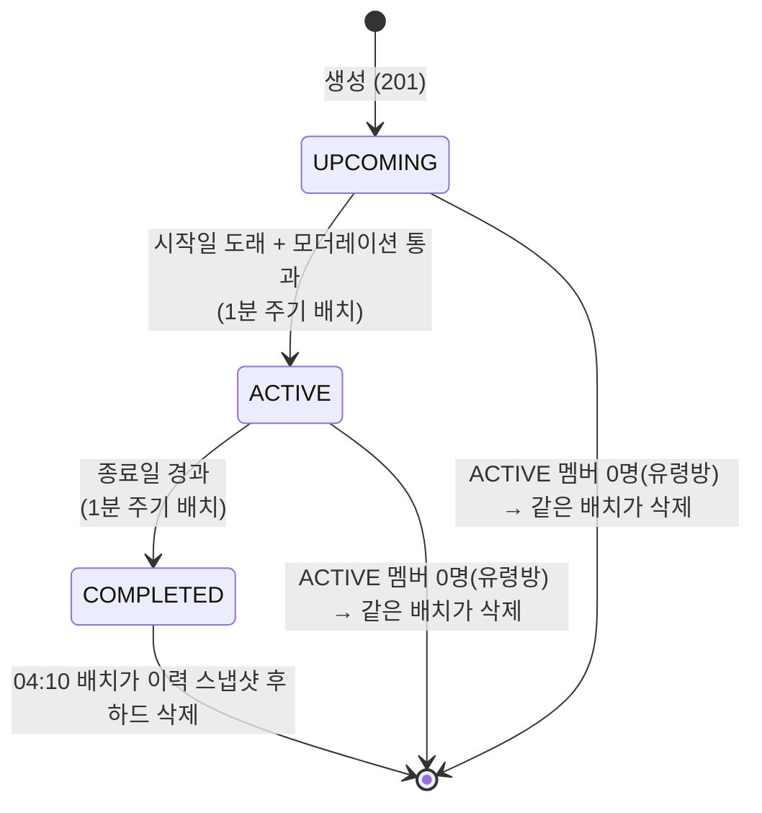
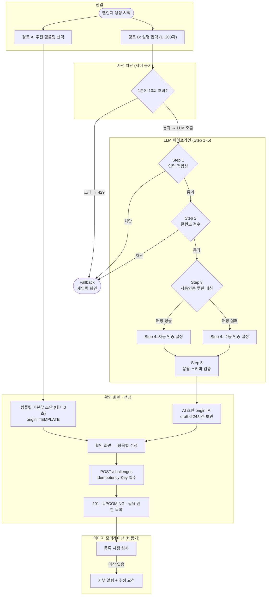
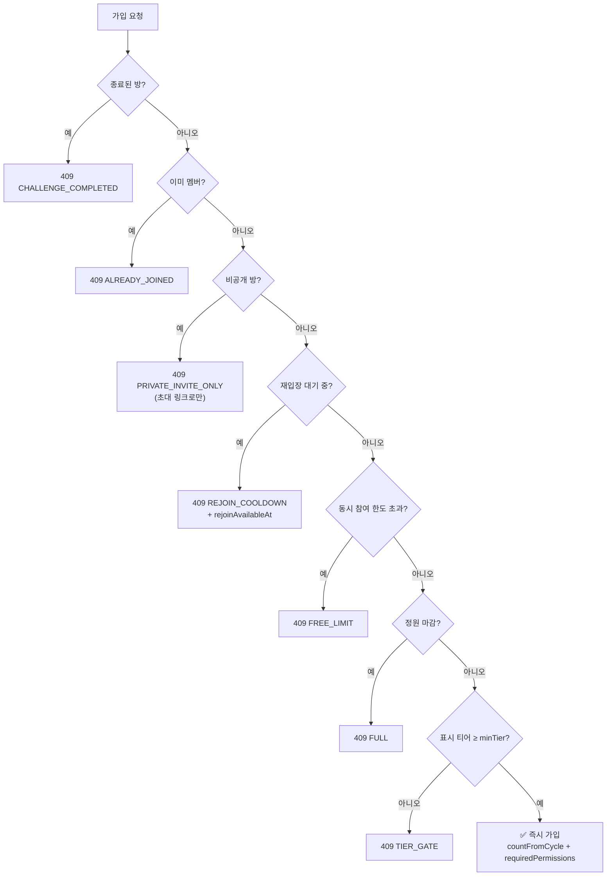

# 챌린지 생성 및 라이프사이클

마감 기한: 2026년 6월 4일 → 2026년 6월 8일
담당자: 성은 이, 준혁
상태: 진행 중
QA 마감 기한: 2026년 6월 8일
개발 마감 기한: 2026년 6월 7일
디자인 마감 기한: 2026년 6월 3일
테크 스펙 마감 기한: 2026년 6월 4일
테크스펙 피드백 마감 기한: 2026년 6월 5일

[챌린지 생성 및 라이프사이클 (이전 버전)](https://app.notion.com/p/38ead4145fb680d8aac1e7a5e50130d6?pvs=21)

# 챌린지 생성 및 라이프사이클 통합 테크 스펙

7.20 수정본

---

## 요약 (Summary)

사용자가 **추천 템플릿 선택(경로 A)** 또는 **LLM 프롬프트(경로 B)** 두 경로로 챌린지 초안을 받고, 확인 화면에서 수정한 값으로 생성한다. 생성된 챌린지는 **`UPCOMING`(시작 전) → `ACTIVE`(진행 중) → `COMPLETED`(종료)** 3단계 라이프사이클을 갖고, 전환은 1분 주기 배치가 수행한다.

LLM 경로는 5-Step 파이프라인(입력 적합성 → 콘텐츠 검수 → 자동인증 루틴 매칭 → 인증 방식 결정 → 형식 검증)으로 제목·설명의 별도 모더레이션을 대체하고, Step 1·2 차단 시 200 `result=FALLBACK` 으로 재입력 화면에 돌려보낸다. 이미지는 등록 시점에 **비동기 심사**한다.

입장 게이트는 **정원 · 최소 티어 · 동시 참여 한도 · 재입장 대기 · 비공개 초대**로 운영하며, 거절은 원인을 가리지 않고 전부 **409 `JOIN_BLOCKED` + `error.reason`** 이다. **방을 지우는 API 는 없다** — 종료·유령방을 매일 04:10 배치가 이력 스냅샷을 남기고 하드 삭제한다.

---

## 이 문서의 개정 이력이 뒤집은 초안 결정

초안(7.20)과 현재 구현이 다른 지점을 먼저 모아 둔다. 아래 본문은 전부 **현재 구현 기준**이다.

| 초안 결정 | 현재 |
| --- | --- |
| 가입 기준 **온도** | **최소 티어**(`min_tier`, BRONZE~RUBY). 판정은 표시 티어로 |
| **탈퇴 시 재참여 영구 금지** | **폐기.** 탈퇴는 1주 대기, 강퇴는 1주→2주→4주 배수 대기 |
| **방장 탈퇴 불가**(참여자 0명 방) | **폐기.** 방장도 자유롭게 나가고, 방은 **봇방장**(`ownerType=BOT`)이 된다 |
| **공동 관리자(MANAGER)** · 방장 위임 | **폐기.** 역할은 `OWNER`·`MEMBER` 둘뿐이고 위임 API 는 기능 플래그 뒤에 잠겨 있다 |
| 이의 제기 = **방장/공동 관리자가 처리**, 실패일 +7일 | **자동 인용.** 형식 요건 4가지만 보고 즉시 인용, 기한은 귀속일 +2일 00:00 KST |
| **방장이 삭제**(멤버 0명 조건) | **삭제 API 없음.** 종료·유령방을 배치가 자동 하드 삭제 |
| 온도 패널티 | **점수 감점**(중도 이탈 최대 −15, 1년 이상 성공 시 면제) |

---

## 배경 (Background)

- RuleUp의 진입 장벽은 "챌린지 설정 항목이 많다"는 것이다. 기본 템플릿을 깔아주고 사용자는 다듬기만 하게 해 생성 전환율을 높인다. AI 는 **초안만 제공**하며, 사용자 확인·수정 후 생성 요청에 담긴 값이 최종 값이다.
- 챌린지는 자동 인증·점수의 **단위**다. 챌린지가 생성돼야 이후 인증·감점·티어가 검증 가능하다.
- 생성·수정·참여·탈퇴·권한 정책이 여러 문서에 흩어져 충돌하던 것을 이 문서가 통합한다.

---

## 디자인


## 목표 (Goals)

- 추천 템플릿을 고르면 **LLM 호출 없이** 기본값 초안으로 즉시 확인 화면에 도달한다.
- 설명을 입력하면 LLM 파이프라인이 초안을 채우고, **부적절 입력은 Step 1·2에서 차단**해 별도 모더레이션 시스템을 대체한다.
- 챌린지 이미지 모더레이션은 비동기로 수행한다.
- 자동인증 루틴 테이블과 매칭해 **매칭되면 자동 인증, 없으면 수동 인증**으로 설정값을 자동 결정한다.
- **정원·최소 티어** 게이트 안에서 시작 전부터 종료 전까지 **언제든 합류**할 수 있게 한다.
- 진행 중에는 제목·설명·정원·이미지만 수정 가능하게 하고, 그 외 설정은 "시작 전 + 혼자"에서만 수정 가능하게 한다.
- 중도 이탈 감점은 **진행 기간에 반비례**하게 해, 오래 해온 사람이 나갈 때 덜 잃게 한다.
- LLM 호출 전 **동기 사전 차단(rate limit)** 으로 남용을 막고 호출 비용을 절감한다.

---

## 목표가 아닌 것 (Non-Goals)

- **제목·설명 독립 모더레이션** — LLM Step 2가 전담한다.
- **리쿠르팅/모집 단계 및 가입 승인제** — `RECRUITING` 상태, 방장 승인(PENDING→ACTIVE)은 구현하지 않는다.
- **공동 관리자(MANAGER)·방장 위임·수동 강퇴** — 페이지2 스펙아웃(기능 플래그 뒤에 잠금).
- **방장의 수동 삭제 API** — 자동 삭제 배치가 대신한다.
- **점수 가감 계산** — 점수·티어 스펙 담당. 여기서는 트리거만 다룬다.
- **탐색·추천·랭킹** — 각 스펙 담당.
- **자동 인증 판정 로직** — 인증(VF) 스펙 담당.

---

## 계획 (Plan)

### 1. 용어 정의

| 용어 | 정의 |
| --- | --- |
| **챌린지** | 목표·기간·멤버를 묶는 방 단위. 솔로(`SOLO`)/그룹(`GROUP`) 구분 |
| **루틴** | 챌린지 안에서 멤버가 반복 수행하는 단위 행동 (일 단위 판정 대상) |
| **사이클** | 판정·정산의 기본 주기. **1주 고정**이며 요일은 지정하지 않는다 |
| **인증** | 루틴 수행을 판정·기록하는 행위. **자동** = 시스템 판정 / **수동** = 사용자가 직접 체크 |
| **탈퇴 (나가기)** | 멤버가 방에서 나가는 것 (`leftType=SELF`) |
| **방장 (OWNER)** | 방의 소유자. `owner_id` 가 비면 `ownerType=BOT`(봇방장) |
| **멤버 (MEMBER)** | 일반 참여자. 역할은 OWNER·MEMBER 두 값뿐이다 |
| **정원 (capacity)** | 방이 받을 수 있는 최대 인원. `null` 이면 무제한 |
| **최소 티어 (minTier)** | 입장에 필요한 표시 티어 하한 |

### 2. 라이프사이클 상태 모델



- **활성화 배치는 모더레이션을 통과한 방만 올린다** — 심사 중인 방은 시작일이 와도 `UPCOMING` 에 머문다.
- **유령방(ACTIVE 멤버 0명)도 삭제 대상**이다. 방장이 나가 봇방장이 된 방이라도 남은 멤버가 있으면 살아 있고, 전원이 나가면 다음 04:10 에 사라진다.

**단계별 허용 동작 요약표**

| 단계 | 가입 | 수정(방장) | 탈퇴 | 삭제 |
| --- | --- | --- | --- | --- |
| `UPCOMING` · 혼자 | ✅ | ✅ 카테고리 제외 전 항목 | ✅ | 배치만 (멤버 0명이 되면) |
| `UPCOMING` · 멤버 ≥2 | ✅ | ❌ — 제목·설명·정원·이미지만 | ✅ | 배치만 |
| `ACTIVE` | ✅ 중도 합류 | ❌ — 제목·설명·정원·이미지만 | ✅ | 배치만 |
| `COMPLETED` | ❌ `CHALLENGE_COMPLETED` | ❌ | ❌ | 04:10 배치가 삭제 |

### 3. 챌린지 생성 플로우

생성 진입은 두 경로다. 어느 경로든 같은 **확인 화면 + 생성 API** 에 도달하고, **생성 요청에 담긴 값이 최종 값**이다.

**최소 티어는 생성자 본인의 표시 티어를 초과할 수 없다.** 서버가 생성 요청 검증에서 초과 값을 거부한다(클라이언트 검증만으로는 우회 가능).



#### 3-1. 경로 A — 추천 템플릿 (LLM 미호출)

1. 생성 화면의 추천 3건 중 하나를 탭한다(`GET /api/v1/challenges/recommendations` — 어떤 경우에도 3건 보장).
2. `POST /api/v1/challenges/recommendation/by-template` 이 템플릿 기본값 초안을 **즉시** 구성한다(`origin=TEMPLATE`).
3. 확인 화면에서 수정 후 생성한다.

#### 3-2. 경로 B — 프롬프트(LLM) 5-Step 파이프라인

`POST /api/v1/challenges/draft` — **설명 1~200자만** 입력하면 제목까지 포함한 초안 전체를 생성한다.

| Step | 이름 | 하는 일 | 실패 시 동작 |
| --- | --- | --- | --- |
| Step 0 (호출 전) | rate limit | 사용자당 **1분 10회** | 🔴 LLM 호출 없이 **429** |
| **Step 1** | 입력 적합성 | 무의미 입력·프롬프트 인젝션 판별 | 🔴 오류가 아니라 **200 `result=FALLBACK`** (재입력 복귀) |
| **Step 2** | 콘텐츠 검수 | 부적절/유해 콘텐츠 차단 (모더레이션 대체) | 🔴 위와 동일 |
| **Step 3** | 루틴 매칭 | 자동인증 가능한 루틴과 매칭 시도 | 매칭 실패는 오류가 아님 → Step 4에서 수동 |
| **Step 4** | 인증 방식 결정 | 매칭 있으면 자동, 없으면 수동 | — |
| **Step 5** | 형식 검증 | `responseSchema` 대조 후 전달 | 이상값은 서버가 보정·기본값 대체 |

초안 원본은 `draftId` 로 **24시간 보관**한다. 생성 시 서버가 draft 원본과 대조해 **심사 대상인지 스스로 판정**한다(클라이언트의 자가 신고를 믿지 않는다).

#### 3-3. 생성 API 계약

- **`Idempotency-Key` 헤더 필수** — DB 유니크 제약으로 재시도가 안전하다.
- 성공은 **201 + `UPCOMING`**.
- 자동 인증을 고르면 필요한 OS 권한 목록을 응답으로 전달한다. **서버는 권한을 검사하지 않는다** — 권한 없이 가입되면 첫날부터 실패가 쌓이므로 클라이언트가 가입 전에 확보한다.
- 대표 이미지는 `POST /api/v1/challenges/image` 로 먼저 올린다(jpg/png, 최대 10MB, 업로드 rate limit). 반환된 `imageUrl` 은 **본인 소유로 기록**되며 타인·외부 URL 은 거절된다. 등록되지 않은 업로드는 24시간 후 정리된다.
- 이미지 콘텐츠 심사는 **등록 시점 비동기**다. 심사 중·거부 상태에서는 제목이 AI 임시 제목으로, 설명·이미지가 `null` 로 대체돼 타인에게 보인다.

#### 3-4. 복제 생성

`POST /api/v1/challenges/{challengeId}/clone` — **공개 그룹 방만** 복제할 수 있다(비공개·솔로는 403). 원본 설정을 프리필한 초안(`origin=CLONE`)을 발급하고 확인 화면·생성 API 를 그대로 재사용한다. 시작일은 생성일 +1, `mode`·정원·티어는 생성 기본값으로 리셋되고 **이미지는 복사하지 않는다.**

### 4. 챌린지 수정 플로우

`PATCH /api/v1/challenges/{challengeId}` — JSON Merge Patch 유사. 미포함 필드는 변경되지 않고, `null` 은 `imageUrl`(기본 이미지 되돌리기)에만 유효하다.

| 시점 | 수정 가능 범위 |
| --- | --- |
| 시작 전 · 혼자 | ✅ **카테고리를 제외한** 전 항목 |
| 그 외 (멤버 ≥2 또는 진행 중) | 제목 · 설명 · 정원 · 이미지 |
| 종료 후 | ❌ 전면 불가 |

- **`version` 필수** — 불일치면 409(낙관적 잠금). 수정 화면은 `GET /{challengeId}/settings` 로 진입하며 `editableFields` 를 서버가 계산해 내려준다.
- 제목·설명·이미지를 고치면 **재심사**한다. 반복 거부로 잠긴 동안은 429.
- 인증 방식은 **`AUTO → MANUAL` 단방향**만 허용한다.
- 정원은 **현재 참여 인원 미만으로 축소할 수 없다.**

### 5. 멤버 가입(참여) 플로우

`POST /api/v1/challenges/{challengeId}/members`



- **거절은 전부 409 `JOIN_BLOCKED` + `error.reason`** 이다. 구 명세의 403 `TIER_NOT_ELIGIBLE` · 409 `CHALLENGE_FULL` 분리는 폐기됐다. 판정 순서는 위 다이어그램 그대로다.
- 동시 참여 한도는 기본 **3개**(`app.challenge.concurrent-limit.max`).
- **참여 버튼 노출 기준은 `joined` 하나다.** 인기·목록·공개 상세가 모두 `joined` 를 내려준다. `eligible`·`joinable` 은 **티어 잠금 표시용**이라 멤버십을 보지 않으므로 버튼 판단에 쓰면 내가 만든 방에도 "참여하기"가 뜬다. 공개 상세의 `joinBlockReason` 은 **종료가 최우선순위**라 참여 여부 판단이 아니라 문구 표시에만 쓴다.
- `countFromCycle` 은 판정이 시작되는 날짜다. **사이클이 1주 고정**이라 주 중간에 들어오면 다음 사이클 경계부터 세며, 그 전 날짜는 성공·실패 어느 쪽으로도 잡히지 않는다.
- 솔로 방은 본인 외에는 **존재 자체를 숨기므로 404** 다.
- 동시 가입 경합(마지막 1자리에 2명)은 잠금으로 막아 정원 초과가 발생하지 않는다.

### 6. 멤버 탈퇴 플로우

`DELETE /api/v1/challenges/{challengeId}/members/me`

- **누구나, 방장도 자유롭게 나갈 수 있다.** 구 명세의 "방장 탈퇴 불가"와 "탈퇴 시 재참여 영구 불가"는 둘 다 폐기됐다.
- 방장이 권한을 넘기지 않고 나가면 방은 **즉시 봇방장 체제**(`botOwnerActivated:true`)가 되고 남은 멤버 전원에게 "방장 자리가 비었어요" 알림이 나간다.
- **재입장은 1주 대기**(`rejoinAvailableAt`). 강퇴와 달리 배수로 늘어나지 않는다(강퇴는 1주 → 2주 → 4주).
- 종료된 방은 탈퇴 개념이 없어 거절된다.

#### 6-1. 중도 이탈 감점과 면제

- 감점은 **최대 −15**이며 진행 기간에 반비례한다: `−⌈15 × (1 − 진행주간/52)⌉`.
- 면제 두 가지(`exemptReason`):
    - `LONG_SUCCESS` — 1년(52주) 이상 성공을 이어온 경우
    - `SUCCESSION_GRACE` — 방장 승계 직후 3일 면책 기간(잔류 멤버 전원 적용)
- **기록은 소급 삭제되지 않는다.** 탈퇴해도 그 방에서 이미 반영된 성공·실패가 점수에 남는다 — 탈퇴로 점수 세탁이 불가능하다. 탈퇴 시점 이후의 잔여 예정일은 계산하지 않는다.

### 7. 권한 모델

| 기능 | OWNER | MEMBER |
| --- | --- | --- |
| 방 홈·랭킹·스레드·멤버 목록 조회 | ✅ | ✅ |
| 챌린지 수정 | ✅ | ❌ |
| 초대 링크 발급(비공개 방) | ✅ | ❌ |
| 멤버 강퇴 · 방장 위임 · 방장 되기 | 페이지2 플래그 off → **404** | 동일 |

- **공동 관리자(MANAGER)는 폐기됐다.** `role` 은 `OWNER`·`MEMBER` 둘뿐이고, 클라이언트와 "모르는 값 = MEMBER" 로 합의돼 있다.
- **방장 위임·수동 강퇴·방장 되기(클레임)** 세 API 는 명세 보존을 위해 코드에 남아 있지만 `app.features.room-owner-admin.enabled=true` 일 때만 매핑된다. 기본값에서는 Swagger 에도 나오지 않는다.
- 방장 자리가 빈 방은 **봇방장**으로 유지된다.

#### 7-1. 이의 제기 — 판정하지 않고 자동 인용

이의의 대다수는 "실제로 했는데 측정이 틀렸다"이고 그 진위는 봇도 사람도 검증할 수 없다. 그래서 **형식 요건 4가지만 보고 통과하면 즉시 인용**한다.

1. 본인의 인증인가
2. 실패로 확정됐거나 **이대로면 실패**인가 (완료된 건과 아직 채울 기회가 남은 건은 거절)
3. 기한 안인가 — **귀속일 +2일 00:00 KST**(확정 시각과 같다)
4. 사유가 10자 이상인가 (사진은 선택)

- **방장·공동 관리자·LLM 은 인용 여부를 판단하지 않는다.** 횟수 한도도 없다 — 남용은 인용과 분리된 이상탐지·운영 제재가 맡는다.
- 이의는 **확정 전에** 받는다. 실제 신청 창은 귀속일이 끝난 뒤의 유예 하루이며, 유저는 "이대로면 실패"를 보고 신청한다.
- 인용하면 실패를 성공으로 정정하고 진행률·통계·연속 기록·점수를 **정상 성공과 같은 기준으로** 다시 계산한다.

### 8. 챌린지 삭제 — 배치가 한다

**방장이 방을 지우는 API 는 없다.** 매일 **04:10 KST** `ChallengeAutoDeleteService` 가 두 종류를 지운다.

| 대상 | 조건 |
| --- | --- |
| 만료방 | `status = 'COMPLETED'` |
| 유령방 | `ACTIVE` 멤버가 한 명도 없는 방 |

방 단위 트랜잭션으로 다음 순서를 밟는다.

1. **이력 스냅샷 적재** — `challenge_history` · `challenge_member_history` · `challenge_final_ranking`. 하드 삭제 뒤에도 완료 목록·최종 랭킹을 열람할 수 있어야 하기 때문이다.
2. **통계 로그 적재**(`[STATS]`) — 어떤 루틴이 얼마나 생성·수행됐는지 보존.
3. **방 데이터 하드 삭제** — 멤버·감시자 등. 인증 기록 원본과 통계는 소프트 참조(V6)라 보존된다.

- 랭킹 제거는 일 1회 랭킹 갱신 배치가 따로 수행한다.
- 실패한 방만 다음 실행에서 재처리된다(방 단위 격리).
- **완료 탭의 대가**: 삭제 뒤에는 이력 스냅샷에서 읽으므로 `description`·`mode`·`visibility`·`participantCount`·`capacity`·`minTier`·`weeklyCount`·`ownerType` 이 사실상 항상 `null` 이다. 값을 지어내면 사용자가 자기 기록을 오독하므로 비워 두는 쪽을 택했다.

### 9. 전체 흐름 한눈에 보기

```
[생성]
  경로 A: 추천 템플릿 탭 → by-template 초안 (LLM 미경유, 대기 0초)
  경로 B: 설명 1~200자 → LLM 5-Step
          Step0 rate limit(1분 10회) → 초과 429
          Step1 입력 적합성  → 차단 시 200 result=FALLBACK
          Step2 콘텐츠 검수  → 차단 시 200 result=FALLBACK
          Step3 자동인증 루틴 매칭
          Step4 매칭 O=자동인증 / X=수동인증
          Step5 스키마 검증 → 초안 완성(draftId 24h)
  → 확인 화면 수정 → POST /challenges (Idempotency-Key) → 201 UPCOMING
  → 이미지가 있으면 비동기 심사

[UPCOMING]
  - 가입 가능 (정원·티어·동시 한도·재입장 대기 게이트)
  - 혼자면 카테고리 제외 전 항목 수정, 아니면 제목·설명·정원·이미지
  - 시작일 도래 + 모더레이션 통과 → 1분 배치가 ACTIVE 로

[ACTIVE]
  - 중도 합류 계속 가능 (다음 사이클 경계부터 판정)
  - 제목·설명·정원·이미지만 수정 (정원은 현재 인원 미만 축소 불가)
  - 탈퇴 자유 — 감점 최대 −15(진행 기간 반비례), 1년 이상 성공 시 면제
  - 방장이 나가면 봇방장 전환 + 남은 멤버에게 알림
  - 종료일 경과 → 1분 배치가 COMPLETED 로

[COMPLETED]
  - 가입·수정·탈퇴 불가
  - 04:10 배치가 이력 스냅샷 적재 후 하드 삭제
```

### 10. QA 시나리오 체크리스트

**생성**

- [ ]  추천 템플릿 탭 → LLM 호출 없이 즉시 초안
- [ ]  LLM 경로 Step 1/2 차단 → 200 `result=FALLBACK`
- [ ]  Step 3 매칭 성공 → 자동 인증 / 실패 → 수동 인증
- [ ]  1분에 10회 초과 → 429
- [ ]  `Idempotency-Key` 재전송 → 같은 챌린지 1건만 생성
- [ ]  생성자 표시 티어보다 높은 `minTier` 요청 → 거부
- [ ]  타인이 올린 `imageUrl` 로 생성 시도 → 거부
- [ ]  미등록 업로드 이미지가 24시간 후 정리되는지

**수정**

- [ ]  멤버 ≥2 또는 진행 중 → 제목·설명·정원·이미지 외 수정 차단
- [ ]  정원을 현재 인원 미만으로 축소 시도 → 거부
- [ ]  `version` 불일치 → 409
- [ ]  제목·설명·이미지 수정 → 재심사 진입

**가입**

- [ ]  거절 7종이 전부 409 `JOIN_BLOCKED` + 해당 `reason`
- [ ]  판정 순서(종료 → 이미 멤버 → 비공개 → 재입장 대기 → 동시 한도 → 정원 → 티어)
- [ ]  동시 가입 경합 시 정원 초과 미발생
- [ ]  주 중간 가입 시 `countFromCycle` 이 다음 사이클 경계
- [ ]  솔로 방을 남이 조회·가입 시도 → 404

**탈퇴**

- [ ]  방장 탈퇴 → 봇방장 전환 + 남은 멤버 알림
- [ ]  재입장 대기 1주(탈퇴) / 1주→2주→4주(강퇴)
- [ ]  1년 이상 성공자 탈퇴 → `exemptReason=LONG_SUCCESS`, 감점 0
- [ ]  승계 3일 이내 탈퇴 → `exemptReason=SUCCESSION_GRACE`

**이의**

- [ ]  형식 요건 4가지 통과 → 즉시 인용, 진행률·점수 재계산
- [ ]  귀속일 +2일 00:00 KST 이후 신청 → `APPEAL_WINDOW_CLOSED`
- [ ]  남의 인증에 이의 → 404(존재를 알리지 않음)

**삭제(배치)**

- [ ]  종료된 방이 04:10 배치로 하드 삭제되고 완료 탭에는 계속 보이는지
- [ ]  ACTIVE 멤버 0명 유령방이 같은 배치로 삭제되는지
- [ ]  최종 랭킹이 삭제 후에도 조회되는지

---

## 이외 고려 사항들 (Other Considerations)

**고려했으나 하지 않기로 결정된 사항**

- **챌린지 이름 독립 모더레이션** — LLM 파이프라인 Step 2가 생성 시점에 차단하는 방식으로 대체. 별도 시스템을 만들지 않는다.
- **리쿠르팅 단계·가입 승인제** — 진입 마찰을 줄이기 위해 폐기. 중간 상태(PENDING)가 없다.
- **방장의 수동 삭제** — "멤버 0명일 때만 삭제"는 결국 유령방 정리와 같은 조건이라, 사용자 액션 대신 배치로 옮겼다. 삭제 시점의 경합(0명 판정 vs 신규 가입)도 함께 사라졌다.
- **탈퇴 후 재참여 영구 금지** — 회피 악용을 막으려는 규칙이었지만, 잘못 들어온 방까지 영구 차단해 이탈을 오히려 키웠다. **대기 기간**(탈퇴 1주 / 강퇴 배수)으로 대체했다.
- **방장 탈퇴 불가** — 방장이 갇히는 구조라 폐기. **봇방장**으로 방을 유지하고, 원하면 남은 멤버가 클레임한다(클레임 API 는 현재 페이지2 플래그 뒤).
- **공동 관리자(MANAGER) 계층** — 권한 원천 리팩터링(creatorId → role)을 요구하는데, 정작 부여할 권한(공지·이의 처리)이 둘 다 사라졌다(공지 Phase 2 이관, 이의 자동 인용). 계층 자체를 폐기했다.
- **이의 제기 인간 판정** — 진위를 검증할 방법이 없어 판정자를 두면 자의적 결정만 남는다. 형식 요건 자동 인용으로 대체하고, 남용은 이상탐지·운영 제재로 분리했다.
- **챌린지 전면 소프트 딜리트** — 하드 삭제 + 이력 스냅샷 + 감사 로깅으로 결정. 대신 완료 카드의 필드 일부가 `null` 인 대가를 진다.

**미결 항목**

- 감사 로그 보관 기간·조회 권한
- `leftType` 세분화 — 저장 컬럼이 `enum('LEAVE','KICK')` 이라 현재 `SELF`·`KICK_BY_OWNER` 두 값만 내려간다. 자동 강퇴 배치를 붙일 때 저장 값부터 갈라야 한다.
