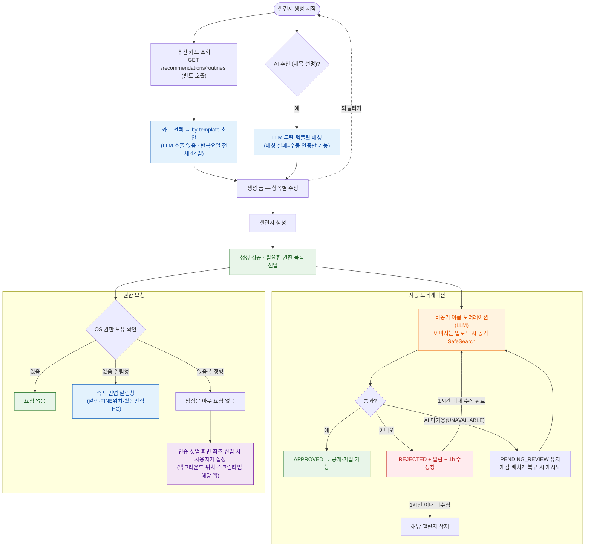
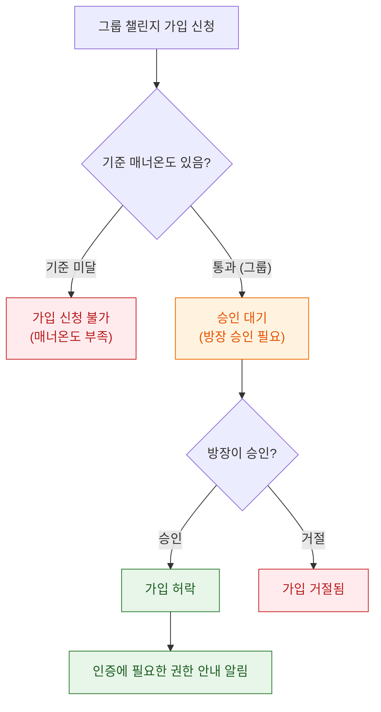
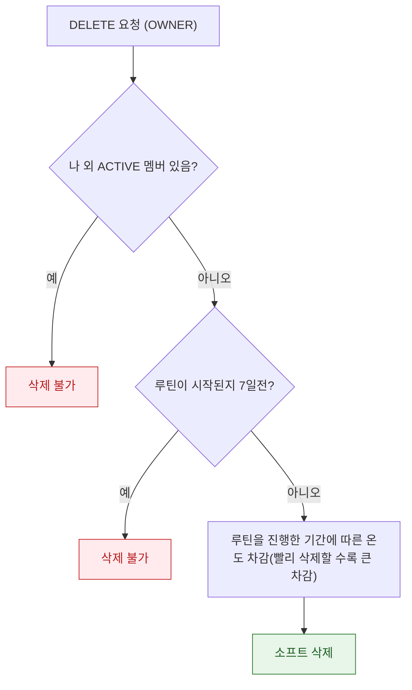
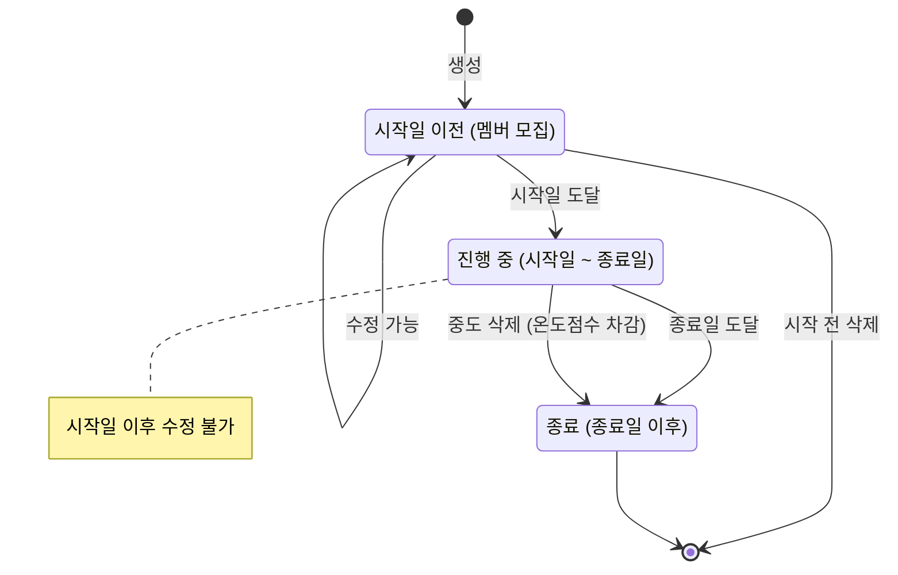

# 챌린지 생성 최종 수정

## 1. 요약

사용자가 챌린지 **카테고리만 고르면**(또는 추천 버튼만 누르면) 기본 템플릿이 깔린 생성 폼으로 바로 진입하고, 원하면 제목/설명을 넣어 **LLM이 루틴 템플릿을 매칭·추천**받아 채울 수 있다. 각 항목을 수정한 뒤 **생성(서버 저장)** 한다.

핵심 원칙: **AI 추천은 구속력 없는 초안**이다. 추천 API와 생성 API를 분리하고, 생성 요청에 담긴 값이 최종 값이다.

IR 매핑: CH-01(개설), CH-02(기본값 LLM 추천), CH-03(참여), CH-04(최소 평판 기준), CH-07(관리자 권한), CH-10(익명/실명), 설정 저장 한정 VF/PN, RP-01(매너 온도).

---

## 2. 배경

- RuleUp의 진입 장벽은 "챌린지 설정 항목이 많다"는 것. → **기본값을 깔아주고 사용자는 다듬기만** 하게 해 생성 전환율을 높인다.
- 챌린지는 자동 인증·평판의 **단위**다. 챌린지가 생성돼야 이후 인증(VF)·패널티(PN)·평판(RP)이 검증 가능하다.
- 매너 온도(RP-01, 초기 36.5)는 온보딩 값. 본 기능은 **참여 기준 비교**(CH-04)와 패널티/보상 **설정값 저장**, 그리고 **중도 삭제 차감 트리거**에만 사용. 실제 가감 적용은 평판/패널티 스펙.
- 추후 RAG 기반 등으로 LLM 대체 고려.

---

### 목표

- **카테고리 추천 버튼 → 즉시 생성 폼 진입(LLM 호출 없음)** → 항목별 수정 → 생성.
- 제목/설명(선택) → **LLM 루틴 템플릿 매칭 추천(2초 이내)** → 폼 갱신. 매칭/LLM 실패도 200 + MANUAL 폴백.
- 추천 항목: 카테고리, 참여 방식(솔로/그룹), 참여 기준 매너(그룹), 반복 요일·기간, 루틴 템플릿·인증 방식(AUTO/MANUAL), 목표값(params), 패널티(매너 차감(필수)·SNS·그룹 공유), 보상(매너(필수)).
- **상세 조회**: 설정 + 참여 자격(내 매너 vs 기준) + 통계(참여수·평균 매너).
- **참여**: 그룹은 기준 매너 서버 검증 후 PENDING(승인) → ACTIVE. 가입 응답에서 권한 안내.
- **관리**: OWNER가 시작 전 수정(PATCH), 삭제(생성 7일 후·소프트), 그룹 참여 승인.
- **모더레이션**: 비동기 자동 게이트(이름 LLM, 이미지 SafeSearch).

### 목표가 아닌 것

- **챌린지 검색/인기/랭킹·루틴 추천(`GET /recommendations/routines`)** → 탐색·추천 스펙.
- **완주율 집계** → VF 선행, 표시 필드만 `null`.
- **패널티/보상·중도삭제 차감 실제 가감 실행** → 평판/패널티 스펙. 본 범위는 설정 저장 + 차감 트리거까지.
- 자동 인증 판정(VF), 임베딩 RAG(Phase 2).

---

## 4. 핵심 의사결정

- **4.1 추천 API와 생성 API 분리 (AI는 초안)** — `POST /recommendation`(상태 저장 X)과 `POST /challenges`(생성) 분리. 생성 요청 값이 최종.
- **4.2 진입은 LLM 비강제** — 생성 진입 시 추천 카드는 `GET /recommendations/routines`(관심사·세그먼트 인기도 기반, 최대 3건)로 **별도 조회**한다(생성 API에 묶여 오지 않는 독립 호출). 카드를 고르면 `POST /challenges/recommendation/by-template`(templateId)로 **LLM 없이** 초안을 구성한다(반복요일 전체·기간 14일 기본값을 수정란에 채워 보냄). 제목/설명 기반 LLM 추천(`POST /challenges/recommendation`)은 루틴 템플릿 매칭으로 폼을 채우는 **선택 단계**. 어느 경로든 초안은 구속력 없음(4.1).
- **4.3 인증 모델 = 루틴 템플릿** — `verificationMethods` 배열 폐기. `templateId`(105개 루틴 카탈로그 매칭) + `selectedMethod(AUTO/MANUAL)` + `verification` 스냅샷(`verificationType`·`signalSource`·`wearableReq`·`requiredPermissions`·`externalService`) + `params`(목표값) 모델.
- **4.4 권한 = 두 갈래(즉시형/설정형)** — AUTO 선택 시 **즉시형 권한**(알림·FINE위치·활동인식·헬스커넥트·카메라 = 생성 버튼 시점 팝업으로 받을 수 있는 것)만 `grantedPermissions`로 받아 생성 시 검증(`ROUTINE_PERMISSION_REQUIRED`). **설정형 권한**(백그라운드 위치·`PACKAGE_USAGE_STATS` = OS 설정에서 직접 켜는 것, 예: 헬스장 위치·스크린타임 앱)은 생성 시 강제하지 않고 **가입 후 최초 진입 셋업(§11.4 `/setup`)으로 이연**한다. 응답에는 `verification.requiredPermissions` 전체 제공. (권한 보유 상태는 저장하지 않음, §5.6.)
- **4.5 모더레이션 = 가시성 게이트 (이름 비동기 · 이미지 동기)** — 생성은 항상 성공. `moderationStatus`(PENDING_REVIEW→APPROVED/REJECTED) 축 추가. **이름**은 생성/이름변경 후 **비동기 LLM** 검수. **이미지**는 업로드 시점(`POST /challenges/image`) **동기** SafeSearch로 명백 위반은 422 `IMAGE_REJECTED` 사전 차단(비동기 재검 없음). 검수 전 타인 비노출, 통과 후 공개·가입. 위반 시 REJECTED + 알림 + **1시간 수정창**(솔로·그룹 동일), 미수정 시 영구 닫힘. **자동 판정만**(어드민 리뷰 없음). REJECTED 시 진행 중 멤버 기록/패널티 별도 처리 없음(비노출 게이트 + 1h 창으로 영향 작음). *AI 미가용(UNAVAILABLE)으로 이름 검수가 결론을 못 내면 PENDING_REVIEW로 남고, 재검 배치가 주기적으로 다시 넣어 AI 복구 즉시 공개된다(§8). AI가 결론을 낸 뒤에는 재검하지 않는다.*
- **4.6 삭제 정책** — **나(OWNER) 외 ACTIVE 멤버가 있으면 삭제 불가**(`CHALLENGE_HAS_MEMBERS`, PENDING 신청자는 제외). **생성 후 7일 잠금**(`DELETE_LOCKED`). **계획 기간(`durationDays`)이 7일 미만이면 영구 삭제 불가.** 7일 경과·기간 7일 이상·다른 멤버 없음이면 중도 삭제 가능하나 **평판 차감 트리거** 발생, 진행 기간 길수록 차감 감소(계획 종료 시 0). 실제 가감은 평판 스펙. → 멤버 게이트가 앞단이라 **차감은 사실상 솔로/멤버 없는 그룹에만 적용**.
- **4.7 상태 축 분리** — lifecycle `status`(RECRUITING/ACTIVE/COMPLETED) · 모더레이션 `moderation_status` · 멤버 `setup_status`는 **서로 다른 축**. 시작 전(ACTIVE 이전)에만 PATCH. lifecycle 전이는 배치로: 시작일 도달 → ACTIVE(활성화 배치), **종료일 경과 → COMPLETED(완료 배치)**. 완주율/정산은 VF·평판 스펙 소관이고 여기선 상태만 마감.
- **4.8 참여 자격 서버 검증(CH-04)** — 그룹 참여 시 `min_manner_temperature ≤ 사용자 매너`를 서버 판정. 가입은 `APPROVED` 챌린지만.
- **4.9 통계는 현재 계산 가능한 것만** — `participant_count`, 참여자 평균 매너. 완주율·실제 가감은 미룸(완주율 `null`).
- 4.10 챌린지 모더레이션의 검수가 완료되기 전에는 다른 사용자에게 보이지 않는다 → 따라서 검수가 완료되지 않은 챌린지는 다른 사용자가 볼 수도 없고 가입 신청할 수도 없다

---

## 5. 플로우

### 5.1 생성 진입 → 추천 → 모더레이션 → 권한 알림

응답의 권한 목록을 받아, 가벼운 팝업 권한만 즉시 요청하고 무거운 설정형 권한은 인증 스펙의 최초 진입 셋업으로 이연.

**signalSource ↔ requiredPermissions (인증 `/setup` 스펙과 동일)**

| signalSource | requiredPermissions |
| --- | --- |
| GPS_PRESENCE | `ACCESS_FINE_LOCATION`, `ACCESS_BACKGROUND_LOCATION` |
| SCREEN_TIME | `PACKAGE_USAGE_STATS` |
| WAKE | `PACKAGE_USAGE_STATS` |
| HEALTH | `READ_STEPS`, `READ_DISTANCE` |
| SLEEP | `READ_SLEEP` (+bg는 HEALTH와 공유) |
| (MANUAL/PHOTO) | `CAMERA` / `[]` |

### 5.3 참여(가입) 플로우

### 5.4 삭제 정책 (생성 7일 잠금 + 차등 차감)

- `unlock = createdAt + 7d`, `end = endDate`. 잠금 해제 직후 차감 최대, 계획 종료에 가까울수록 0으로 수렴.
- `basePenalty`·하한은 config. 실제 매너 가감 실행은 평판 스펙(본 API는 트리거 + `mannerPenalty` 값 반환).

### 5.5 챌린지 lifecycle 관리

---

[6. API 명세 모음](%EC%B1%8C%EB%A6%B0%EC%A7%80%20%EC%83%9D%EC%84%B1%20%EC%B5%9C%EC%A2%85%20%EC%88%98%EC%A0%95/6%20API%20%EB%AA%85%EC%84%B8%20%EB%AA%A8%EC%9D%8C%2038ead4145fb6808fb000f0388d103451.csv)

---

## 7. DB

[https://app.notion.com/p/DB-38bad4145fb68087adefe2629be2fdb4?source=copy_link](https://app.notion.com/p/DB-38bad4145fb68087adefe2629be2fdb4?pvs=21)

---

## 8. 이외 고려사항

- **AI 신뢰 경계**: LLM 응답 enum/숫자는 서버가 검증·보정. 이상값은 기본 템플릿 대체.
- **모더레이션**: 이름은 **비동기 LLM**, 이미지는 **업로드 시 동기 SafeSearch**. 명백 비속어는 규칙 기반 blocklist로 동기 사전 차단. 검색 노출은 APPROVED만. AI 미가용 시 이름 검수는 재검 배치로 복구(§4.5) — AI 결론 후 재검 없음.
- **권한 모델 정렬(확정)**: AUTO 생성 시 **즉시형 권한만** `grantedPermissions`로 검증하고, **설정형(백그라운드 위치·`PACKAGE_USAGE_STATS`)은 최초 진입 셋업(§11.4)으로 이연**(§4.4).
- **LLM 비용·남용**: 추천 호출 rate limit(연타 방지). 모더레이션은 blocklist 사전 필터로 호출 절감.
- **중도삭제 차감 곡선**: `basePenalty`·하한 config. 짧은 챌린지(기간<7일)는 삭제 불가라 차감 대상 아님.
- **재참여**: `uq_member`로 1회 멤버십. 탈퇴 후 재참여는 status 갱신(인증/운영 스펙).
- **익명(CH-10)**: 상세 `owner.nickname` 마스킹.
- **참여 인원 정합성**: `participant_count` 참여/탈퇴/승인 시 갱신(비정규화). 동시성 락 고려.

### 분리(다른 스펙)

- **본 스펙 소관 API**: `GET /challenges`는 **내 챌린지 목록**(멤버십 기준, scope=ACTIVE/ALL). 추천 진입은 `GET /recommendations/routines`(추천 카드) + `POST /challenges/recommendation/by-template`(선택 초안, LLM 우회).
- 챌린지 **탐색/검색·랭킹**(공개 목록)과 `GET /recommendations/routines`의 추천 로직 자체 → 탐색·추천 스펙(랭킹 + APPROVED 노출 게이트).
- 패널티/보상·중도삭제 매너 실제 가감 → 평판/패널티 스펙.

---

## 9. 마일스톤 (W2 예정 · 날짜 TBD)

스프린트 범위 → 디자인 확정 → 테크 스펙(본 문서) → 피드백/수정 → 개발(진입/추천 → 생성/수정 → 모더레이션 게이트 → 참여 → 권한 알림 → 삭제 정책) → QA → 멘토 피드백