# 인증 구현 - 최종 수정본

## 1. 요약 (Summary)

사용자가 루틴을 수행한 뒤 **"인증" 버튼을 누르는 수고 없이**, 폰이 가진 신호(GPS·스크린타임·Health Connect 등)만으로 루틴 참여를 자동 인증한다. 사용자는 루틴 수행 그 자체에만 집중하면 된다.

다만 **본질적으로 자동화가 불가능한 루틴**, 그리고 **자동 인증이 불가능한 예외 상황**을 위한 수동 인증은 남겨둔다.

---

## 2. 배경 (Background)

기존 사진/메시지 수동 인증은 루틴을 다 하고도 **인증을 까먹어 미수행으로 처리**되거나, 매번 인증을 올리고 관리자가 일일이 확인해야 하는 불편이 있었다. 이 과정을 폰 신호 기반으로 자동화하면 사용자·관리자 양쪽의 마찰이 사라진다.

### 왜 자동 인증이 RuleUp의 차별점인가

- 유저가 직접 "인증" 버튼을 누르는 방식은 핵심 경험을 훼손한다. 폰 신호로 자동 판정하는 것이 차별점이다.
- 루틴 템플릿 105개 재분류: **폰 단독 자동 56 / Health Connect 4 / 외부연동 5 / 수동 40**. MVP는 폰 단독 자동 일부(GPS·기상·스크린타임) + Health Connect 일부부터 시작해 점진 확대.
- 배터리·발열 우려 때문에 실시간이 아니라 **30분 주기 sync**로 신호를 모아 보낸다.

---

## 3. 목표 (Goals)

- 주기 sync 신호로 **오늘자 자동 인증을 증분 판정**하고 진행률을 최신화한다.
- 내 모든 챌린지 **진행률 일괄 조회**로 홈/리스트를 렌더링한다.
- **인증 여부 + 실패 사유**를 내려 성공·실패 화면을 렌더링한다.
- MVP 자동 인증 범위: **GPS PRESENCE(지오펜스 체류) · HEALTH(거리·걸음) · SCREEN_TIME(앱 사용 MIN/MAX) · WAKE(기상) · SLEEP(수면)**.
- 판정 모델을 **도달형/제약형**으로 분류하고, **각 판정 모델이 소비하는 시그널을 필드 단위로 명세**한다.
- 스케줄(고정요일/빈도)을 판정 모델에 반영한다.
- 진행률은 **확정된 날짜 기준으로만** 노출한다(계산 가능한 것만).
- 서버 측 상태 관리를 최소화한다 — **조회 시점 실시간 평가(스테이트리스) 우선**, 저장은 원본 신호와 확정 레코드만.
- 기본적인 GPS 어뷰징 방어(VPN 감지 + 움직임 이상탐지 + 비동기 처벌·어필).

### 목표가 아닌 것 (Non-Goals)

| 항목 | 이유 / 시점 |
| --- | --- |
| 외부연동(GitHub·solved.ac·WakaTime·RSS) | 구현 효율 대비 사용자 수가 적을 것 같아 추후 확장 → **Phase 2 1순위** |
| 위치 기반 가게 자동 수집(NEARBY_BRAND 등) | MVP는 유저가 앵커를 직접 등록하는 로직만 유지. 자동 수집·동적 브랜드 매칭은 Phase 2 |
| 작정한 어뷰징 방어(독립 raw 트랙 재계산) | MVP는 기본적인 어뷰징까지만. 강한 방어는 Phase 2 |
| 패널티/보상 실제 매너온도 가감 | 본 스펙은 SUCCESS/FAIL 확정 이벤트(트리거)까지만 정의. 실제 가감은 이후 스펙 |
| 수동 인증 무결성(가짜 사진 신고·관리자 VOID) | 본 스펙은 제출=SUCCESS(+방장 승인 fallback)까지. MVP 이후 확장 가능성 |

> **앵커**: 일정 장소에 가야 하는 챌린지 수행 시 "수행했다"고 인정해주는 장소(헬스장 등).
> 

---

# 계획 (Plan)

## 4. 핵심 개념 — Config(외부 메트릭) vs Signal(내부 가공 타입)

| 구분 | 정의 | 예시 |
| --- | --- | --- |
| **외부 메트릭 / Config (외부 API DTO)** | 외부 API·센서가 주는 원본 데이터 형태. 우리가 가공하기 전의 외부 dto. | Android Geofencing의 transition 이벤트, Health Connect의 distance/steps record, UsageStats의 RESUMED/PAUSED 이벤트 |
| **Signal (내부 가공 타입)** | 외부 메트릭을 판정 모델이 바로 소비할 수 있게 정규화·가공한 내부 타입. | `GEOFENCE`, `HEALTH`, `SCREEN_TIME`, `SLEEP`, `LOCATION` |
| **챌린지 규칙 (verification_config)** | 챌린지 생성 시 정하는 목표·임계값(외부 메트릭을 어떻게 판정할지의 기준). | HEALTH 목표 km, SCREEN_TIME 목표 분 |

### 데이터 흐름

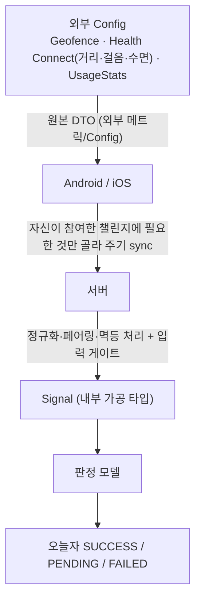

**서버 수집 원칙**

- 서버는 **일단 다 모으는 로직을 유지**한다. 어떤 메트릭이 유효하게 들어올지가 기기·상황마다 다르기 때문이다.
- Android는 **필요한 것만 보낸다**(활성 챌린지·권한 허용된 신호만). 전체 앱·상시 위치 무차별 전송은 금지.
- 좌표 원본을 실시간으로 받는 건 어렵다 → **비동기 처리**로 모았다가 판정한다.

---

## 5. 전체 인증 구조 (유저 관점 플로우)

> **핵심: 생성은 규칙 정의 + 가벼운 권한(팝업) 확보까지, 설정 화면을 거치는 무거운 권한(백그라운드 위치·사용정보 접근)과 멤버 바인딩(앵커·대상앱)만 챌린지 최초 진입으로 미룬다.** 팝업 한 번이면 끝나는 권한은 생성·가입 때 같이 받아 가입을 가볍게 유지하고, 설정 앱을 거쳐야 하거나 직접 골라야 하는 무거운 것만 뒤로 뺀다. 받을 게 없는 method(HEALTH·SLEEP)는 가입 직후 바로 READY.
> 

### 5.1 권한 요청 UX — 설계 의도 (설명란)

권한을 두 등급으로 나눈다.

| 등급 | 정의 | 예시 | 요청 시점 |
| --- | --- | --- | --- |
| **알림형 권한** | 인앱 **팝업 허용 한 번**으로 끝나는 권한 | 알림 · FINE 위치 · 활동인식 · Health Connect | **초기 권한 요청** (가입 시) |
| **입력형 권한·바인딩** | **설정 화면을 거치거나 별도 입력이 필요한** 것 | 백그라운드 위치(설정 딥링크) · 사용정보 접근(설정) · 앵커 등록(지도 핀) · 대상 앱 선택 | **추가 권한 요청** (챌린지 최초 진입 시) |

**왜 입력형 권한을 가입 이후로 미루는가 — 매몰 비용 효과.** 가입 전에 설정 화면까지 요구하면 그 시점에서 이탈한다. 반면 가입을 마치고 팀에 합류한 사용자는 이미 투자한 비용(가입·팀 합류·소셜 노출)이 있어, 챌린지를 시작하기 위한 무거운 권한을 수락할 확률이 훨씬 높다. 따라서:

- **초기 권한 요청**(가입): 팝업으로 끝나는 알림형 권한만 일괄 요청 → 가입 플로우를 가볍게 유지.
- **추가 권한 요청**(최초 진입 = 셋업): 설정 화면 권한 + 멤버 바인딩(앵커·대상 앱)만 요청 → 매몰 비용이 형성된 뒤라 수락률이 높다.
- 받을 게 없는 method(HEALTH·SLEEP)는 가입 직후 바로 READY.

### 권한·바인딩 무게 분류

| 신호 | 가입 시 받는 것 (팝업 권한) | 최초 진입 시 받는 것 (설정 화면 권한) | 최초 진입 시 바인딩 | 최초 진입 셋업 |
| --- | --- | --- | --- | --- |
| **GEOFENCE (GPS)** | 알림 · FINE 위치 · (활동인식) | **BACKGROUND_LOCATION** (설정 딥링크) | 앵커(지도 핀) | 필요 |
| **HEALTH** | 알림 · Health Connect(+bg) | — | — | **불필요 → 가입 직후 READY** |
| **SCREEN_TIME** | 알림 | **PACKAGE_USAGE_STATS** (사용정보 접근 설정) | 대상 앱 | 필요 |
| **WAKE** | 알림 | **PACKAGE_USAGE_STATS** (사용정보 접근 설정) | — | 필요(권한만) |
| **SLEEP** | 알림 · Health Connect(+bg) | — | — | **불필요 → 가입 직후 READY** |

> 셋업 화면이 필요한 조건 = **"설정 화면 권한이 있거나 OR 바인딩이 있거나"**. HEALTH·SLEEP만 둘 다 없어서 가입 직후 READY로 직행한다.
> 

### 플로우차트

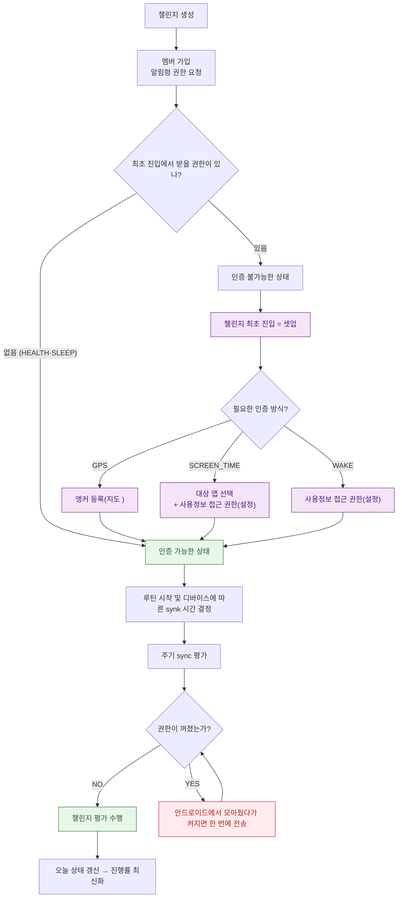

- 플로우차트 용어는 **"초기 권한 요청"(가입) / "추가 권한 요청"(최초 진입)** 두 가지로 통일한다. (구 명칭 "초기 퍼널 권한 요청", "마지막 퍼널 권한" 폐기)
- 셋업 화면 = "내 인증 장소 등록(+백그라운드 위치 권한)" 화면이고, 나중에 "내 위치 수정"으로 동일 컴포넌트를 재사용한다.

---

## 6. 신호 교환 플로우

> 클라이언트 관련 페이지 : [https://app.notion.com/p/38ead4145fb68022aa6ec1077e748e1b?source=copy_link](https://app.notion.com/p/38ead4145fb68022aa6ec1077e748e1b?pvs=21)
> 

## 제어 모델 — client-initiated + server-policy

전송은 **클라이언트가 시작**하고, 주기(cadence)는 **서버 정책**이 관리한다.

- **주기는 서버가 기기 정보로 결정한다.** 로그인 시 클라가 기기 정보(sdkInt·model·lowRam·appVersion·배터리 최적화 상태)을 올리면, 서버가 기기 스펙에 맞는 synk 계산 시간을 내려준다(기본 30분, 취약 기기는 완화된 주기, 좋은 기기는 짧은 주기). 클라는 **내려받은 값 그대로** WorkManager 주기를 설정한다 — 주기의 결정 주체는 항상 서버, 실행 주체는 항상 클라.
- **settings 재수신 주기 = 토큰 갱신 주기(1주).** 리프레시 토큰 갱신 시점에 기기정보를 재전송하고 settings를 재수신한다. 앱 업데이트·OS 업그레이드로 기기 특성이 바뀌어도 최대 1주 안에 정책이 따라온다.
- **버퍼가 진실의 원천, 전송은 단순 배치.** sync **성공 시 버퍼를 플러시**하고, **실패(오프라인·서버 오류) 시 버퍼에 누적**했다가 다음 성공 시 **누적분을 리스트 형태로 일괄 전송**한다. 서버는 멱등이 있으므로 재전송이 중복 판정을 만들지 않는다.
- **권한이 없어도 sync는 보낸다.** 보낼 신호가 없으면 빈 `signals[]` 대신 `gaps[]`에 **"데이터 없음 + 사유"**(`PERMISSION_MISSING` 등)를 담아 전송한다. 서버가 "신호가 안 온 것"과 "권한이 없어 못 보낸 것"을 구분해야 실패 사유를 올바르게 확정할 수 있기 때문이다(§8.6).

흐름: **서버 정책(기기별 주기) → (연결/전원 off면 FCM으로 클라 기동) → 클라가 버퍼 누적분을 list로 일괄 전송 → 서버가 한 번에 수신·처리.**

## 플로우

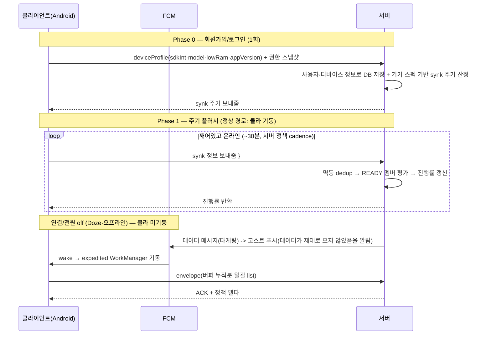

## 서버가 sync 1회에 받는 데이터

활성 챌린지의 **권한 허용된 신호만** 골라 들어온다. envelope 1건 구조:

**공통 envelope**`deviceTimeMillis`, `elapsedRealtimeMillis`, `bootSessionId`, `timeZone`(하루 경계 귀속), `activeChallengeIds[]`, `permissions`(신호별 권한 현황), `integrity.token`, `network.vpnActive`, `gaps[]`, `signals[]`

**signals[] — 신호별 페이로드**

| 신호 | 인증 방식 | 서버가 받는 필드 |
| --- | --- | --- |
| **GEOFENCE** (GPS PRESENCE) | 헬스장 갔다 / 술집 안 갔다 | `anchorId`, `transition`(ENTER=1·EXIT=2·DWELL=4), `observedAt`(triggeringLocation.time 우선), `observedElapsedMillis`, `accuracy`(m), `isMock` |
| **SCREEN_TIME** | 앱 사용 MIN/MAX | 대상 앱 이벤트 시퀀스 `RESUMED(1)` / `PAUSED(2)` / `STOPPED(23)` + ts (RESUMED→PAUSED 페어링은 서버, STOPPED는 PAUSED 누락 fallback) |
| **WAKE** | 일찍 일어났다 | `firstUnlock`=KEYGUARD_HIDDEN(18, 우선) / `firstScreenOn`=SCREEN_INTERACTIVE(15, 폴백) + `deviceSecure` |
| **HEALTH** (거리·걸음) | 러닝·걷기 | `type` / `metric` / `readings[]` (각 `value`·`startTime`·`endTime`·`recordingMethod`·`originPackage`·`recordId`). 클라는 MANUAL만 drop, 화이트리스트·dedup·합산은 서버 |

**gaps[]** — 신호 공백 사유. 각 항목 `signalType`·`reason`·`fromMillis`·`toMillis`·`recoverable`. 서버는 신호 부재를 NO_SIGNAL로 처리하기 전 이 사유를 본다.

## 서버 처리 (한 번에)

1. **멱등 dedup** — `recordId`(HC) 우선, 없으면 `(challengeId, signalType, observedAt)` 조합.
2. **입력 게이트** — isMock·VPN·MANUAL·비화이트리스트 origin·accuracy 이상값 필터링.
3. **정규화·페어링** — 외부 메트릭 → Signal. RESUMED↔PAUSED(STOPPED 보정) 페어링, HEALTH 화이트리스트·합산.
4. **평가** — `setup_status=READY` 멤버만 오늘자 자동 인증 증분 판정 (PENDING_SETUP은 skip).
5. **응답** — 진행률 갱신 후 ACK + 정책 델타(`nextSyncAfterSec`·커서). 바뀐 게 없으면 정책 델타 생략.

## 7. 인증 방식별 유저 플로우 (각 메트릭 설명)

> 유저가 무엇을 하고 → 서버가 어떤 메트릭을 받아 → 어떻게 판단하는가 순서로 기술한다.
> 

### 7.0 한눈에 보는 매핑

| 유저가 하는 루틴 | 인증 방식 | 서버가 받는 메트릭(Signal) | polarity |
| --- | --- | --- | --- |
| 헬스장·도서관·카페에 갔다 | GPS PRESENCE | `GEOFENCE` (ENTER/EXIT/DWELL) | 도달형 |
| 특정 장소(술집 등)를 안 갔다 | GPS PRESENCE (AVOID) | `GEOFENCE` | 제약형 |
| 특정 앱을 얼마 이상/이하 썼다 | SCREEN_TIME (MIN/MAX) | `SCREEN_TIME.usageEvents` | 도달형/제약형 |
| 폰 들고 얼마나 움직였다(러닝·걷기) | HEALTH | `HEALTH.readings` + origin | 도달형 |
| 일찍 일어났다 | WAKE | `SCREEN_TIME.screenEvents` (첫 UNLOCK) | 도달형 |
| 제때 자고 충분히 잤다 | SLEEP | `SLEEP.sessions` | 도달형 |
| "아무 데서나 운동했다" 등 복합 행동 | — (자동 불가) | — | 수동 |

---

### 7.1 특정 위치에서의 상태 변화 판정 모델 — GPS PRESENCE

**유저 플로우**

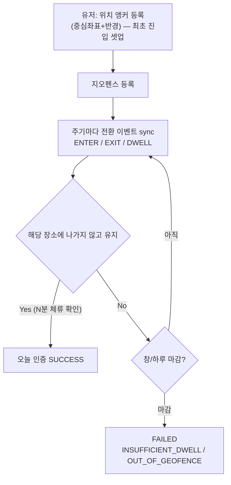

- **ENTER**: 유저가 인증 반경 안으로 처음 들어왔을 때
- **EXIT**: 유저가 반경 밖으로 나갔을 때
- **DWELL**: 반경 안에서 일정 시간 이상 머물렀을 때

> **권한 타이밍**: FINE 위치는 가입 시 팝업으로 확보, **백그라운드 위치 권한은 앵커 등록 화면(최초 진입)에서 rationale과 함께 받는다**(설정 딥링크). 안드로이드는 FINE 허용 후에야 백그라운드 위치를 요청할 수 있으므로 가입(FINE) → 최초 진입(백그라운드) 순서가 자연스럽고, Play의 점진 요청 가이드(§8.3 심사)와도 맞다.
> 
- **1. 유저가 자신의 챌린지에 대한 앵커를 등록한다.**
    - *앵커란?* 인증 기준이 되는 **장소(중심좌표 + 반경)**. "강남 OO짐(80m)"처럼 핀 하나가 하나의 앵커.
    - 같은 챌린지라도 사람마다 다니는 헬스장이 다르므로, 앵커는 챌린지가 아니라 **멤버 본인에게 붙는다(PER_MEMBER)** → 헬스장을 옮기거나 특수하게 다른 헬스장에서 진행하는 경우 직접 수정한다.
    - MVP는 유저가 지도에서 직접 등록하는 방식만 지원한다. (위치 기반 자동 수집은 Phase 2)
- **2. 서버는 30분마다 메트릭을 보고받고 있다.**
    - 받는 메트릭 = 지오펜스 전환 이벤트(`GEOFENCE`): 등록한 앵커에 대해 OS가 발화하는 ENTER / EXIT / DWELL.
    - 좌표 원본이 아니라 "들어왔다/나갔다/N분 머물렀다"는 전환 이벤트만 받는다 → 비용·대역폭·위치정보 노출을 동시에 줄임.
- **3. 메트릭으로 "앵커에 충분히 머물렀다"가 판단되면 인증한다.**
    - 판단 알고리즘: Android Geofencing의 **DWELL 전환을 주신호로** 쓴다. OS가 `setLoiteringDelay`(예 60분) 동안 반경 안 체류를 직접 확인한 뒤 DWELL을 발화 → 그게 오면 곧바로 충족.
    - 그냥 스쳐 지나가면 ENTER만 오고 DWELL은 안 오므로 인증되지 않는다(오탐 방어).
- **판정 구조 알고리즘: OS Geofencing DWELL(주경로) + 정확도 가중 체류(fallback)**
    
    OS가 직접 발화한 DWELL을 1순위로 믿되, DWELL이 안 오거나 못 믿을 때만 보조 좌표로 체류를 추정한다.
    
    - **1순위 — DWELL 트랜지션 (주경로)**: OS가 `setLoiteringDelay`(= 목표 체류분) 동안 반경 안 체류를 확인한 뒤 발화한 DWELL이 평가창/하루 안에 들어오면 곧바로 충족. 체류 시맨틱을 OS가 네이티브 판정하므로 가장 정밀하고 배터리도 유리.
    - **2순위 — ENTER/EXIT 페어 합산 (DWELL 누락 시)**: DWELL이 없으면 ENTER → EXIT 페어로 체류 구간을 잘라 합산. 합산 체류 ≥ `dwellMinutes`면 충족. 미완 페어 보정 — EXIT 없는 ENTER → 창/하루 끝을 implicit EXIT로 간주, 등록 전부터 안에 있었으면 등록시각(또는 첫 DWELL)을 implicit ENTER로 간주.
    - **3순위 — 정확도 가중 체류 추정 (fallback)**: 트랜지션이 아예 비거나 신뢰할 수 없을 때만 진입. 보조로 받아둔 좌표 샘플에 GPS 정확도 기반 가중치(부정확한 점일수록 낮게)를 줘서 "안에 있을 확률"로 체류시간을 추정 → 목표 이상이면 충족. 정밀 보정 수학은 Phase 2.
    
    > Doze·배터리 최적화에서 트랜지션이 지연·배칭·누락될 수 있어 2·3순위가 필요하다. 주경로는 어디까지나 DWELL이다.
    > 
- **GPS 정확도 정밀 보정 (Phase 2)**
    
    위 3순위 fallback에서 좌표를 쓸 때, 못 믿을 좌표를 먼저 걸러내는 정제 로직.
    
    - 정확도 필터: accuracy(추정 오차 반경)가 임계값보다 큰 점은 버린다.
    - 속도-정확도 이상치 필터: 연속 두 점의 물리 속도 v를 구해 v × accuracy > Threshold면 이상치로 버린다. (빠르게 점프 + 그 좌표마저 부정확 = 진짜 이동이 아니라 신호 튐)
    - DISTANCE 커스텀 세션: 제거된 빈 구간을 양옆 정상 점으로 정확도 가중 선형 보간 → 연속 두 점 haversine 누적으로 거리 계산.
    - WiFi 앵커 보정·임계값 Bayesian 튜닝도 고려. MVP는 보수적 기본 임계값으로 시작하고, 실데이터가 쌓이면 튜닝한다.

---

### 7.2 특정 위치에 변화를 측정하는 판정 모델 — HEALTH (Health Connect)

**유저 플로우**

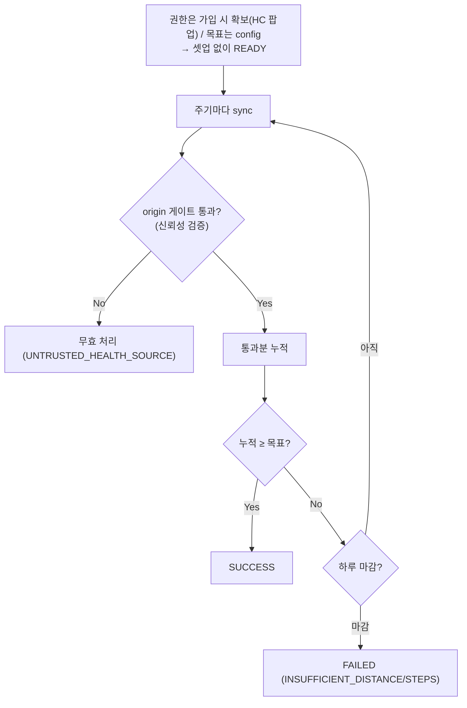

**1. 권한은 가입 시 Health Connect 팝업으로 확보되고, 거리/걸음 목표는 챌린지 config에 이미 있다.** → 멤버가 셋업에서 따로 고를 바인딩이 없어 **가입 직후 READY**.

- **2. 서버는 30분마다 Health Connect가 읽은 결과값(`HEALTH.readings`: distance/steps + origin 메타데이터)을 받는다.**
    - 원시 GPS 트랙이 아니라 **결과값만** 받는다 → "좌표 안 들고 있기" 원칙과 일관. 트레드밀(실내)도 커버.
- **3. 누적값이 목표 이상이면 인증.** 단, Health Connect는 아무 앱이나 값을 써넣을 수 있어 그 자체론 못 믿는다. → **메타데이터 게이트**로 캐주얼 어뷰징 차단:
    - `recordingMethod == MANUAL` → 거부(손입력)
    - `dataOrigin` 화이트리스트(삼성헬스·구글핏 등 신뢰 writer만) → 이외의 앱 거부

---

### 7.3 스크린타임 판정 모델 — SCREEN_TIME

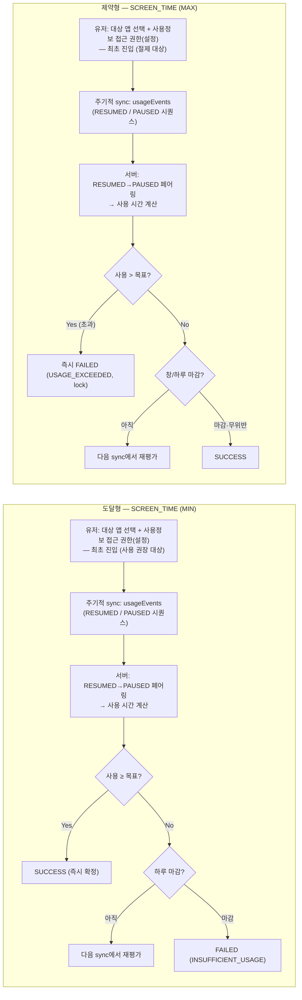

**1. 유저가 대상 앱(사용 권장 또는 절제 대상)을 고르고, 사용정보 접근 권한을 설정 화면에서 grant한다(최초 진입).** 대상 앱 선택이 바인딩, 권한이 설정 화면 권한이라 둘 다 최초 진입 셋업에 묶인다.

**2. 서버는 30분마다 앱 사용 이벤트 시퀀스(`usageEvents`: RESUMED/PAUSED)를 받는다.**

- 일 누적 단일값은 기기·버전 오차가 커서 금지. **RESUMED → PAUSED 페어링은 서버가** 하여 사용 시간을 계산.

**3. 목표와 비교:**

- **MIN(도달형)**: 사용 ≥ 목표면 충족 (예: 공부앱 30분↑)
- **MAX(제약형)**: 사용 ≤ 목표면 충족, 초과 시 즉시 FAILED (예: 쇼핑앱 30분↓, 폰 금지 창)

---

### 7.4 기상 판정 모델 — WAKE

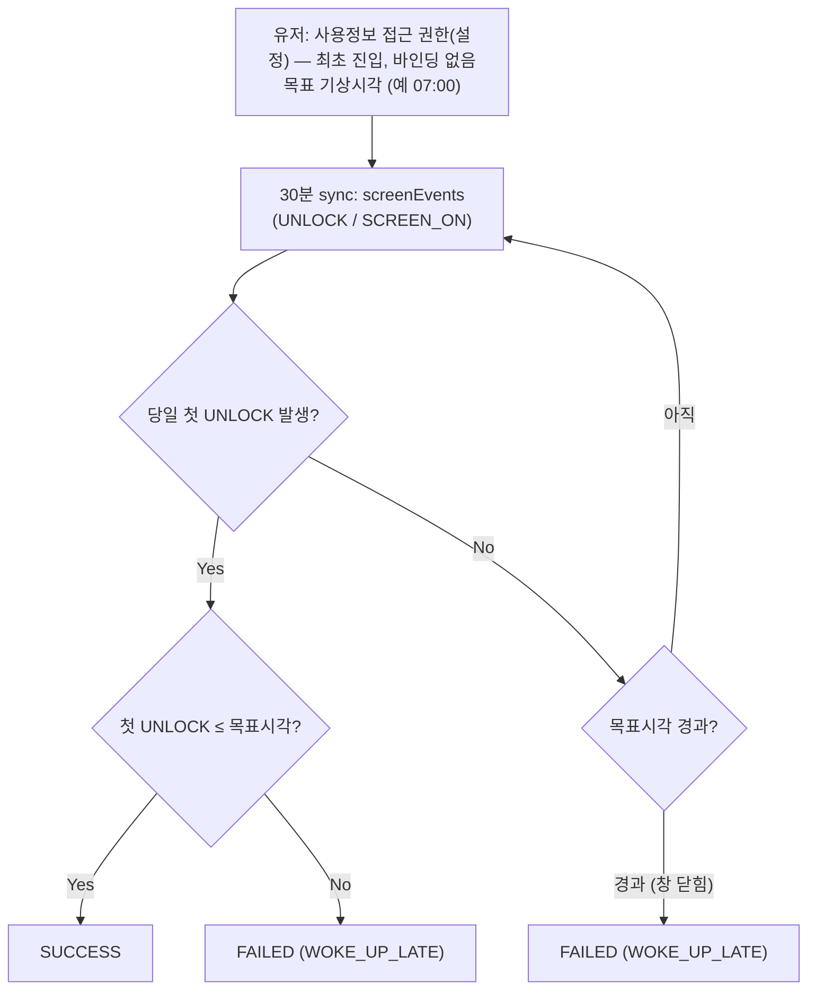

- **WAKE**: 당일 첫 잠금해제(UNLOCK) 시각이 목표시각 이전이면 충족. 메트릭은 `screenEvents`. 자정이 아니라 **목표시각(예 07:00)에 창이 닫힌다** → 그때까지 UNLOCK 없으면 그 순간 FAILED(`WOKE_UP_LATE`).
- **권한 타이밍**: WAKE는 바인딩(고를 것)은 없지만 UsageStats(`PACKAGE_USAGE_STATS`, 사용정보 접근)가 필요해 **설정 화면 권한이라 최초 진입에서 받는다.** "바인딩은 없지만 무거운 권한이 있어서 셋업이 필요한" 케이스.
- **종속 창 (windowAnchor)** → "기상 후 1h 폰 금지"처럼 기준 시점이 명확하지 않은 경우. 평가창의 시작이 다른 방식의 결과에 종속될 때 쓴다.
    - 대표 사례 = "기상(WAKE) 후 1시간 동안 폰 금지(SCREEN_TIME)"
    - 설정 형태: `{ "base": "WAKE", "offsetMin": 60, "durationMin": 60 }`
    - 평가 순서: 같은 sync 안에서 base(WAKE)를 먼저 평가해 `firstUnlockAt`을 구한 뒤, 그 시각 + offset부터 duration만큼을 SCREEN_TIME 평가창으로 잡는다.
    - WAKE가 그 챌린지의 pass/fail 기준이 아니라 **창 시작 시각만 제공**하는 용도면, WAKE 자체는 daily status에 반영하지 않고 `firstUnlockAt`만 산출(anchorOnly).
    - 일반 표현식 파서는 만들지 않는다 — 정해진 base 목록으로만 해석.
    - windowAnchor는 GPS 전용이 아니라 **method 공통 필드**다. 대표 케이스가 SCREEN_TIME이라 SCREEN_TIME config에도 자리를 둔다.

---

### 7.5 수면 판정 모델 — SLEEP

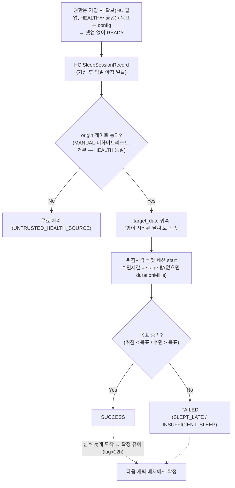

- **SLEEP**: Health Connect의 `SleepSessionRecord`를 기상 후 익일 아침 일괄로 받는다(세션당 페이로드 = `SLEEP.sessions`). 취침시각/수면시간을 목표와 비교. 자정을 가로지르므로 **"밤이 시작된 날짜"에 귀속**하고, 신호가 늦게 오므로 확정도 늦춘다(§7.1-A 확정 유예).
- **권한·게이트**: SLEEP은 **HEALTH와 HC 권한(`READ_SLEEP`+bg)·origin 게이트·`record.id` dedup을 공유**한다. 바인딩(고를 것)이 없고 권한도 HC 팝업이라 **HEALTH와 동일하게 가입 직후 READY.** 셋업 화면 불필요. MANUAL·비화이트리스트 origin은 HEALTH와 같은 기준으로 거른다.
- **수면시간 산출**: stage가 있으면 AWAKE·AWAKE_IN_BED·OUT_OF_BED 제외 합, 없으면 세션 `durationMillis`. 취침시각 = 세션 start. (필드 계약 상세는 FE 전송 스펙 §5 단일 출처.)

---

## 8. 판정 모델 (Judgment Model)

### 8.1 도달형 vs 제약형 (polarity)

| polarity | 의미 | 조기 확정 | 창 닫힐 때 | 쓰는 메트릭 |
| --- | --- | --- | --- | --- |
| **도달형 (ACHIEVEMENT)** | 목표를 달성해야 함 (출석·운동·기상·수면) | 충족 즉시 SUCCESS | 미충족 → FAILED | GEOFENCE(VISIT) · HEALTH · SCREEN_TIME(MIN) · WAKE · SLEEP |
| **제약형 (CONSTRAINT)** | 위반을 회피해야 함 (장소 회피·앱 절제) | 위반 즉시 FAILED | 무위반 → SUCCESS | GEOFENCE(AVOID) · SCREEN_TIME(MAX) |

polarity는 규칙(config)에서 결정된다: `SCREEN_TIME MIN→도달 / MAX→제약`, `GPS VISIT→도달 / AVOID→제약`, `HEALTH·WAKE·SLEEP→도달`.

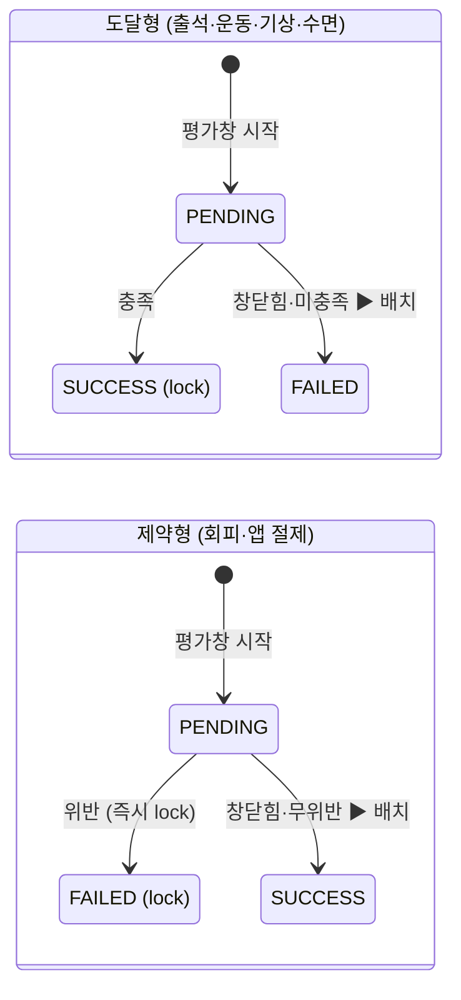

- **A. 확정 유예 — 늦게 오는 신호 (maxSignalLagHours)**
    - 확정(잠금)은 **창 닫힘 + lag 시점**에 한다. 배치가 `finalizeAfter < now`인 PENDING을 폴링해 잠근다.
    - lag 안에서는 PENDING 유지 → 늦게 온 유효 신호가 **PENDING → SUCCESS로 정정** 가능.
    - 단 **FAILED → SUCCESS 역전은 금지**. 그래서 늦는 신호 method는 잠그기 전까지 FAILED가 아니라 PENDING으로 둔다.
    - lag 값: GPS·SCREEN_TIME·WAKE·HEALTH ≈ 12h(다음 새벽 확정), SLEEP ≈ 12h(익일 아침 일괄).
- **B. 다중 인증방식 결합 (methodCombine)**
    - MVP는 챌린지당 단일 method. 다중 도입 시 config 최상위 `methodCombine`(AND/OR) 사용(스키마에 자리만 잡아둠).
    - **AND (기본)**: 그날 모든 필수 method 충족 시 SUCCESS. 하나라도 미충족/위반이면 FAILED.
    - **OR**: 하나라도 충족되면 SUCCESS.
    - 확정 타이밍은 결합 결과에서 **가장 늦은 창/lag**를 따른다(AND면 모든 method 창이 닫혀야 확정).

### 8.2 하루 판정 = 0 or 100

- 하루 단위 판정은 **이진**(SUCCESS=100% / 아니면 0%). 진행률만 연속값 = 성공 확정일 ÷ 대상일.
- 스케줄 두 종류:
    - **고정요일(FIXED_DAYS)**: 정해진 요일만 대상일
    - **빈도(FREQUENCY)**: "주 N회"처럼 주기당 횟수. 모든 날이 수행 가능하고, 주기 마감 시 부족분을 실패로 집계.
- **A. 타임존 & 하루 경계**
    - 모든 일 단위 판정은 사용자 로컬(MVP=KST 고정) **자정 기준**.
    - 신호의 `observedAt`(UTC)을 KST로 변환해 `target_date`에 귀속한다.
    - **"귀속(target_date)"과 "확정(잠금)"은 다르다** — 귀속은 어느 날의 결과인지, 확정은 언제 잠그는지.
    - 수면은 자정을 가로지르므로 "밤이 시작된 날짜"에 귀속.
- **B. 빈도형(FREQUENCY) 롤오버**
    - 모든 날이 수행 가능(eligible). 수행하면 주기 카운트 +1.
    - 오늘 상태: SUCCESS(수행) / PENDING(미수행·주기 미달) / NOT_REQUIRED(횟수 채움). 빈도형은 개별 day에 FAILED를 찍지 않는다.
    - 주기 마감: `completed < N`이면 미달 → 부족분을 `fail_days += (N − completed)`로 집계, 다음 주기로 롤오버(카운트 0 리셋).
    - 진행률 = 총 SUCCESS 일수 / (N × 주기수), 상한 100.

### 8.3 판정 모델별 명세

#### 요약 테이블

| 판정 모델 | polarity | 사용 Signal | 핵심 소비 필드 | 조기 확정 | 창 닫힘 | 실패 사유 | lag |
| --- | --- | --- | --- | --- | --- | --- | --- |
| 위치 상태 변화 (VISIT) | 도달형 | `GEOFENCE` | `anchorId` `transition` `observedAt` `accuracy` `isMock` | 체류 충족 → SUCCESS | 미충족 → FAILED | `INSUFFICIENT_DWELL` | ≈12h |
| 위치 상태 변화 (AVOID) | 제약형 | `GEOFENCE` | `anchorId` `transition`(ENTER) `observedAt` | 위반 → 즉시 FAILED | 무위반 → SUCCESS | `ENTERED_FORBIDDEN_ZONE` | ≈12h |
| 이동 거리 | 도달형 | `HEALTH` | `metric` `readings[]` `recordingMethod` `originPackage` `recordId` | 누적 ≥ 목표 → SUCCESS | 미달 → FAILED | `INSUFFICIENT_DISTANCE/STEPS` `UNTRUSTED_HEALTH_SOURCE` | ≈12h |
| 스크린 타임 (MIN) | 도달형 | `SCREEN_TIME.usageEvents` | `RESUMED/PAUSED/STOPPED` + ts | 사용 ≥ 목표 → SUCCESS | 미달 → FAILED | `INSUFFICIENT_USAGE` | ≈12h |
| 스크린 타임 (MAX) | 제약형 | `SCREEN_TIME.usageEvents` | 동일 + `windowAnchor` | 초과 → 즉시 FAILED | 무위반 → SUCCESS | `USAGE_EXCEEDED` | ≈12h |
| 기상 | 도달형 | `SCREEN_TIME.screenEvents` (+`HEALTH` 보조 검토) | `firstUnlock` `firstScreenOn` `deviceSecure` (+걸음 첫 `startTime`) | 목표시각 前 신호 → SUCCESS | 목표시각 경과 → FAILED | `WOKE_UP_LATE` | ≈12h |
| 수면 ⚠️ | 도달형 | `SLEEP.sessions` | `start` `stages[]` `durationMillis` + origin 메타 | — (익일 일괄) | 미충족 → FAILED | `SLEPT_LATE` `INSUFFICIENT_SLEEP` | ≈12h(익일 아침) |

---

#### 8.3.1 위치 상태 변화 판정 모델 (GPS PRESENCE)

- **A. VISIT — 도달형**
    - **사용 시그널**: `GEOFENCE` — `anchorId`(멤버 앵커 식별), `transition`(ENTER=1·EXIT=2·DWELL=4), `observedAt`, `observedElapsedMillis`, `accuracy`, `isMock`.
    - **config**: `anchorId`(PER_MEMBER 바인딩), `radiusMeters`, `dwellMinutes`(= OS `setLoiteringDelay`), `windowAnchor`(옵션).
    - **판정 알고리즘 — 3순위 구조**:
        1. **DWELL 트랜지션 (주경로)**: OS가 `setLoiteringDelay`(= 목표 체류분) 동안 반경 안 체류를 확인한 뒤 발화한 DWELL이 평가창/하루 안에 들어오면 곧바로 충족. 체류 시맨틱을 OS가 네이티브 판정하므로 가장 정밀하고 배터리도 유리. 스쳐 지나가면 ENTER만 오고 DWELL은 안 오므로 오탐 방어.
        2. **ENTER/EXIT 페어 합산 (DWELL 누락 시)**: ENTER→EXIT 페어로 체류 구간을 잘라 합산. 합산 체류 ≥ `dwellMinutes`면 충족. 미완 페어 보정 — EXIT 없는 ENTER는 창/하루 끝을 implicit EXIT로, 등록 전부터 안에 있었으면 등록시각(또는 첫 DWELL)을 implicit ENTER로 간주. **열린 구간(open interval)도 합산에 포함**한다(INSUFFICIENT_DWELL 버그 재발 방지).
        3. **정확도 가중 체류 추정 (fallback)**: 트랜지션이 아예 비거나 신뢰할 수 없을 때만. 보조 좌표 샘플에 정확도 기반 가중치를 줘 "안에 있을 확률"로 체류시간을 추정. 정밀 보정 수학(보간·Bayesian 튜닝·WiFi 앵커)은 Phase 2.
    - **이상값 필터**: §8.2의 Mock·VPN·정확도·속도-정확도 게이트 전부 적용.
    - **확정**: 체류 충족 즉시 SUCCESS(lock). 창 닫힘+lag까지 미충족이면 FAILED(`INSUFFICIENT_DWELL`).
- **B. AVOID — 제약형** ⚠️ 신규 명세
    - **사용 시그널**: `GEOFENCE` — 같은 페이로드에서 **ENTER 이벤트만 소비**한다. DWELL·EXIT는 위반 판정에 쓰지 않는다.
    - **config**: `anchorId`(회피 대상 장소), `radiusMeters`, `graceSeconds`(스침 허용, 아래), `windowAnchor`(옵션 — "밤 10시 이후 술집 금지" 등).
    - **판정 알고리즘**: 평가창 내 유효한 ENTER 발생 → 위반 → **즉시 FAILED(lock)**. 창 닫힘까지 무위반이면 SUCCESS.
    - **결스침(pass-by) 처리**: 제약형은 즉시 FAILED가 잠기므로 오탐 비용이 크다. 두 안 중 택일:
        - **(ENTER 후 `graceSeconds`(예 10m) 내 EXIT면 무위반** — ENTER+EXIT 페어를 봐야 해서 판정이 한 sync 늦지만 오탐이 줄어듦.
    - **이상값 필터**: VISIT과 동일 + 위반 확정 전 `accuracy > radiusMeters`인 ENTER는 근거 부족으로 폐기(반경보다 오차가 크면 "들어갔다"고 단정 불가).
    - **확정**: 위반 즉시 FAILED(`ENTERED_FORBIDDEN_ZONE`, lock). 창 닫힘+lag 무위반 → SUCCESS
- 8.3.2 이동 거리 판정 모델 (HEALTH)
    - **사용 시그널**: `HEALTH` — `type`/`metric`(DISTANCE·STEPS), `readings[]`(각 `value`·`startTime`·`endTime`·`recordingMethod`·`originPackage`·`recordId`). 클라는 MANUAL만 drop, 화이트리스트·dedup·합산은 서버.
    - **config**: `metric`(DISTANCE | STEPS), `targetValue`(km 또는 걸음수), `windowAnchor`(옵션).
    - **판정 알고리즘**: 게이트 통과분의 `value`를 target_date 기준 누적. `누적 ≥ targetValue` → 충족. 겹치는 구간(`startTime`~`endTime` overlap)은 dedup 후 합산해 이중 집계 방지.
    - **이상값 필터**: 오리진 게이트 2종(MANUAL 거부·화이트리스트) 필수 — Health Connect는 아무 앱이나 값을 써넣을 수 있어 그 자체론 못 믿는다. 걸러진 값은 `UNTRUSTED_HEALTH_SOURCE`로 기록.
    - **확정**: 누적 충족 즉시 SUCCESS(lock). 창 닫힘+lag 미달 → FAILED(`INSUFFICIENT_DISTANCE` / `INSUFFICIENT_STEPS`).
- 8.3.3 스크린 타임 판정 모델 (SCREEN_TIME)
    - **사용 시그널**: `SCREEN_TIME.usageEvents` — 대상 앱의 `RESUMED(1)` / `PAUSED(2)` / `STOPPED(23)` 이벤트 + ts. 일 누적 단일값은 기기·버전 오차가 커서 금지, **페어링은 서버가** 한다(STOPPED는 PAUSED 누락 fallback).
    - **config**: `targetPackages[]`(바인딩), `mode`(MIN | MAX), `targetMinutes`, `windowAnchor`(옵션 — 종속 창의 대표 사용처).
    - **판정 알고리즘**: RESUMED→PAUSED(STOPPED 보정) 페어링으로 세션 길이를 구해 평가창 내 합산.
        - **MIN (도달형)**: 합산 ≥ `targetMinutes` → 충족 즉시 SUCCESS. 창 닫힘 미달 → FAILED(`INSUFFICIENT_USAGE`).
        - **MAX (제약형)**: 합산 > `targetMinutes` → **즉시 FAILED**(`USAGE_EXCEEDED`, lock). 창 닫힘 무위반 → SUCCESS.
    - **종속 창 (windowAnchor)** — "기상 후 1h 폰 금지"처럼 평가창 시작이 다른 모델의 결과에 종속될 때. 설정 형태 `{ "base": "WAKE", "offsetMin": 60, "durationMin": 60 }`. 같은 sync 안에서 base(WAKE)를 먼저 평가해 `firstUnlockAt`을 구한 뒤 그 시각+offset부터 duration만큼을 평가창으로 잡는다. base가 pass/fail 기준이 아니라 창 시작만 제공하면 daily status에 반영하지 않고 시각만 산출(anchorOnly). 일반 표현식 파서는 만들지 않는다 — 정해진 base 목록으로만 해석. windowAnchor는 method 공통 필드다.
    - **이상값 필터**: 페어링 불능 이벤트(PAUSED만 단독 등)는 폐기. 미래 ts·부트 이전 ts는 `elapsedRealtimeMillis`/`bootSessionId`로 검증 후 폐기.
- 8.3.4 기상 판정 모델 (WAKE)
    - **주 시그널**: `SCREEN_TIME.screenEvents` — `firstUnlock`(KEYGUARD_HIDDEN=18, 우선) / `firstScreenOn`(SCREEN_INTERACTIVE=15, 폴백) + `deviceSecure`.
    - **config**: `targetWakeTime`(예 07:00). **창은 자정이 아니라 목표시각에 닫힌다.**
    - **판정 알고리즘**: 당일 첫 unlock(폴백: 첫 screen-on) 시각 ≤ `targetWakeTime` → SUCCESS. 목표시각 경과까지 신호 없으면 그 순간 FAILED(`WOKE_UP_LATE`).
    - **한계와 보조 시그널 (검토안)** — "어떤 앱을 썼다/화면을 켰다"만으로 기상을 판단하기엔 정확도가 엄격하지 않다:
        - 위양성: 알람 끄려고 unlock 후 다시 잠듦 → 실제로는 못 일어났는데 SUCCESS.
        - 위음성: 일어나서 폰을 안 봄(운동·샤워 먼저) → 실제로는 일어났는데 FAILED.
        - **보조안: Health Connect 걸음(StepsRecord) 첫 기록 시각 쿼리.** 당일 걸음 카운트가 동작하기 시작한 첫 record의 `startTime`을 기상 근사치로 쓴다 — "걸었다"는 "화면을 봤다"보다 기상의 물리적 증거에 가깝다.
        - **결합 방식(제안)**: `min(firstUnlock, firstStepsStart) ≤ targetWakeTime` 이면 충족 (OR 결합) — 위음성을 줄이는 방향. 위양성(알람 끄고 재취침)까지 잡으려면 "unlock 이후 N분 내 걸음 발생" AND 조건이 필요하지만 복잡도가 커서 Phase 2 검토.
        - **결정 필요**: **주 시그널(firstUnlock) 단독으로 출시하고, 보조 시그널은 스키마에 자리만 잡아둔 뒤 실데이터로 위음성 비율 확인 후 도입.**
    - **이상값 필터**: `deviceSecure == false`(잠금 미설정 기기)면 KEYGUARD_HIDDEN 신뢰도가 낮음 → screen-on 폴백 사용을 명시 기록. 보조 시그널 채택 시 HC 오리진 게이트 적용.
- 8.3.5 수면 판정 모델 (SLEEP)
    - **사용 시그널**: `SLEEP.sessions` — HC `SleepSessionRecord` 세션당 `start`(취침시각), `end`, `stages[]`, `durationMillis`, origin 메타(`recordingMethod`·`originPackage`·`record.id`). 기상 후 **익일 아침 일괄** 수신.
    - **config**: `targetBedtime`(취침 목표) 및/또는 `targetSleepMinutes`(수면량 목표).
    - **판정 알고리즘**:
        - 취침시각 = 첫 세션 `start`. 수면시간 = stage 합(AWAKE·AWAKE_IN_BED·OUT_OF_BED 제외), stage 없으면 `durationMillis`.
        - 자정을 가로지르므로 **"밤이 시작된 날짜"에 귀속**.
        - `취침 ≤ targetBedtime` / `수면 ≥ targetSleepMinutes` 충족 여부 판정. 미충족 → FAILED(`SLEPT_LATE` / `INSUFFICIENT_SLEEP`).
    - **이상값 필터**: HEALTH와 동일한 오리진 게이트(MANUAL 거부·화이트리스트)·`record.id` dedup 공유.
    - **확정**: 신호가 익일 아침에 오므로 조기 확정 없음. lag ≈ 12h — 다음 새벽 배치에서 확정.
    - **(a) SLEEP을 MVP에 유지** → 전송 스펙 §5에 `READ_SLEEP` + `SLEEP.sessions` 페이로드 추가 (Android 작업 발생).
- 8.4 평가 구조 — 스테이트리스 우선 (상태 테이블 최소화)
    
    **원칙: 하루 상태를 "미리 저장"하지 않고, 조회 시점에 원본 신호 + config로 실시간 계산한다.** 상태 테이블(일자별 PENDING row 사전 생성 등)은 상태 전이 버그·정정 로직 복잡도의 근원이므로 최소화한다.
    
    **저장하는 것 (write는 3종뿐)**
    
    1. **원본 Signal** — 멱등 dedup·입력 게이트 통과 후의 신호 레코드 (게이트 탈락분도 플래그와 함께 보존).
    2. **확정 레코드 (불변)** — lock이 걸리는 순간에만 쓴다:
        - 도달형 조기 SUCCESS / 제약형 즉시 FAILED (역전 불가이므로 즉시 lock 가능)
        - 창 닫힘 + lag 경과 후 새벽 배치가 잠그는 최종 SUCCESS/FAILED
    3. **수동 인증 제출·승인 레코드** (§10).
    
    **저장하지 않는 것**
    
    - 일자별 PENDING row 사전 생성 (없음 = PENDING으로 해석)
    - sync마다 갱신되는 "오늘 진행중 상태" mutable row
    - 빈도형 주기 카운터 스냅샷 (조회 시 SUCCESS 확정 레코드를 세면 됨)
    
    **조회 시 평가 (progress API·verification API 공통)**
    
    ```
    status(member, date) =  확정 레코드 있음        → 그 값 (불변)  없음 & date가 대상일    → 원본 신호 + config로 §8.3 알고리즘 실행                             → 충족이면 SUCCESS(+ 이때 확정 레코드 write)                             → 위반이면 FAILED(+ write)                             → 아니면 PENDING (아무것도 쓰지 않음)  없음 & 비대상일         → NOT_REQUIRED
    ```
    
    **이 구조의 효과**
    
    - "셋업 전 FAILED" 류 버그 원천 차단 — row가 없으니 잘못된 상태가 존재할 수 없다.
    - **늦게 온 신호의 정정이 공짜** — PENDING은 저장된 상태가 아니라 계산 결과이므로, 늦은 신호가 들어오면 다음 조회에서 자연히 SUCCESS로 계산된다. "PENDING→SUCCESS 정정 로직"이 별도로 필요 없다.
    - **FAILED→SUCCESS 역전 금지가 구조적으로 보장** — FAILED는 확정 레코드(불변)로만 존재하므로 역전 자체가 불가능하다. 그래서 늦는 신호 method는 잠그기 전까지 FAILED를 쓰지 않고 PENDING(= 미기록)으로 둔다.
    - 새벽 배치의 역할 축소: "`finalizeAfter < now`인 미확정 대상일을 계산해 확정 레코드로 잠근다" 하나로 단순화.
    
    **성능 노트**: 조회 시 계산 비용은 (멤버 × 오늘 신호 수) 수준으로 작다. 홈 진행률 일괄 조회가 무거워지면 확정 레코드 집계(과거) + 오늘만 실시간 계산으로 분리하면 된다 — 과거는 전부 불변이라 집계 캐시(Caffeine)가 안전하다.
    
- 8.5 신호/권한 부재일 처리
    - 창 닫힘 + lag까지 필수 신호 미수신 → FAILED로 확정하되, **gaps[] 사유로 구분 기록**:
        - `NO_SIGNAL_RECEIVED` — 권한은 있는데 신호가 안 옴(일시적 먹통 등)
        - `PERMISSION_MISSING` — 권한 자체가 없음 (클라가 gaps[]로 사유를 보내줬으므로 서버가 확실히 구분 가능, §6.1)
    - UI는 이 사유를 "실패"로 주지 않고 **권한 재요청·신호 점검을 유도**(결과는 FAILED여도 톤은 복구 유도).
    - 일시적 불가면 FAILED 확정 전에 수동 인증 가능(§10.2).
    - 권한 부재가 명백하면 그 method는 처음부터 `supported=false`로 취급 → `setup_status` 단계에서 걸러져 불필요한 FAILED를 줄인다. **확정 시점은 권한 무게에 따라 다르다: 가벼운 권한(초기 권한 요청) 거부는 가입 시, 무거운 권한(추가 권한 요청) 거부는 최초 진입 시 확정된다.**
- 8.6 다중 인증방식 결합 (methodCombine)
    - MVP는 챌린지당 단일 판정 모델. 다중 도입 시 config 최상위 `methodCombine`(AND/OR) 사용(스키마에 자리만 잡아둠).
    - **AND (기본)**: 그날 모든 필수 모델 충족 시 SUCCESS. 하나라도 미충족/위반이면 FAILED. **OR**: 하나라도 충족되면 SUCCESS.
    - 확정 타이밍은 결합 결과에서 **가장 늦은 창/lag**를 따른다(AND면 모든 모델의 창이 닫혀야 확정).

---

## 9. GPS 어뷰징 방어

> 페이크 GPS·우회를 막기 위한 **최선의(best-effort) 방어**. 실시간 차단이 어려운 부분은 **비동기 이상탐지 + 처벌 + 유저 어필**로 간다.
> 

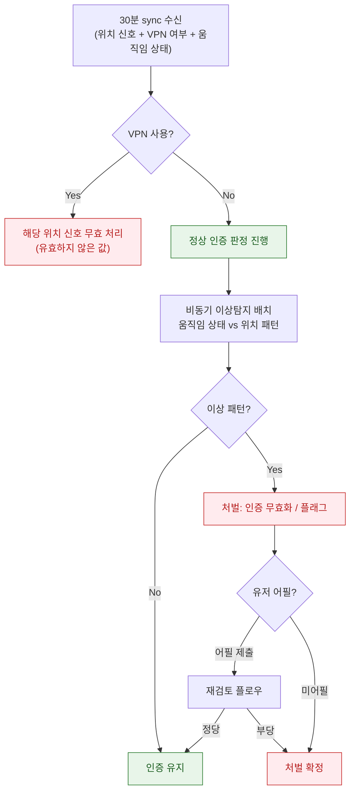

**9.1 두 갈래**

1. **VPN 여부 확인 (동기, 입력 단계)**: sync 신호에 VPN 사용 여부를 함께 받는다. VPN이 켜져 있으면 위치 신호를 유효하지 않은 값으로 처리(해당 신호 무시/플래그). 페이크 GPS 자체를 완벽히 막진 못하지만, 흔한 우회(VPN+위치 위조)를 싸게 거른다.
2. **움직임 상태 기반 비동기 이상탐지 (비동기, 사후 처벌)**: 유저의 움직임 상태(activity recognition 등)를 함께 수집한다. 서버가 비동기 배치로 이상 패턴을 탐지(예: 물리적으로 불가능한 순간이동, 체류 중인데 움직임 신호가 전혀 없음). 의심되면 해당 인증을 처벌(무효화/플래그). **처벌받은 유저는 반드시 어필(이의제기)할 수 있어야 한다.**

**9.2 플로우**

- 작정한(루팅+신뢰앱 위장 주입) 어뷰징은 메타데이터·VPN 체크로는 못 막는다. 독립 raw 트랙 재계산이 필요하므로 **Phase 2 하이브리드**로 미룬다.
- 가정: MVP는 금전 패널티 등이 없어 공격 보상이 0 → 합리적 공격자는 시도하지 않는다고 가정한다.

---

## 10. 수동 인증 & 최종 fallback (방장 승인)

> 자동 인증이 끝내 안 되는 경우의 구제는 "일단 통과"가 아니라 **방장(=챌린지 관리자)이 승인(approval)** 해야 하는 이의제기 성격의 최종 fallback(수동 인증)이다.
> 

**10.1 정규 수동 (자동 판정이 불가능한 루틴)**

- 사진·자가체크가 본질인 루틴. **제출 즉시 SUCCESS**(대상일·중복만 검증, 사진 내용 판단 없음).
- 무결성은 그룹 공개 + 신고 → 관리자 확인.

**10.2 최종 fallback — 자동인데 오늘 자동이 안 될 때**

자동 챌린지인데 권한 먹통·기기 미지원·신호 부재로 무조건 FAILED는 억울하다. 단 아무 때나 수동으로 도망가면 자동 인증이 무의미해지므로 **트리거 + 방장 승인**을 건다.

- **트리거**
    - 구조적 불가(권한 거부·기기 미지원) → 처음부터 fallback 제공.
    - 일시적 불가(평소 자동인데 오늘 신호 없음) → "오늘은 수동으로 증명하기" 노출.
- **핵심 규칙**
    - 제출은 **잠정 상태일 뿐, 자동 통과가 아니다.**
    - **방장이 approval 해야 비로소 인증 확정**된다(거절 가능). 완전히 이의제기/승인 플로우.
    - 남용 방지를 위해 한도(예: 주 1회)를 둔다.

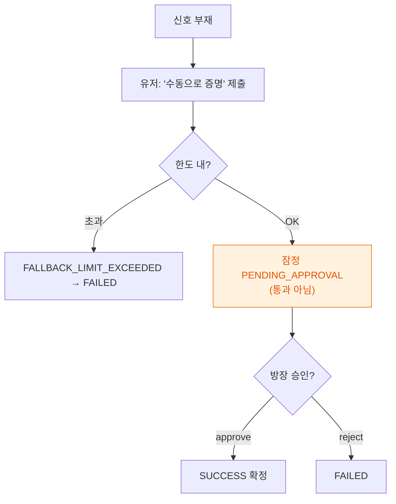

---

[11. API 명세 모음](%EC%9D%B8%EC%A6%9D%20%EA%B5%AC%ED%98%84%20-%20%EC%B5%9C%EC%A2%85%20%EC%88%98%EC%A0%95%EB%B3%B8/11%20API%20%EB%AA%85%EC%84%B8%20%EB%AA%A8%EC%9D%8C%2038ead4145fb68062ac54fbdc68c59f7d.csv)

---

## 12. DB

> [https://app.notion.com/p/DB-38bad4145fb68087adefe2629be2fdb4?source=copy_link](https://app.notion.com/p/DB-38bad4145fb68087adefe2629be2fdb4?pvs=21)
> 

---

## 13. 이외 고려 사항 (Other Considerations)

> "왜 이 기술을 선택하고, 무엇을 선택하지 않았는가"를 남겨 같은 논의가 반복되지 않게 한다.
> 
- **앵커 vs 그냥 GPS 근처 판정 (재검토)**: "GPS 받아서 근처면 인증"도 가능하지만, MVP는 유저가 앵커를 직접 등록하고 그 앵커에 OS Geofence를 거는 방식을 유지한다(오탐·정밀도·배터리 균형). 위치 기반 가게 자동 수집 아이디어는 매력적이지만 Phase 2로 이동.
- **NEARBY_BRAND 자동 채우기**: 현재 설계에 비해 부가 가치가 작고 오탐·캐시 신선도 부담이 있어 MVP에서 제외. 유저가 직접 다중 선택하는 MANUAL만 유지.
- **위치 판정 알고리즘 선택**: 후보 여럿 중 OS Geofencing DWELL을 주경로로 선택.
- **실시간 좌표 vs 비동기**: 실시간 좌표 수집은 어렵다 → 30분 sync로 모아 비동기 판정. 어뷰징도 비동기 처벌이 현실적.
- **Activity Recognition 단독 판정**: 확률 기반 보조신호라 단독 판정은 오분류·치팅에 취약 → 채택 안 함(움직임 이상탐지 보조 신호로만).
- **앱 데이터 초기화 시 커스텀 리스트 삭제**: 기존 로직에 로컬 추가 핸들링이 없어, 본 기능에서도 별도 구현하지 않기로 함.
- **권한 획득 타이밍 (본 수정본)**: 팝업으로 끝나는 권한은 생성·가입 시 같이 받고, 설정 화면을 거치는 무거운 권한(백그라운드 위치·사용정보 접근)만 멤버 바인딩과 함께 최초 진입으로 미룬다. "권한은 전부 가볍다"는 일반화를 피하면서 가입을 가볍게 유지하는 절충.

### Phase 2 (요약)

1. 하이브리드 어뷰징 방어(독립 raw 트랙 재계산, Activity Recognition = 세션 트리거)
2. 외부연동(GitHub·solved.ac·WakaTime·RSS) — Phase 2 1순위
3. 위치 기반 가게 자동 수집 / 동적 브랜드 매칭
4. WiFi 앵커 보정(실내 정확도), 임계값 자동 튜닝