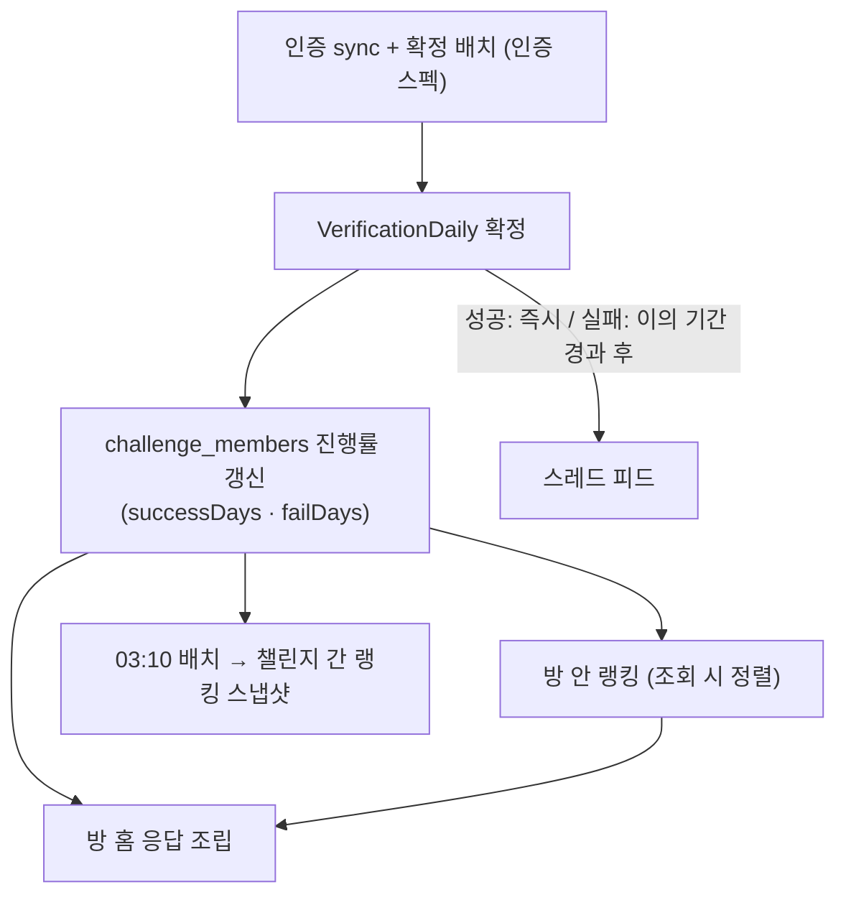
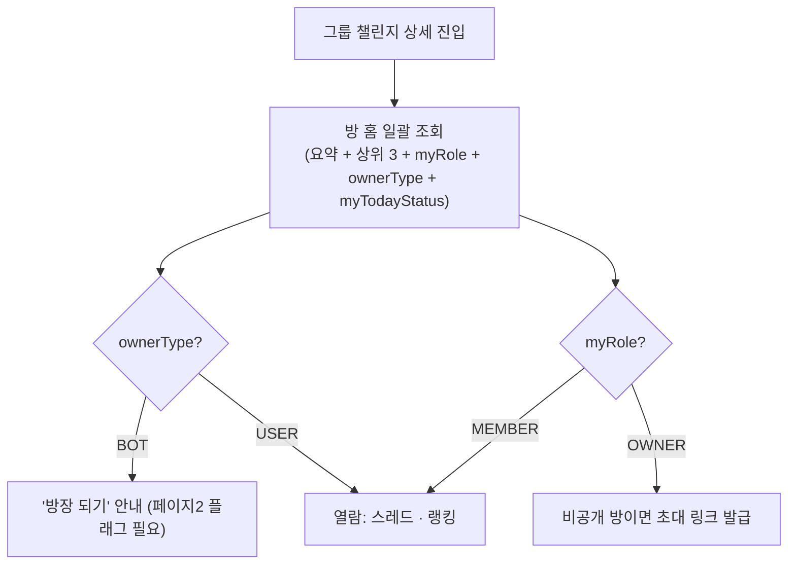
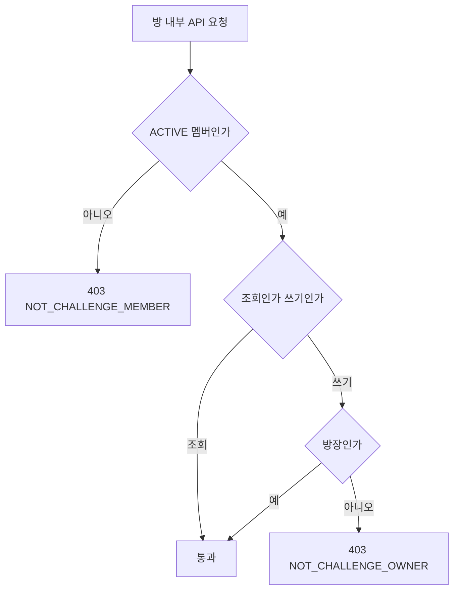

# 챌린지공지_방내부기능_테크스펙_v1

> **현행 코드 기준 갱신.** 이 문서가 처음 다뤘던 **공지(Notice)·댓글은 2026-08-12 Phase 2 로 이관**되며
> 코드·스키마에서 제거됐다(`V16__drop_phase2_notice_comment.sql`). **공동 관리자(MANAGER)** 계층과
> **방장의 멤버 운영 API**(강퇴·위임·승계)도 페이지2 스펙아웃이다. 아래 내용은 지금 서버가 실제로
> 제공하는 방 내부 기능만 기술한다.

## 1. 요약 (Summary)

방 내부는 **조회 허브**다. 멤버가 방에 들어가면 방 홈 한 번으로 요약 스탯·상위 3 랭킹·내 오늘 상태·내 역할을 받고, 필요에 따라 인증 이벤트 스레드와 방 안 랭킹을 따로 조회한다. 방 밖에서는 챌린지끼리 겨루는 랭킹을 본다.

제공 API는 네 개다.

| API | 경로 | 성격 |
| --- | --- | --- |
| 방 홈 일괄 조회 | `GET /api/v1/challenges/{challengeId}/room` | ACTIVE 멤버 전용 |
| 방 안 랭킹 | `GET /api/v1/challenges/{challengeId}/ranking` | ACTIVE 멤버 전용, 실시간 |
| 인증 이벤트 스레드 | `GET /api/v1/challenges/{challengeId}/threads` | ACTIVE 멤버 전용, 커서 페이징 |
| 방 밖 랭킹(챌린지 간) | `GET /api/v1/rankings/challenges` | 로그인 사용자, 일 1회 스냅샷 |

여기에 방장의 **초대 링크 발급**(`POST /api/v1/challenges/{challengeId}/invitations`)만 쓰기 액션으로 남아 있다.

## 2. 배경 (Background)

그룹 챌린지는 "내가 어떻게 하고 있는지"와 "다른 사람은 어떤지"를 같은 화면에서 확인해야 유지된다. 이 스펙은 그 정보 루프(수행 → 판정 → 스레드·랭킹 확인)를 앱 안으로 가져온다.

### 왜 공지가 빠졌는가

- 공지는 **방장이 멤버에게 무언가를 지시·통지하는 기능**이다. 2026-08-25 방장 권한 축소 결정으로 방장이 사람에 대한 권한을 갖지 않게 되면서 공지의 전제도 함께 사라졌다.
- 남겨 둘 수도 있었지만, **쓰지 않는 테이블은 스키마를 읽는 사람에게 곧 돌아올 기능처럼 보이고** 하드 삭제·통계 쿼리에 계속 끌려다닌다. 그래서 코드와 함께 지웠다(`Notice`·`NoticeRead`·`room_comments`·`RoomActivityLog` 드롭, `Notification.type` 의 `NOTICE_CREATED`·`COMMENT_CREATED` 행 정리).
- 재개할 때는 이 마이그레이션을 되돌리는 것이 아니라 **새 마이그레이션으로 다시 만든다.**
- 클라이언트 호환을 위해 방 홈 응답의 `pinnedNotice` 필드만 남아 있고 **Phase 1 동안 항상 `null`** 이다. 스레드의 `type` 판별자에도 `NOTICE` 값이 예약돼 있으나 내려오지 않는다.
- **읽음/미읽음은 영구 미제공**이다. 구 명세의 `unreadNoticeCount`·`pinnedNotice.isRead` 는 삭제됐다.

## 3. 목표 (Goals)

- **방 홈 일괄 조회**: 요약(성공률·정원·남은 기간·주간 조건)·상위 3 랭킹·내 오늘 상태·내 역할을 한 번에.
- **방 안 랭킹**: 참여일 이후 전체 성공률 기준 정렬 + 내 순위.
- **인증 이벤트 스레드**: 멤버들의 성공·실패 판정이 시간순으로 흐르는 피드.
- **방 밖 랭킹**: 그룹은 그룹끼리, 솔로는 솔로끼리 겨루는 챌린지 간 순위.
- 권한 판정을 **단일 게이트(`RoomAuthority`)** 로 모아, 권한 원천이 바뀌어도 한 곳만 고치면 되게 한다.

### 목표가 아닌 것 (Non-Goals)

| 항목 | 이유 / 시점 |
| --- | --- |
| **공지·댓글** | Phase 2 이관(2026-08-12). 저장소·API·알림 타입까지 제거 |
| **공동 관리자(MANAGER)** | 폐기. 방 안 역할은 `OWNER`·`MEMBER` 두 값뿐 |
| **방장의 멤버 강퇴·방장 위임·방장 승계** | 페이지2 스펙아웃(2026-08-26). 기능 플래그로 잠금 |
| 실시간 채팅 | 수요 미검증 + 인프라 비용 |
| 랭킹 기반 보상/패널티 | 온도·티어 계산 스펙 관할 |

---

# 계획 (Plan)

### 4. 데이터 흐름

## 5. 전체 구조 (유저 관점 플로우)

- 비멤버는 방 내부 API 전체 **403 `NOT_CHALLENGE_MEMBER`** — 공개 상세는 탐색 모듈의 `GET /api/v1/challenges/{challengeId}` 담당.

## 6. 권한 모델 — 단일 게이트

| 기능 | OWNER (= `challenges.owner_id`) | MEMBER |
| --- | --- | --- |
| 방 홈 / 랭킹 / 스레드 조회 | ✅ | ✅ |
| 초대 링크 발급(비공개 방) | ✅ | ❌ 403 `NOT_CHALLENGE_OWNER` |
| 멤버 강퇴 · 방장 위임 · 방장 되기 | 페이지2 플래그 off → **404** | 동일 |

- **`RoomAuthority` 단일 게이트**: `requireMember`(조회) · `requireOwner`(쓰기) · `requireMembership`(내 멤버십이 필요한 조회) 세 진입점뿐이다. 지금 `requireOwner` 내부는 `challenge.isOwner()` 한 줄이지만, 권한 원천이 role 기반으로 바뀌어도 **이 컴포넌트만** 고치면 방 내부 전체가 따라온다.
- 방 안 역할은 `OWNER` · `MEMBER` 두 값뿐이다. 클라이언트와는 **"모르는 값 = MEMBER"** 로 합의돼 있어 값이 늘어도 파싱이 깨지지 않는다.

## 7. 기능별 계약

### 7.1 방 홈 일괄 조회

- 요약: `roomSuccessRate`(판정이 한 건도 없으면 **`null`** — 갓 만든 방과 전원 실패한 방이 같아 보이면 안 된다), `capacity`(정원 무제한이면 `null`), 남은 기간, `weeklyCount`(주간 수행 횟수 1~7).
- 이번 주 내 진행도는 `myWeekly`(`done` · `weekStart` · `weekEnd` · `judging`). 판정 주기는 **1주 고정**이고 특정 요일은 지정하지 않는다.
- `myTodayStatus` 5종: `IN_PROGRESS` · `CHECKING`(00~03시 유예 구간) · `DONE` · `FAILED` · `NOT_TARGET`. 요일 지정이 없으므로 "요일상 대상이 아닌 날"은 없고, `NOT_TARGET` 은 이번 주 몫을 채웠거나(`myWeekly.done ≥ weeklyCount`) 아직 판정 대상이 아닌 경우(`judging:false`)뿐이다.
- `topRanking` 은 **10회 이상 참여자만** 등재되므로 초반 빈 배열이 정상이다.
- `ownerType` 이 `BOT` 이면 방장 자리가 비어 있다는 뜻이다(방장이 위임 없이 나간 방).

### 7.2 방 안 랭킹

- 기준은 **참여일 이후 전체 성공률** 하나. 주간/월간 탭은 없다.
- **등재 조건: 확정 판정 10회 이상**(`successDays + failDays ≥ 10`, `RankingService.MIN_PARTICIPATIONS`). 미달이면 `rank:null` · `ranked:false` · `successRate:null` 로 내려가고 등재자 뒤에 붙는다 — 표본이 적을 때 100%가 1위를 먹는 것을 막는다.
- 동점은 `successCount` 가 많은 쪽이 앞이고, 그것도 같으면 먼저 참여한 순이다. 같은 순위는 같은 `rank` 값을 공유한다.
- `me.gapToFirst` 는 1위와의 성공률 차이(미등재면 `null`).
- 강퇴·탈퇴한 사람은 목록에 없다. **내가 차단한 사람은 빠지지 않고** 임시 닉네임 + 기본 이미지로 가려진 채 남는다 — 빼버리면 같은 방인데 사람마다 등수가 달라진다.
- 익명 챌린지는 차단 여부와 무관하게 닉네임 마스킹 + 프로필 사진 미제공.
- **집계 쿼리를 새로 만들지 않는다** — 인증 파이프라인이 확정일 기준으로 유지하는 비정규화 진행률을 정렬만 한다.

### 7.3 인증 이벤트 스레드

- `VERIFY_SUCCESS` — 성공 확정 시 **즉시** 노출, `streak`(연속 성공 일수) 동반.
- `VERIFY_FAIL` — **바로 뜨지 않는다.** 이의 가능 기간(1일)이 지난 뒤에만 공유되고, 그사이 이의가 인용되면 **영원히 공유되지 않는다**(`VerificationDaily.shareableAt`).
- 실패 아이템의 `at` 은 공유 시각, `failDate` 가 실제 실패 날짜다. 화면에는 `failDate` 로 과거형 표기해야 한다 — `at` 으로 표시하면 지난 실패가 오늘 일처럼 읽힌다.
- 차단한 사람의 이벤트도 남고 `user.blocked=true` + 마스킹으로 표시한다(빼면 피드에 구멍이 생긴다).
- 커서 페이징. 깨진 커서는 400 `CURSOR_INVALID`.

### 7.4 방 밖 랭킹 (챌린지 간)

- `mode` 필수(`GROUP`|`SOLO`) — 인원 규모가 다른 방을 한 표에 올리면 순위가 의미를 잃는다.
- 진행 중인 방만 대상, 기준은 방 전체 성공률. 등재 조건은 **그룹 50회 · 솔로 10회** 이상 누적 판정.
- **하루 1회 03:10(KST) 배치 스냅샷**(`challenge_cross_ranking_snapshot`)이다. 실시간이 아니므로 `updatedAt`(스냅샷 시각)을 함께 표시해야 방 안 랭킹과의 차이가 오해되지 않는다.
- `challengeId` 를 넘기면 그 방의 순위를 `myChallenge` 로 함께 준다. 미등재면 `ranked:false` · `rank:null`.

### 7.5 초대 링크 발급

- **비공개 그룹 방 전용**. 공개 방은 그냥 가입하면 되고 솔로 방은 부를 사람이 없으므로 둘 다 409 `NOT_PRIVATE_CHALLENGE`.
- `token` 은 **응답에서만** 볼 수 있다(서버에는 해시만 저장). 유효기간 7일, 수락 1회로 소모, 발급 횟수 제한 없음.

## 8. 정책 모델 (Policy Model)

- 8.1 조회 권한: 방 홈·랭킹·스레드 전부 **ACTIVE 멤버 전용**. 비멤버 403.
- 8.2 랭킹 등재: 방 안 10회 / 방 밖 그룹 50회·솔로 10회. 미달자는 제외가 아니라 **미등재 표시**로 목록에 남는다.
- 8.3 마스킹: 차단 → 임시 닉네임 + 기본 이미지(목록에서 제거하지 않음), 익명 챌린지 → 닉네임 마스킹 + 사진 미제공.
- 8.4 실패 공개 지연: 이의 기간(1일) 경과 후에만 스레드에 노출, 인용되면 영구 미노출.

[9. API 명세 모음](%EC%B1%8C%EB%A6%B0%EC%A7%80%EA%B3%B5%EC%A7%80_%EB%B0%A9%EB%82%B4%EB%B6%80%EA%B8%B0%EB%8A%A5_%ED%85%8C%ED%81%AC%EC%8A%A4%ED%8E%99_v1/9%20API%20%EB%AA%85%EC%84%B8%20%EB%AA%A8%EC%9D%8C%203a0ad4145fb6805da6a8eef301b6a5c7.csv)

# 10. 이외 고려 사항 (Other Considerations)

> "왜 이 기술을 선택하고, 무엇을 선택하지 않았는가"를 남겨 같은 논의가 반복되지 않게 한다.

- **공지를 지운 이유**: 방장 권한 축소로 전제가 사라졌고, 빈 테이블로 남기면 "곧 돌아올 기능"으로 오독된다. 명세는 보존하되 스키마는 제거했다.
- **방장 운영 API 를 지우지 않고 플래그로 잠근 이유**: 세 API(강퇴·위임·승계)는 재개 시 그대로 쓰기 위해 명세를 보존하기로 했고, 서비스 계층은 **자동 강퇴 3종이 계속 쓰고 있다**. 그래서 컨트롤러만 `app.features.room-owner-admin.enabled=true` 조건부 빈으로 두었다 — 빈이 없으면 매핑도 Swagger 문서도 없고 호출은 404 다.
- **클라이언트에서 감추는 것으로 부족한 이유**: 진입점을 숨겨도 매핑이 살아 있으면 호출된다. 방장 권한 축소는 "버튼을 안 보이게 하자"가 아니라 **방장이 사람에 대한 권한을 갖지 않는다**는 정책이므로 서버가 거절해야 성립한다.
- **강퇴 대체 경로**: 자동 제재 3종(부정행위·연속 실패 3사이클·권한 미허용)으로 전부 배치에서 처리한다.
- **위임 대체 경로**: 없다. 방장이 나가면 **봇방장(`ownerType=BOT`)** 으로 자동 전환한다(정책 §11.2). 승계 3일 면책도 함께 폐지됐다.
- **랭킹에 비정규화 진행률 사용**: 인증 sync·확정 배치가 이미 확정일 기준으로 유지하므로, 랭킹용 집계를 따로 만들면 두 수치가 어긋난다. 정렬만 한다.
- **방 밖 랭킹만 스냅샷인 이유**: 전 챌린지를 가로질러 세는 질의라 조회마다 돌리면 비싸고, "어제 기준 순위"라는 표현이 사용자에게도 자연스럽다. 방 안 랭킹은 멤버 수가 작아 실시간으로 둔다.
- **차단자를 목록에서 빼지 않는 이유**: 빼면 같은 방인데 보는 사람마다 등수·피드가 달라진다. 가리되 자리는 남긴다.

## Phase 2 (요약)

1. 공지·댓글 재도입(재개 시 새 마이그레이션으로 신설)
2. 방장 운영 API 재개 여부 — 재개하면 `app.features.room-owner-admin.enabled` 를 켜는 것부터 시작
3. 실시간 채팅 수요 검증 후 도입 여부 결정
4. 랭킹 시즌제
