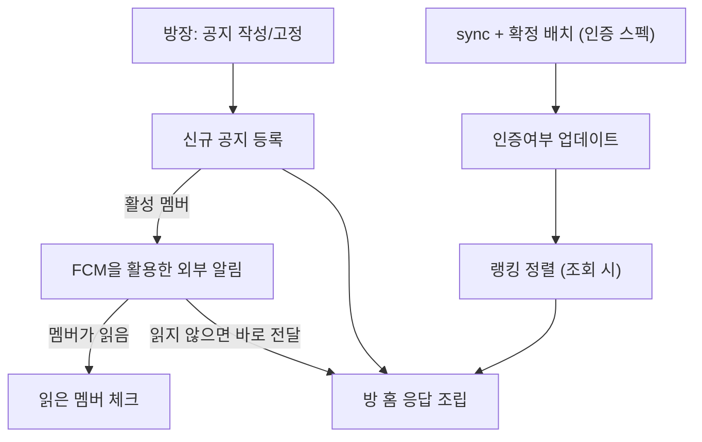
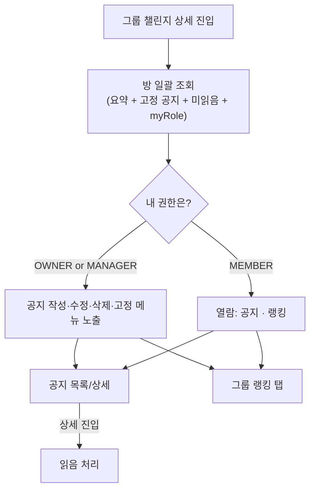
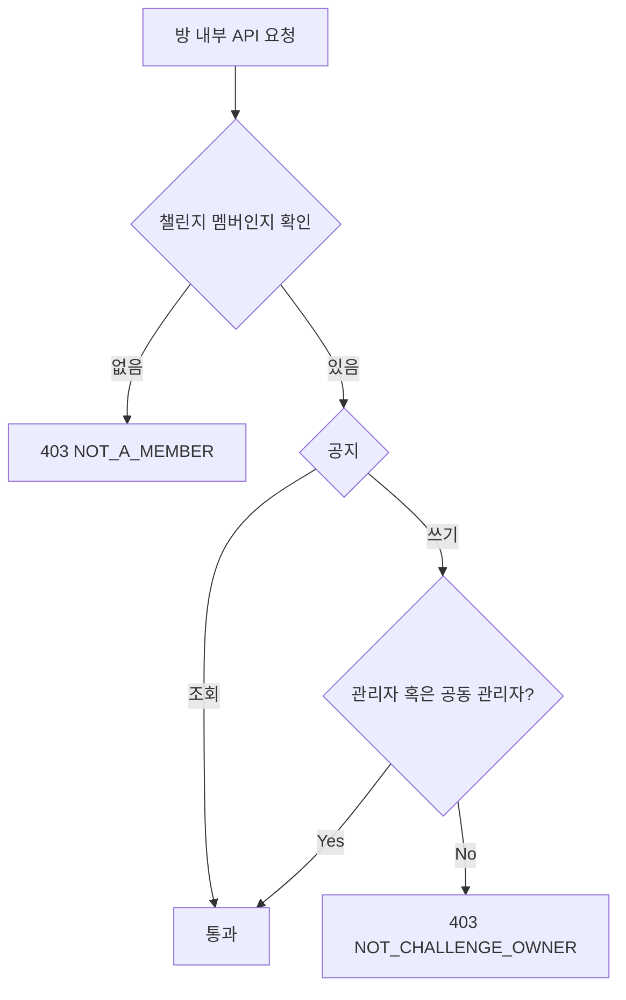
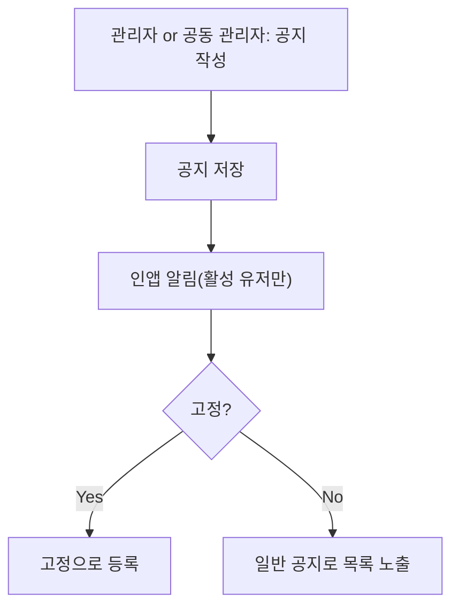
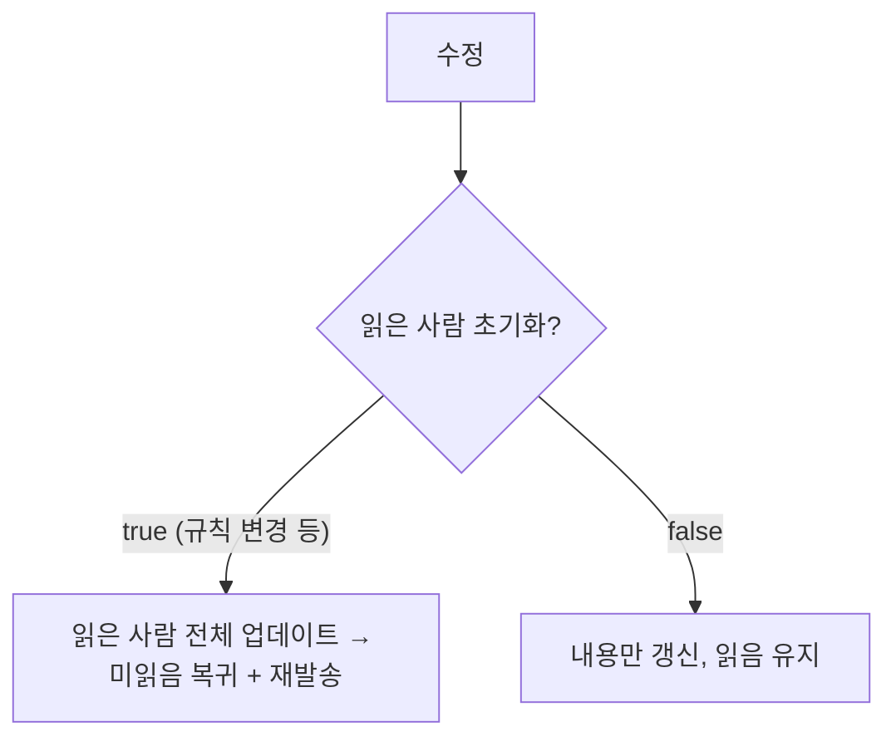
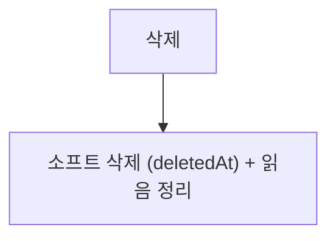
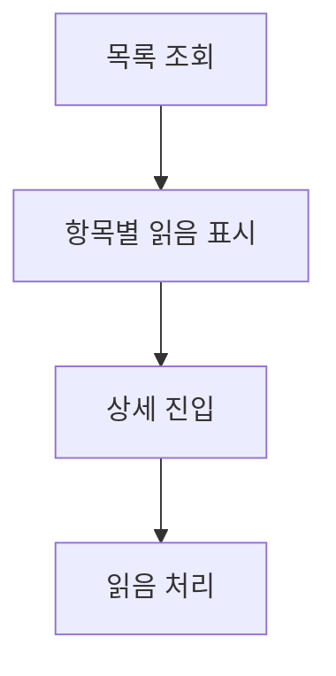
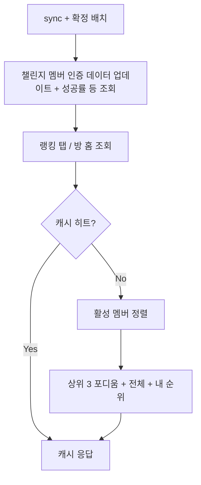

# 챌린지공지_방내부기능_테크스펙_v1

## 1. 요약 (Summary)

운영자(방장)가 챌린지 방에 **게시형 일반 공지**를 올리고, 멤버는 방 진입 시 공지·그룹 랭킹·오늘 내 상태 등 **챌린지 운영 정보를 한 화면에서** 확인한다. 공지는 메신저(채팅)가 아니라 작성·고정(pin)·읽음 확인이 있는 **게시판**이다.

방 내부는 **조회 허브**다: 방 홈 요약(완주율·평균 매너·남은 기간·고정 공지·미읽음 수·내 오늘 상태) + 그룹 랭킹. 멤버를 관리하는 운영 액션(강퇴·역할·위임 등)은 본 스펙 범위 밖이다.

## 2. 배경 (Background)

그룹 챌린지는 규칙 변경·일정 안내·독려 같은 운영 커뮤니케이션이 필수이다. 이 스펙은 그룹 챌린지의 정보 루프(공지 → 수행 → 랭킹 확인)를 앱 안으로 가져온다.

### 왜 메신저가 아니라 게시형 공지인가

- 공지는 **저빈도·고중요도 요소이**다. 실시간 양방향 인프라가 필요 없고 **REST + 기존 Push Outbox(FCM)로 충분**하다. (2인 팀·일정 고려)
- 채팅은 휘발성이라 규칙·일정이 대화에 묻힌다. **고정(pin)과 읽음 확인**이 있는 게시판이 운영 목적에 부합한다.
- 실시간 소통 수요는 Phase 2에서 검증 후 결정한다.

## 3. 목표 (Goals)

- 공지 **CRUD + 고정(pin)** + 멤버별 **읽음 상태**(미읽음 뱃지).
- 공지 등록 시 ACTIVE 멤버 **FCM fan-out**(기존 Push Outbox 재사용) + 인앱 알림함 적재.
- **방 홈 일괄 조회**: 요약(완주율·평균 매너·남은 기간·참여자 수)·고정 공지·미읽음 수·내 오늘 상태
- **그룹 랭킹**: 챌린지 멤버 정렬 + 내 순위.
- 권한 판정은 **현행 코드 그대로** 사용하되, **판정 지점을 단일 게이트로 모아** 운영 스프린트의 role 기반 이관이 한 곳 수정으로 끝나게 한다.

### 목표가 아닌 것 (Non-Goals)

| 항목 | 이유 / 시점 |
| --- | --- |
| **멤버 운영 전반** — 강퇴(추방), 관리자/공동 관리자(MANAGER) 계층, 방장 위임, 탈퇴, 승인 권한 확장 | **별도 운영 스프린트 스펙**에서 진행. 본 스펙은 조회·공지만 |
| 권한 원천 리팩터링 (creatorId → role) | 위임·MANAGER의 선행 작업이므로 운영 스프린트로 함께 이동. 본 스펙은 현행 `isOwner()` 유지 |
| 실시간 채팅·댓글/스레드 | 수요 미검증 + 인프라 비용 → Phase 2 |
| 공지 리액션·조회수 통계 | 부가 가치 대비 비용 → Phase 2 |
| 공지 이미지/파일 첨부 | MVP 텍스트 전용 |
| 랭킹 기반 보상/패널티 | 온도 계산 스펙 관할 |

---

# 계획 (Plan)

### 4. 데이터 흐름

## 5. 전체 구조 (유저 관점 플로우)

- OWNER은 관리자(1명), MANAGER은 공동 관리자(여러명 가능)

- 비멤버(NONE)는 방 내부 API 전체 403 — 공개 상세는 기존 챌린지 상세 API 담당.

## 6. 권한 모델 — 현행 유지 + 단일 게이트

| 기능 | OWNER (= creatorId) | MEMBER |
| --- | --- | --- |
| 방 홈 / 공지 / 랭킹 조회 | ✅ | ✅ |
| 공지 작성·수정·삭제·고정 | ✅ | ❌ 403 |

- **`RoomAuthority` 단일 게이트**: 공지의 방장 판정을 컨트롤러마다 흩뿌리지 않고 한 컴포넌트
    - `requireOwner(challengeId, userId)`)로 모은다. 지금은 내부가 `challenge.isOwner()` 한 줄이지만, 운영 스프린트가 role 기반으로 이관할 때 **이 한 곳만** 바꾸면 공지 전체가 따라온다.

## 7. 기능별 유저 플로우

### 7.1 공지 작성·수정·삭제·고정 — 방장

- 알림은 신규 발송 경로를 만들지 않고 **기존 `PushOutboxService`*에 타입(`NOTICE_CREATED`)만 추가 — 트랜잭션 커밋 후 발송 보장을 그대로 얻는다.
- **단일 pin**: 방 홈 배너에 고정 공지 1개만 노출하므로 고정은 챌린지당 1개. 새로 고정하면 기존 고정 자동 해제(에러 아님, 교체).
- **수정 = 읽음 유지가 기본.** 재확인이 필요한 수정만 `resetRead=true`.

### 7.2 공지 조회 & 읽음 처리

- **상세 조회 = 읽음.** 별도 읽음 API 없음(호출 절감 + UX 일치). 중복 진입은 unique 제약으로 멱등.
- 작성자 닉네임 노출은 기존 모더레이션 규칙 적용

### 7.3 그룹 랭킹

- **집계 쿼리를 새로 만들지 않는다** — 인증 파이프라인이 이미 확정일 기준으로 유지하는 비정규화 진행률을 정렬만 한다.
- 연속 기록 필드는 현재 없음 → tie-break 2순위는 `successDays`. streak 도입 시(마이 스펙 마일스톤과 상수 공유) 교체 검토.
- 닉네임은 `visibleNicknameTo` + 익명 챌린지(`Anonymity`) 마스킹 — 기존 멤버 목록과 동일 규칙.

## 8. 정책 모델 (Policy Model)

- 8.1 공지 정렬·고정
    - 정렬 `pinned desc → createdAt desc`, 커서 = `(createdAt, id)`. 고정은 챌린지당 **1개**.
    - 본문 상한: title 100자, content 2,000자.
- 8.2 읽음 판정
    - `uq(noticeId, userId)` upsert — 멱등. 상세 조회가 곧 읽음. 재참여 유저는 과거 읽음 유지(멤버십 유저당 1행 모델과 일관).
- 8.3 알림
    - 공지 생성 / `resetRead=true` 수정: ACTIVE 전원(작성자 제외) — Push Outbox + 인앱 Notification 타입 추가.

[9. API 명세 모음](%EC%B1%8C%EB%A6%B0%EC%A7%80%EA%B3%B5%EC%A7%80_%EB%B0%A9%EB%82%B4%EB%B6%80%EA%B8%B0%EB%8A%A5_%ED%85%8C%ED%81%AC%EC%8A%A4%ED%8E%99_v1/9%20API%20%EB%AA%85%EC%84%B8%20%EB%AA%A8%EC%9D%8C%203a0ad4145fb6805da6a8eef301b6a5c7.csv)

# 10. 이외 고려 사항 (Other Considerations)

> "왜 이 기술을 선택하고, 무엇을 선택하지 않았는가"를 남겨 같은 논의가 반복되지 않게 한다.
> 
- **운영 기능을 분리한 이유 (v3)**: 강퇴·역할 계층·위임은 권한 원천 리팩터링(creatorId → role)이라는 코드 전반의 선행 작업을 요구해 스프린트 단위가 다르다. 공지·랭킹은 그 리팩터링 없이 현행 `isOwner()`로 즉시 출고 가능 — 결합하면 공지가 리팩터링에 발목 잡힌다.
- **분리하되 이음새는 미리 만든다**: 공지의 방장 판정을 `RoomAuthority` 단일 게이트로 모아, 운영 스프린트가 role 판정으로 갈아끼울 때 공지 코드는 무수정. `myRole` 필드도 값 추가만으로 확장되게 안드와 "미지 값 = MEMBER" 합의.
- **게시판 vs 채팅 (재확인)**: 공지의 사용 패턴(저빈도·read-heavy)에 실시간 인프라는 과설계. REST + FCM으로 시작.
- **읽음을 별도 API로 두지 않은 이유**: 상세 조회 = 읽음이 UX와 일치, 왕복 1회 절감, unique 제약으로 멱등 보장.
- **랭킹에 비정규화 진행률 사용**: `progressRate`는 인증 sync·확정 배치가 이미 확정일 기준으로 유지 — 랭킹용 집계를 따로 만들면 두 수치가 어긋날 수 있다. 정렬만 한다.
- **단일 pin**: 방 홈 배너 노출이 1개라 다중 고정은 UI 근거 없음. 요구가 생기면 `pinnedOrder`만 추가.
- **알림 인프라 재사용**: 기존 Push Outbox + 인앱 Notification 타입 추가로 처리 — 발송 경로 이원화 금지.
- **읽음 키 = userId**: 멤버십이 유저당 1행(uq)이라 별도 키가 무의미. 재참여 시 과거 읽음 유지가 자연스러운 동작.

## 후속 스프린트로 이관된 항목 (참조)

> "챌린지 운영(멤버 관리·역할 계층) 스펙"에서 다룬다. v2 문서의 해당 섹션이 초안 역할.
> 
1. 권한 원천 리팩터링: `Challenge.isOwner()`(creatorId) → `ChallengeMember.role` 기반 (`RoomAuthority` 내부 교체 포함)
2. 관리자/공동 관리자(MANAGER) 계층 — 임명/해제(OWNER 전용), 권한 매트릭스
3. 멤버 강퇴(추방) — OWNER=전원 / MANAGER=MEMBER만, CAS ACTIVE→REMOVED
4. 방장 위임 — MANAGER에게만, 트랜잭션 role swap, OWNER 1명 불변식
5. 챌린지 탈퇴 — OWNER는 위임 후에만, CAS ACTIVE→LEFT
6. 참여 승인/거절 권한 확장 (OWNER → OWNER·MANAGER)

## Phase 2 (요약)

1. 공지 댓글/리액션, 이미지 첨부
2. 실시간 채팅 수요 검증 후 도입 여부 결정
3. 공지 작성 권한의 MANAGER 확장 여부 (운영 스프린트 이후 재논의)
4. 랭킹 시즌제·streak tie-break (마이 스펙 마일스톤과 상수 공유)