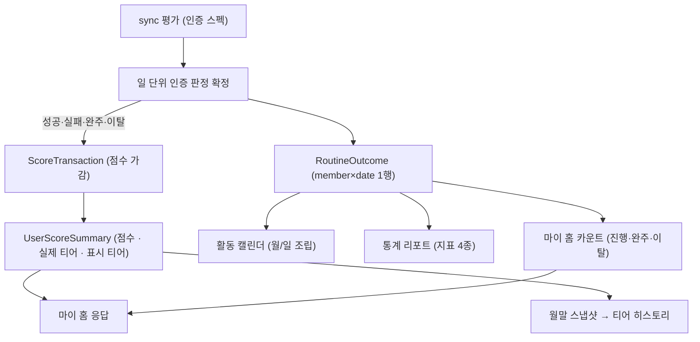
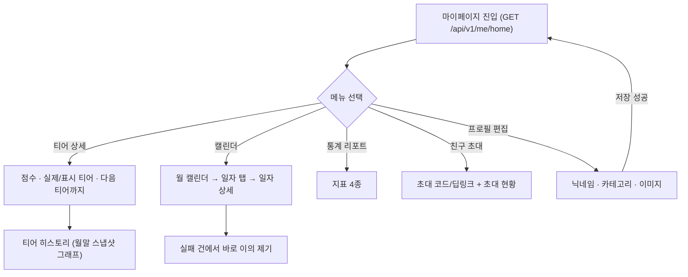
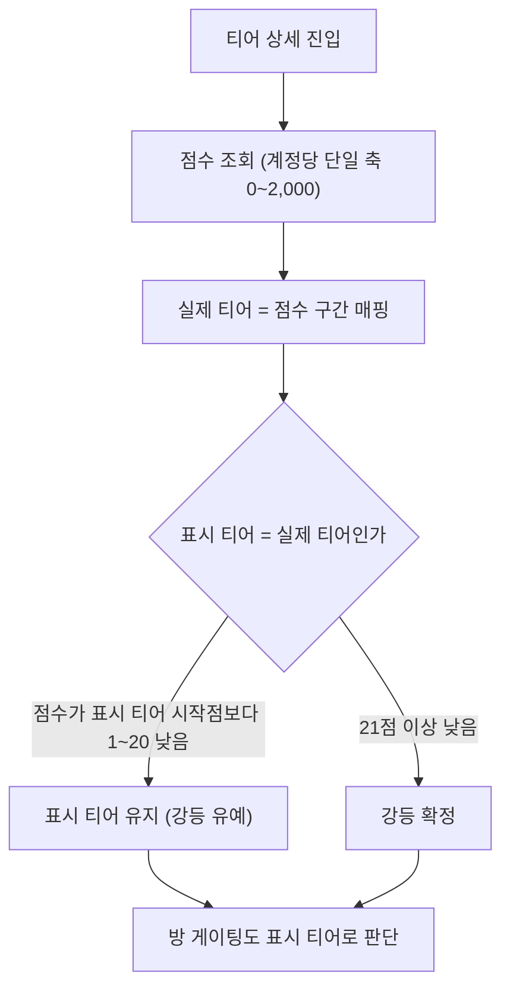
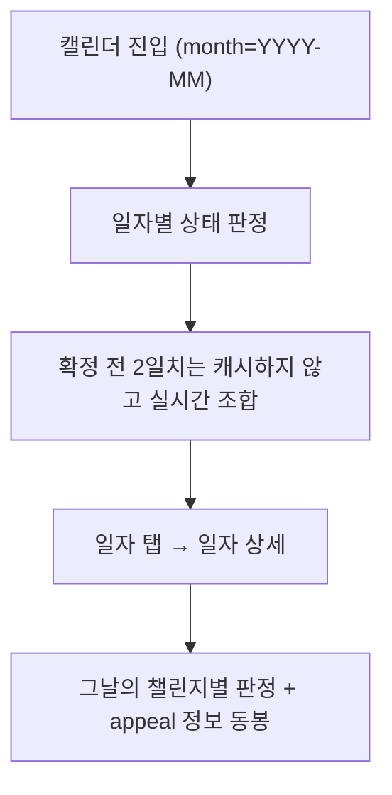

# 마이프로필_캘린더_테크스펙_v1

> **현행 코드 기준 갱신.** 초안의 **매너 온도(°C)** 모델은 **점수·티어 엔진**으로 대체됐고
> (`V32__tier_scoring_engine.sql`, 계정당 단일 점수축 0~2,000 + 5티어), 통계 리포트의
> **주간/월간/연간 탭은 폐기**돼 고정 지표 4종으로 바뀌었다. 초안이 Phase 2 로 미뤄 뒀던
> **타인 공개 프로필**과 **이미지 S3 이관**은 이미 구현됐다.

## 1. 요약 (Summary)

마이 탭 메인(마이 홈)·티어 상세·티어 히스토리·통계 리포트·활동 캘린더·친구 초대, 그리고 프로필 편집을 제공한다.

핵심 원칙: 이 스펙의 화면들은 인증 파이프라인이 이미 쌓고 있는 데이터와 점수 트랜잭션을 **읽기 전용으로 조립하는 조회 계층**이다. 새 판정 로직을 만들지 않는다(초대만 쓰기).

| 화면 | API |
| --- | --- |
| 마이 홈 | `GET /api/v1/me/home` |
| 월 활동 캘린더 | `GET /api/v1/me/calendar?month=YYYY-MM` |
| 일자 상세 | `GET /api/v1/me/calendar/{date}` |
| 통계 리포트 | `GET /api/v1/me/stats` |
| 내 티어 상세 | `GET /api/v1/me/tier` |
| 티어 히스토리 | `GET /api/v1/me/tier/history?months=N` |
| 친구 초대 | `GET /api/v1/me/invitation` |
| 프로필 조회·수정·사진 | `GET/PATCH /api/v1/profile`, `POST/DELETE /api/v1/profile/image` |
| 타인 공개 프로필 | `GET /api/v1/users/{targetUserId}/profile` |
| 내 이의 목록 | `GET /api/v1/users/me/appeals` |

## 2. 배경 (Background)

인증 파이프라인(sync)이 데이터를 쌓지만, 유저가 자기 성과를 확인할 화면이 없다. 자동 인증은 "버튼을 누르는 행위"가 없기 때문에 **"잘 되고 있다"는 피드백을 화면이 대신해야** 리텐션이 유지된다.

### 왜 캘린더·티어 시각화가 리텐션의 핵심인가

- 자동 인증의 부작용 = 유저 행위 부재 → 성취감의 접점이 사라짐. 캘린더(연속 기록)·티어(누적 평판)가 그 접점을 대체한다.
- 진행률·판정은 **확정된 날짜 기준으로만 노출**하므로, 시각화도 같은 원칙을 따르면 "어제 성공했는데 왜 빈칸이야" 류의 혼란이 없다.

## 3. 목표 (Goals)

- **마이 홈 일괄 조회**: 닉네임·사진(+심사 상태), 티어 3종 값, 진행 중/완주/이탈 카운트, 계정 상태.
- **티어 상세**: 실제 티어·점수와 **표시 티어**를 분리해 제공. 강등 유예 20점 규칙 포함.
- **티어 히스토리**: 월말 스냅샷 시리즈 + 역대 최고. 보관 1년.
- **통계 리포트**: 고정 지표 4종 — 전체 성공률 / 총 성공 인증 수 / 현재·최고 스트릭 / 완주 개수.
- **활동 캘린더**: 월 단위 일자별 상태 + 일자 상세(챌린지별 결과·이의 가능 여부).
- **친구 초대**: 유저당 1개 초대 코드/딥링크(멱등 생성) + 초대 현황.
- **프로필 편집**: 닉네임(2~12자 한/영/숫자 · 중복 검사 · **30일 변경 제한** · 비동기 검수), 관심 카테고리(**12종 중 1~6개**), 프로필 이미지.

### 목표가 아닌 것 (Non-Goals)

| 항목 | 이유 / 시점 |
| --- | --- |
| 점수 가감 규칙 정의 | **온도(점수·티어) 계산 테크스펙** 관할 |
| 기간별 통계 탭(주간·월간·연간) | **폐기.** 지표 4종 고정으로 단순화 |
| 하락 사유 표기 | 정책상 미제공 — 히스토리는 그래프 + 역대 최고만 |
| 초대 보상 지급 | 이벤트만 기록, 지급은 미정 |
| 통계 공유 이미지 생성 | 필요성 낮음 |

---

# 계획 (Plan)

### 4. 데이터 흐름

## 5. 전체 구조 (유저 관점 플로우)

## 6. 기능별 계약

### 6.1 마이 홈

- 본인 화면이므로 닉네임·사진은 **검수 상태와 무관하게 입력값**을 그대로 보여준다. 타인에게 지금 어떻게 보이는지는 `status` 뱃지로 판단한다.
- 카운트는 진행 중 / 완주 / 이탈 3종.

### 6.2 티어 상세 · 히스토리

- 점수는 티어마다 0~99 로 끊지 않는 **계정당 단일 축**이라 승급해도 초과 점수가 사라지지 않는다.
- **강등에만 20점의 유예**가 있다. 표시 티어 시작점보다 1~20점 낮은 동안은 표시 티어를 유지하고, 21점 이상 낮아져야 강등이 확정된다.
- **방 게이팅(`min_tier`) 판정도 표시 티어**로 한다 — 화면에 보이는 티어와 입장 가능 여부가 어긋나면 안 된다.
- 히스토리는 **월말 스냅샷 시리즈 + 역대 최고**만 내린다. 정책이 "그래프 형식 + 하락 사유 표기 없음"으로 정해졌기 때문이다. 보관 1년이라 그 이전은 조회되지 않는다.

### 6.3 통계 리포트

- **지표 4종 고정**: 전체 성공률 / 총 성공 인증 수 / 현재·최고 스트릭 / 완주 개수.
- **기간 파라미터가 없다.** 구 명세의 `WEEKLY`·`MONTHLY`·`YEARLY` 탭과 완주율 시리즈·인사이트 문구는 폐기됐다.
- 확정된 판정만 센다. 유예 구간(귀속일 + 2일 00:00 KST 이전)의 건은 아직 반영되지 않는다.

### 6.4 활동 캘린더

- **확정 전 2일치는 늦게 도착한 신호로 값이 뒤집힐 수 있으므로 캐시하지 않는다.**
- 일자 상세의 실패·실패 예정 건에는 **`appeal` 이 함께 실린다** — 별도 조회 없이 이의 버튼의 활성 여부와 기한을 결정할 수 있다.
- 잘못된 형식은 400 `INVALID_CALENDAR_MONTH` · `INVALID_CALENDAR_DATE`.

### 6.5 친구 초대

- 초대 코드·딥링크는 **유저당 1개**이며 **멱등 생성**이다(다시 호출해도 같은 값).
- 초대 현황은 피초대자의 가입 내역(`InvitationSignup`) 기준이다. 보상 지급은 아직 없다.

### 6.6 프로필 편집 (구현 완료)

- 닉네임: `^[가-힣ㄱ-ㅎa-zA-Z0-9]{2,12}$`, 중복 검사, **변경 주기 30일**(`NicknamePolicy.CHANGE_INTERVAL`), 저장 후 비동기 검수.
- 관심 카테고리: **12종 중 1~6개**(`InterestCategory.MAX_SELECTABLE = 6`). 상한은 `maxSelectable` 로 내려가므로 **클라이언트가 개수를 하드코딩하지 않는다.**
- 이미지: multipart 업로드 → S3 저장, 바깥 주소는 `/files/{파일명}` 고정.
- **타인이 보는 값은 승인된 값만**이다. 검수 중이거나 거절이면 임시 닉네임 + 기본 프로필(`profileImageUrl=null`)이 보인다.

[7. API 명세 모음](%EB%A7%88%EC%9D%B4%ED%94%84%EB%A1%9C%ED%95%84_%EC%BA%98%EB%A6%B0%EB%8D%94_%ED%85%8C%ED%81%AC%EC%8A%A4%ED%8E%99_v1/7%20API%20%EB%AA%85%EC%84%B8%20%EB%AA%A8%EC%9D%8C%2039fad4145fb68006a048d91e8fe14a7f.csv)

# 8. 이외 고려 사항 (Other Considerations)

> "왜 이 기술을 선택하고, 무엇을 선택하지 않았는가"를 남겨 같은 논의가 반복되지 않게 한다.

- **온도(°C) → 점수·티어로 바꾼 이유**: 온도는 "지금 몇 도"만 말할 뿐 다음 목표가 보이지 않는다. 계정당 단일 점수축 + 5티어는 승급 조건이 명시적이고, 방 게이팅(`min_tier`)과 같은 어휘를 쓴다.
- **표시 티어를 따로 둔 이유**: 점수가 경계에서 오르내릴 때마다 티어가 흔들리면 사용자에게는 버그로 읽힌다. 강등에만 20점 유예를 둬 **내려갈 때만 둔감하게** 만들었다.
- **하락 사유를 표기하지 않는 이유**: 사유를 붙이면 "이 방 때문에 떨어졌다"는 귀책이 방·사람으로 향한다. 그래프와 역대 최고만 보여준다.
- **통계에서 기간 탭을 없앤 이유**: 주간/월간/연간 세 탭은 같은 데이터를 세 번 보여줄 뿐 행동을 바꾸지 못했다. 고정 4종이 화면도 쿼리도 단순하다.
- **캘린더·통계 원천 = `RoutineOutcome`**: member×date 1행(uq), category 스냅샷, **탈퇴 후에도 보존**(점수 스펙의 "탈퇴 회피 차단"과 같은 원천). 기간 절단이 불가능한 `challenge_members` 누적 비정규화나 정리될 수 있는 `VerificationDaily` 보다 통계에 적합하다.
- **확정 전 2일을 캐시하지 않는 이유**: 늦게 도착한 신호로 판정이 뒤집히는 구간이라, 캐시하면 사용자가 이미 본 값과 최종 값이 달라진다.
- **일자 상세에 `appeal` 을 동봉하는 이유**: 이의 버튼 하나 그리자고 왕복을 한 번 더 하면 캘린더 탐색이 느려진다. 기한 계산도 서버가 한 곳에서 한다.
- **초대 코드를 유저당 1개·멱등으로 둔 이유**: 여러 개가 되면 "어느 코드로 들어왔나"를 집계할 때 사람 단위로 다시 묶어야 한다.

### Phase 2 (요약)

1. 주간 리포트 푸시 — 통계 집계 + 기존 Push Outbox 재사용
2. 초대 보상 지급 (`InvitationSignup` 트리거 소비) + 초대 퍼널 추적(LINK_CLICKED)
3. 통계 사전 집계 테이블 (규모 증가 시)
4. 프로필 이미지 CDN(CloudFront) 도입 — 지금은 presigned GET 302
