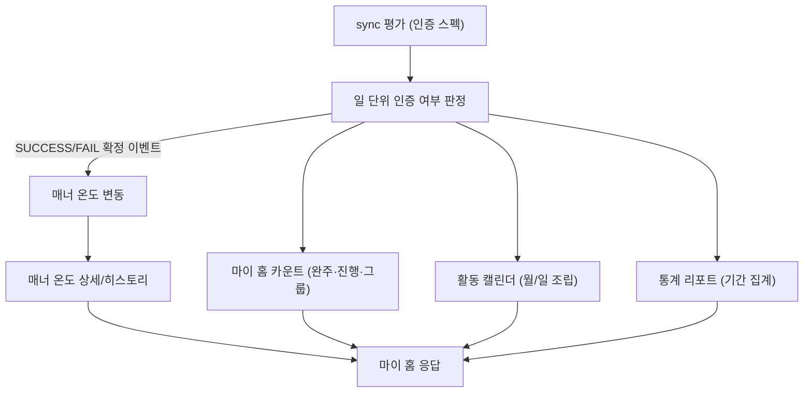
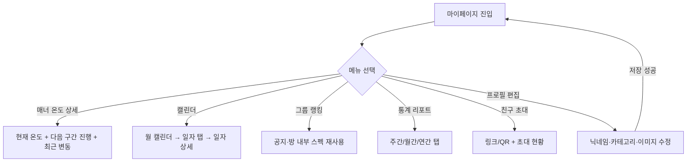
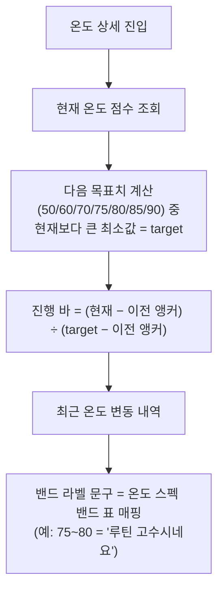
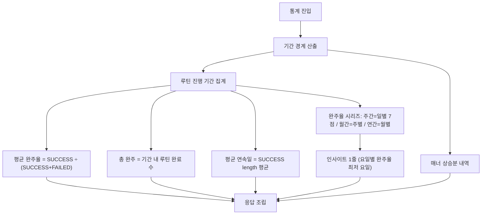
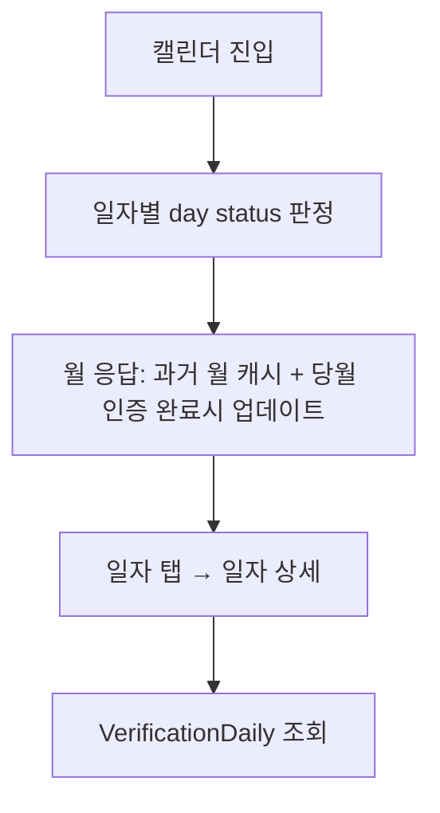
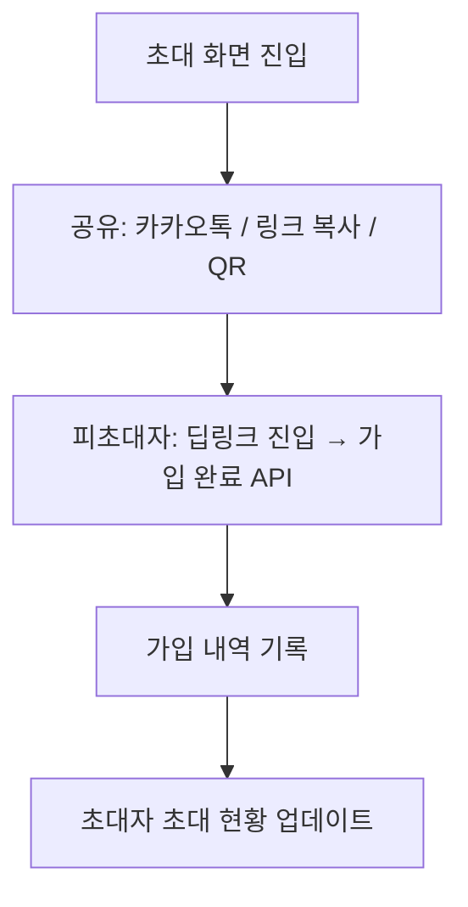

# 마이프로필_캘린더_테크스펙_v1

## 1. 요약 (Summary)

마이 탭 메인(프로필 홈)·매너 온도 상세·프로필 편집·통계 리포트·평판 히스토리·친구 초대, 그리고 **월 단위 활동 캘린더 시각화**를 제공한다.

핵심 원칙: 이 스펙의 화면들은 인증 파이프라인이 이미 쌓고 있는 데이터**와 매너 변동 이벤트를 읽기 전용으로 조립하는 조회 계층**이다. 새 판정 로직을 만들지 않는다(초대만 쓰기).

> **프로필 편집(조회·수정·사진)은 이미 구현 완료**(`/api/v1/profile`)라 본 스펙에서는 계약 참조만 한다. 신규 구현 대상은 **마이 홈·온도 상세/히스토리·통계·캘린더·친구 초대**다.
> 

## 2. 배경 (Background)

인증 파이프라인(30분 sync)이 데이터를 쌓지만, 유저가 자기 성과를 확인할 화면이 없다. 자동 인증은 “버튼을 누르는 행위”가 없기 때문에 **“잘 되고 있다”는 피드백을 화면이 대신해야** 리텐션이 유지된다.

### 왜 캘린더·온도 시각화가 리텐션의 핵심인가

- 자동 인증의 부작용 = 유저 행위 부재 → 성취감의 접점이 사라짐. 캘린더(연속 기록)·매너 온도(누적 평판)가 그 접점을 대체한다.
- 진행률·판정은 이미 **확정된 날짜 기준으로만 노출**하므로, 시각화도 같은 원칙을 따르면 “어제 성공했는데 왜 빈칸이야” 류의 혼란이 없다.
- 시각화를 통해 자신의 성과를 한 눈에 들어오게 한다.

## 3. 목표 (Goals)

- **마이 홈 일괄 조회**: 매너 온도 + 카운트(완주·진행 중·그룹) + 메뉴 진입점.
- **매너 온도 상세**: 현재 온도, 다음 밴드(예: 80°C)까지 진행 바, 최근 변동 로그(일별 스냅샷 diff).
- **프로필 편집 (구현 완료 — 참조)**: 닉네임(2~12자 한/영/숫자 · 중복 검사 · **30일 변경 제한** · LLM 비동기 검수), 관심 카테고리(**15종 중 1~6개**), 프로필 이미지 → `/api/v1/profile`, `/api/v1/profile/image` 그대로 사용.
- **통계 리포트**: 주간/월간/연간 — 총 완주, 평균 완주율, 매너 상승분, 평균 연속일, 기간 내 완주율 시리즈, 규칙 기반 인사이트 1줄.
- **평판 히스토리**: 역대 최고 온도(달성일), 마일스톤 피드.
- **활동 캘린더**: 월 단위 일자별 상태 + 일자 상세(챌린지별 결과·시각·실패 사유).
- **친구 초대**: 초대 코드/링크/QR 데이터 + 초대 현황 목록.

### 목표가 아닌 것 (Non-Goals)

| 항목 | 이유 / 시점 |
| --- | --- |
| 매너온도 가감 규칙 정의 | **온도 계산 테크스펙 V1에 이미 구현** |
| 프로필 편집 재설계 | `ProfileController`·`NicknamePolicy`·모더레이션 파이프라인 구현 완료 — 참조만 |
| 초대 보상 지급 | 결정 후에 지급 여부 지정 → 일단 이벤트는 기록 |
| 타 유저 공개 프로필 페이지 | 노출 규칙은 이미 존재 → 재사용 예정 |
| 통계 공유 이미지 생성 | 크게 필요 없을듯 |

---

# 계획 (Plan)

### 4. 데이터 흐름

## 5. 전체 구조 (유저 관점 플로우)

## 6. 기능별 유저 플로우

> 유저가 무엇을 보고 → 서버가 어떤 원천을 어떻게 집계해 → 무엇을 내리는가 순서로 기술한다.
> 

### 6.1 매너 온도 상세

- 온도는 이벤트별로 계산이 아니라 일별로 계산한다

### 6.2 통계 리포트

### 6.3 활동 캘린더

### 6.4 친구 초대

[7. API 명세 모음](%EB%A7%88%EC%9D%B4%ED%94%84%EB%A1%9C%ED%95%84_%EC%BA%98%EB%A6%B0%EB%8D%94_%ED%85%8C%ED%81%AC%EC%8A%A4%ED%8E%99_v1/7%20API%20%EB%AA%85%EC%84%B8%20%EB%AA%A8%EC%9D%8C%2039fad4145fb68006a048d91e8fe14a7f.csv)

# 8. 이외 고려 사항 (Other Considerations)

> “왜 이 기술을 선택하고, 무엇을 선택하지 않았는가”를 남겨 같은 논의가 반복되지 않게 한다.
> 
- **온도 히스토리를 이벤트 소싱으로 하지 않은 이유** : 초안은 `MannerEvent` delta 합산을 가정했지만, 실제 온도는 **일일 배치 EMA + 밴드 매핑**(ReputationScore 저장값)이라 “방 단위 사유 delta”가 모델상 존재하지 않는다. 일별 스냅샷(ReputationSnapshot)이 유일하게 정직한 이력이고, 배치가 이미 하루 1스텝 멱등 구조라 insert 1줄로 붙는다. **시안의 “기상 챌린지 +0.6” 류 사유 문구는 일별 ΔT + 규칙 라벨로 조정 필요**
- **캘린더·통계 원천 = RoutineOutcome**: member×date 1행(uq), category 스냅샷, **탈퇴 후에도 보존**(온도 스펙 “탈퇴 회피 차단”과 동일 원천) — 기간 절단이 불가능한 ChallengeMember 누적 비정규화나, 정리될 수 있는 VerificationDaily보다 통계에 적합. 당일 PENDING만 VerificationDaily로 보강.
- **완주 기준 상수 공유**: “완주 = progressRate ≥ 90”을 온도 스펙 완주 커트라인(r ≥ 0.9)과 같은 프로퍼티에서 읽어, 마이 화면 카운트와 온도 서사의 불일치를 차단.
- **관심 카테고리 개수 불일치**: 시안은 “3/10”, 코드는 **15종 중 1~6개**(`MAX_SELECTABLE=6`, V1 CHECK·안드 enum과 3자 동기화 명시). 스펙은 코드를 따르고, 시안 수정 요청.
- **프로필 이미지 presigned 미채택 (초안에서 변경)**: 이미 multipart + 로컬 저장(W1) + 매직넘버 검증 + 레이트리밋 + 모더레이션 파이프라인이 동작 중. S3·presigned는 저장소 이관과 함께 Phase 2 — 지금 갈아엎을 이유 없음.
- **통계 사전 집계 배치 미채택**: 현 유저 규모에서 온디맨드 + Caffeine이면 충분. 느려지면 `ExploreAggregationService`처럼 스케줄 사전 집계로 교체(쿼리 계층 분리로 스키마 변경 없이 전환 가능하게).
- **QR 서버 생성 미채택 / LINK_CLICKED 추적 미채택**: QR은 클라 렌더링으로 충분, 클릭 추적은 리다이렉트 서버 필요 → 초대 퍼널 분석이 필요해질 때.
- **마일스톤 append-only**: 조회 시 재계산하면 캘린더·온도 전체 스캔이 반복된다. 각 배치(확정 00:05 · 온도 03:00)가 자기 이벤트를 멱등 적재하는 쪽이 기존 배치 구조와 일관.

### Phase 2 (요약)

1. 타 유저 공개 프로필 (`visibleNicknameTo/visibleProfileImageTo` 재사용 + 공개 범위 정책)
2. 이미지 저장 S3 이관 + presigned 업로드
3. 주간 리포트 푸시 — 통계 집계 + 기존 Push Outbox(`PushOutboxService`) 재사용
4. 초대 보상 지급 (InvitationSignup 트리거 소비) + 초대 퍼널 추적(LINK_CLICKED)
5. 통계 사전 집계 테이블 (규모 증가 시)