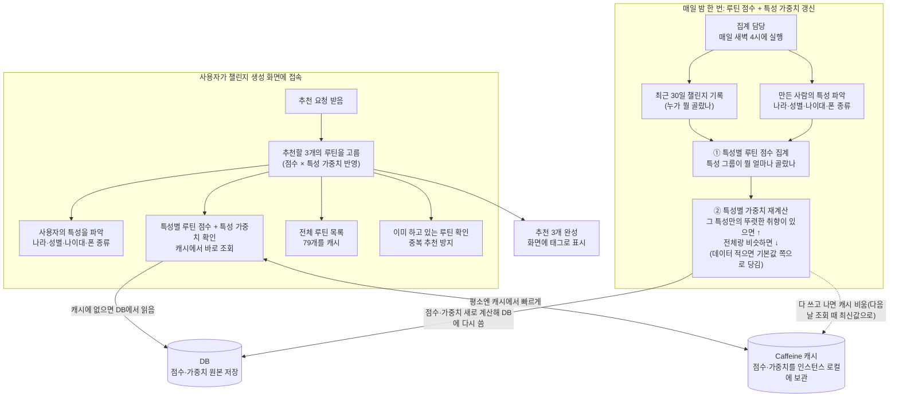
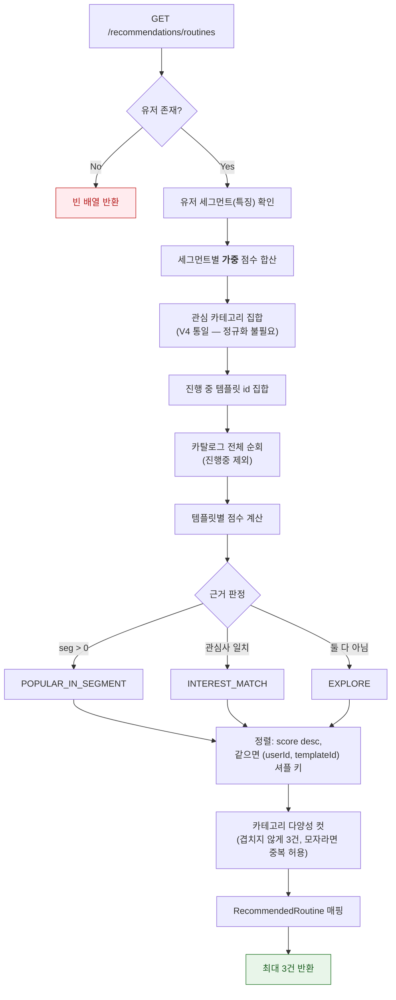
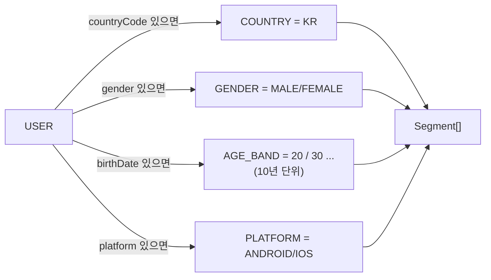
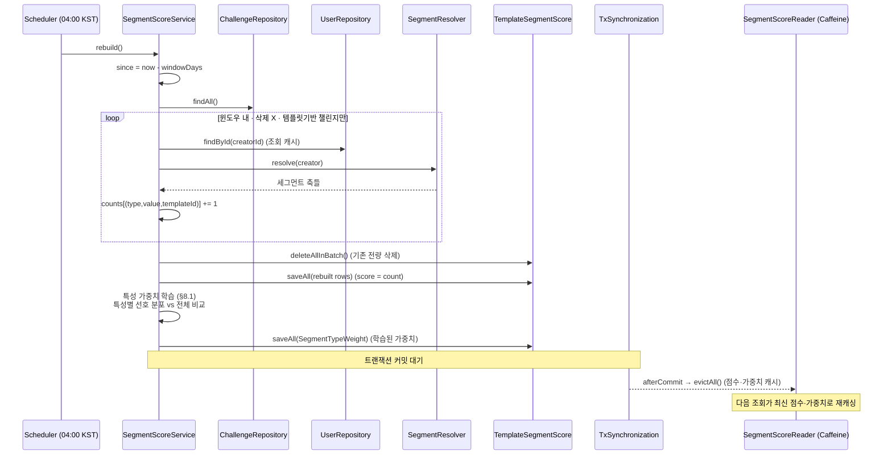
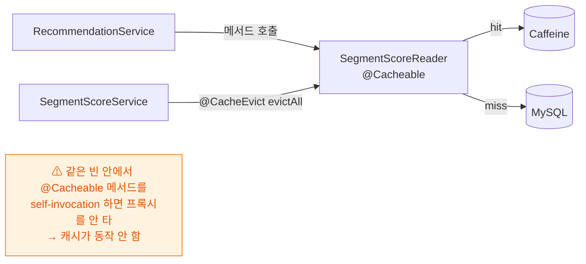
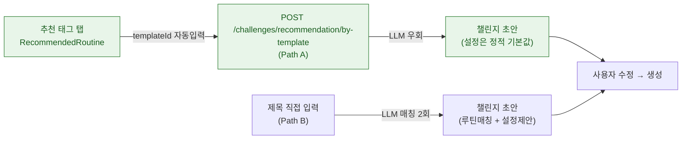

# 추천 시스템 - 루틴 카테고리 추천

상태: 이성은

## 1. 요약 (Summary)

챌린지 생성 화면에서 사용자에게 **"지금 시작하기 좋은 루틴" 3건**을 자동으로 띄운다. 탭하면 자동으로 다음 페이지로 넘어가 챌린지 초안까지 이어진다. 추천은 **LLM·임베딩 없이 rule-based**로 굴러가며, 두 개의 신호를 blending한다:

- **세그먼트 인기도** (warm-up): 나와 같은 부류(국가·성별·연령대·플랫폼)의 사람들이 최근 많이 고른 루틴. **특성마다 가중치가 붙는데, 이 가중치는 배치가 실제 선택 데이터로 매일 학습한다** — 취향을 잘 가르는 특성일수록 자동으로 가중치가 올라간다(§8.1).
- **관심사 매칭** (cold-start): 가입 때 고른 관심 카테고리와 일치하는 루틴

핵심 설계 원칙은 **"데이터가 0이어도 항상 3건이 나온다"**. 점수 테이블이 텅 비어 있어도(서비스 초기·신규 유저) 관심사 보너스와 GLOBAL 인기도로 추천이 성립한다.


## 2. 배경 (Background)

### 왜 rule-based인가

초기 추천은 "정확도"보다 빠르게 선택할 수 있는 방법을 제공하는 부가적인 요소이기 때문에 속도가 더 중요하다고 판단하였다. LLM호출 등은 속도가 너무 느리다고 판단하였고 협업 필터링/임베딩은 유저·상호작용 데이터가 쌓인 뒤의 후순위 최적화로 미룬다. (개발 속도도 고려하여 후순위로 미루었다.)

### 콜드스타트 문제

서비스 초기에는 (1) 인기도 데이터가 없고 (2) 신규 유저는 행동 이력이 없다. 이를 두 겹으로 방어한다:

- **GLOBAL 세그먼트("ALL")**: 모든 유저가 공유하는 base 축. 인구통계를 하나도 안 넣어도 '전체 인기도'로 추천된다.
- **관심사 보너스(가중 5.0)**: 인기도 점수가 전부 0이어도, 관심 카테고리와 맞는 템플릿이 위로 올라온다.

### 왜 실시간이 아니라 배치인가

챌린지 생성 때마다 점수를 즉시 갱신하면 추천 결과가 매번 흔들려 캐시 효율이 무너진다. 점수는 **매일 04:00 KST 배치**로만 바뀌고, 그 사이에는 Caffeine(JVM 로컬) 캐시에서 읽는다. 점수가 바뀌는 시점 = 캐시가 무효화되는 시점이라 thrash가 없다.

## 3. 목표 (Goals)

- 관심사 + 세그먼트 인기도를 blending해 **루틴 템플릿 3건** 추천
- 이미 **진행 중인 템플릿은 제외** (중복 추천 방지)
- 콜드스타트(데이터 0·신규 유저)에서도 빈 응답 금지
- 추천 탭 → **생성 초안으로 무손실 연결** (templateId로 LLM 우회)
- 점수 최신성은 **슬라이딩 윈도우**로 자동 반영(오래된 유행 자연 감쇠)

### 목표가 아닌 것 (Non-Goals)

| 항목 | 이유 / 시점 |
| --- | --- |
| 협업 필터링·임베딩·LLM 추천 | rule-based로 충분한 초기 규모(목표 2만). 데이터 쌓인 뒤 후순위 |
| 실시간 점수 갱신 | 배치(일 1회)로 충분. 실시간은 캐시·정합성 비용만 큼 |
| 개인화 학습(성공률·이탈 반영) | warm-up 이후 단계. 별도 테이블 없이 Challenge/Member/Result에서 파생 가능하게만 열어둠 |
| 4건 이상 노출 | 생성 화면 태그는 최대 3건 고정(`MAX_RECOMMENDATIONS`) |

## 4. 핵심 개념

| 개념 | 정의 | 예시 |
| --- | --- | --- |
| **세그먼트(Segment)** | 유저 1명을 이루는 인구통계/기기 축 하나. 채워진 것만 사용 | `COUNTRY=KR`, `GENDER=MALE`, `AGE_BAND=20`, `PLATFORM=ANDROID`, `GLOBAL=ALL` |
| **세그먼트 점수(TemplateSegmentScore)** | (세그먼트축, 값, 템플릿) → 인기 점수. 배치가 주기 재작성 | `(GENDER, MALE, 42) → 17.0` |
| **세그먼트 가중치(SegmentTypeWeight)** | 세그먼트 **축(type)마다** 곱하는 계수. **배치가 선택 데이터로 학습**(구별력 큰 축 ↑). 저장값은 축별 1개, 조회 때 곱함 | `AGE_BAND ×1.4(학습)`, `GLOBAL ×0.3(고정)` |
| **관심 카테고리(InterestCategory)** | 가입 시 유저가 고른 관심사(**12종**, 1~6개). 추천 보너스에 사용 | `EXERCISE`, `STUDY`, `WAKE_SLEEP` |
| **루틴 카탈로그(RoutineCatalog)** | **79개** 정적 템플릿(시드 id 1001~)을 메모리 캐시. 추천 후보 = 카탈로그 전체 | — |
| **warm-up vs cold-start** | warm-up = 세그먼트 인기도(집단 신호) / cold-start = 관심사·GLOBAL(개인·전체 신호) | — |

> **카테고리 코드는 한 벌이다(V4 통일).** 초안 시점에는 관심 카테고리(`WAKE_UP`)와 루틴 템플릿 카테고리(`WAKEUP`)가 갈라져 있어 정규화가 필요했지만, `V4__routine_category_interest_12.sql` 이 **12종 단일 코드**로 통일하면서 정규화 단계가 사라졌다. 지금은 문자열을 그대로 비교한다.
> 

## 5. 전체 아키텍처

추천은 **조회 경로**(빠름, 캐시)와 **집계 경로**(느림, 배치)로 분리되어 있고, 둘은 오직 `TemplateSegmentScore`·`SegmentTypeWeight` 테이블과 Caffeine 캐시로만 만난다.



**분리의 의미**: 조회는 배치가 만들어 둔 점수를 캐시에서 읽기만 하므로 DB를 거의 안 친다. 집계는 하루 한 번 전량 재계산으로 단순·정확하게 간다. 두 경로가 코드로 얽히지 않아 각각 독립적으로 튜닝된다.

## 6. 추천 점수 블렌딩 알고리즘

조회 1회에서 벌어지는 일. 카탈로그 전체(79개)를 후보로 놓고 점수를 매겨 **카테고리가 겹치지 않게** 상위 3건을 자른다(§10 다양성 제약).

$$
\operatorname{score}(t) =\underbrace{\sum_{s \in \operatorname{Seg}(u)} w\big(\operatorname{type}(s)\big) \cdot \operatorname{segScore}[s][t]}_{\text{warm-up: 특성별 가중 인기도}}+\underbrace{\begin{cases} 5.0 & t.\text{category} \in \operatorname{Interests}(u) \\ 0 & \text{otherwise} \end{cases}}_{\text{cold-start: 관심사 보너스}}
$$

```
특성별 가중치 w(type):   ← 배치가 학습(§8). 아래는 데이터가 없을 때의 기본값(prior)
  COUNTRY  1.0   지역·문화 신호
  GENDER   1.0   성별 신호
  AGE_BAND 1.2   연령대가 루틴 취향을 가장 잘 가름 → 약간 우대
  PLATFORM 0.5   기기(안드/iOS)는 취향 신호가 약함

정렬: score DESC, 동점이면 RecommendationShuffle.orderKey(userId, templateId) ASC
       (사용자별 결정적 셔플 — templateId 오름차순이 아니다. §10)
필터: 진행 중(ACTIVE) 챌린지의 템플릿 제외
컷:   카테고리 중복을 피해 3건, 못 채우면 중복 허용
```

> **가중치는 고정값이 아니라 배치가 학습한다.** "어느 특성이 취향을 잘 가르는지"를 사람이 정하지 않고, 매일 밤 배치가 실제 선택 데이터로 재계산한다(§8). 위 숫자는 **데이터가 없을 때 끌어당길 기본값(prior)**이자 콜드스타트 초기값일 뿐이다.
> 
- **설계 포인트 — 학습은 배치, 적용은 조회**
    
    가중치의 *값*은 배치가 계산해 DB에 저장하고(점수와 같은 트랜잭션), 조회는 저장된 가중치를 `w(type) × 저장점수`로 곱하기만 한다. 즉 읽기 경로는 여전히 단순 곱셈이고, 무거운 학습은 하루 한 번 배치에 몰려 있다. 점수·가중치가 같은 배치에서 함께 갱신되므로 둘의 정합이 자동으로 맞는다.
    
- **관심사 보너스와의 균형**
    
    보너스 5.0은 그대로 둔다. 강한 인기(가중 합 10~15점)를 관심사 하나(5점)가 뒤집지는 않되, 인기도가 비슷할 때 관심사 맞는 쪽을 위로 올릴 만한 크기다.
    
- **구현 변경점** — 조회 쪽은 학습된 가중치를 읽어 곱하는 한 줄:
    
    가중치는 `SegmentType` 상수 맵 또는 `@ConfigurationProperties`(`app.recommendation.segment-weights`)로 둔다. 미지정 축은 기본 1.0으로 폴백해, 설정 누락이 추천을 깨지 않게 한다.
    



**근거(reason)의 우선순위**: 세그먼트 점수가 있으면 `POPULAR_IN_SEGMENT`(집단 신호가 가장 설득력 있음) → 없으면 관심사 일치 시 `INTEREST_MATCH` → 그것도 아니면 `EXPLORE`(탐색 유도). UI는 이 값으로 "20대가 많이 해요 / 관심사 맞춤 / 새로운 도전" 같은 뱃지를 붙인다.

- **계산 예시**
    
    "아침 러닝" 루틴, 유저 = 남자·20대·한국·안드로이드, 관심사에 '운동' 포함 (가중치는 이번 배치가 학습한 값 스냅샷):
    
    ```
    저장된 인기 점수(선택 수)          가중치(학습)   기여
      (GLOBAL=ALL, 러닝)   88    ×  0.3(고정)     =  26.4
      (COUNTRY=KR, 러닝)   30    ×  1.0(학습)     =  30.0
      (GENDER=MALE, 러닝)  17    ×  1.0(학습)     =  17.0
      (AGE_BAND=20, 러닝)  12    ×  1.4(학습↑)    =  16.8
      (PLATFORM=AND, 러닝)  8    ×  0.5(학습)     =   4.0
      ────────────────────────────────────────────────
      가중 세그먼트 합                               94.2
      + 관심사 보너스('운동' 일치)                  + 5.0
      ────────────────────────────────────────────────
      최종 score(러닝)                              99.2
    ```
    
    가중치가 없던 이전 방식이라면 단순 합 155(88+30+17+12+8)에 GLOBAL(전체 인기)이 절반 이상을 차지해 개인 특성이 묻혔다. 가중치를 넣으면 GLOBAL 기여가 88→26.4로 눌린다. 여기서 AGE_BAND가 1.4로 학습된 건, 이번 윈도우에서 **20대의 선택이 전체 평균과 뚜렷이 달랐다**(구별력 높음)는 뜻이다 — 나이대가 이 서비스에서 취향을 잘 가르는 특성이라 배치가 그 축을 스스로 우대한 것.
    

## 7. 세그먼트 해석 (SegmentResolver)

유저 1명을 여러 세그먼트 축으로 펼친다. 인구통계·기기는 **선택 입력**이라, 채워진 축만 내보낸다(NULL 축은 추천에서 그냥 빠짐).



- **AGE_BAND**은 생일 → 0~120 범위 밖이면 제외.
- **COUNTRY는 유저 입력이 아니다.** 서버가 `CountryResolver`로 요청 헤더에서 해석한다: CloudFront-Viewer-Country 등 **지오 헤더 최우선 → Accept-Language 폴백 → 없으면 null**. 배치 스레드(요청 밖)에서는 null.
- **PLATFORM·성별·생일**은 가입/로그인 시(기기 정보) 또는 온보딩(`PUT /onboarding/me`)에서 수집. 안 넣으면 그냥 그 축이 빠질 뿐 추천은 동작.

## 8. 배치 재집계 (SegmentScoreService)

매일 04:00 KST, 최근 N일(기본 30일) 안에 생성된 챌린지를 **생성자 세그먼트별로 세어** 점수 테이블을 통째로 다시 쓴다.



- 설계 포인트
    - **슬라이딩 윈도우**: 전체 누적이 아니라 최근 30일만 집계. 옛 유행은 윈도우 밖으로 빠지며 자연 감쇠 → 최신성이 자동 반영된다.
    - **전량 재작성(idempotent)**: 증분이 아니라 `deleteAll + saveAll`로 현 상태를 그대로 반영. 단순·정확하며, 몇 번 돌려도 결과가 같다. (데이터가 커지면 마지막 실행 이후 챌린지만 보는 증분으로 최적화 여지.)
    - **점수 = 선택 수**: 선택 1건 = 가중 1.0. `score`와 `selectionCount`를 함께 저장(후자는 정규화·디버깅용). **여기서의 "가중"은 특성 가중치(§8.1)와 무관하다** — 이 점수는 순수 선택 수이고, 특성 가중치는 별도로 학습·저장돼 조회 시점에 곱해진다.
    - **제외 대상**: 삭제된 챌린지(`deletedAt`), 직접 입력 챌린지(`templateId == null`), 윈도우보다 이전 생성분.
    - **커밋 후에만 캐시 무효화**: `registerSynchronization(afterCommit)`으로 미커밋 데이터가 캐시에 재적재되는 레이스를 차단. **변경 시점 = 무효화 시점**. 점수와 가중치가 같은 트랜잭션에서 커밋되므로 둘이 어긋난 채 캐싱될 일이 없다.

## 8.1 특성 가중치 학습 (같은 배치에서 함께)

점수를 재집계한 **같은 배치 안에서**, "어느 특성(축)이 취향을 잘 가르는지"를 데이터로 재계산해 `SegmentTypeWeight`(5행)에 저장한다. 핵심 직관:

> **그 특성으로 나눴을 때 사람들의 선호가 전체 평균과 많이 달라지면 = 그 특성이 취향을 잘 설명한다 → 가중치 ↑.** 나눠도 전체랑 비슷하면 있으나 마나 → 가중치 ↓.
> 
- 계산 절차 (특성 축 T마다)
    1. **분포 만들기**: 전체 선택 분포 `Q(t)`(= GLOBAL 분포)와, T의 각 값 v별 선택 분포 `P_{T,v}(t)`를 만든다(선택 수를 정규화한 확률분포).
    2. **차이 재기**: 값마다 `P_{T,v}`가 `Q`와 얼마나 다른지 **Jensen-Shannon 발산(JSD, 0~1)**으로 잰 뒤, 인구수로 가중 평균 → 축 단위 구별력 `D(T) ∈ [0,1]`. (JSD는 대칭·유계·0분모 문제 없음 → KL보다 안전.)
    3. **가중치로 변환 + 안전장치**:
        - **prior 혼합(shrinkage)**: 표본이 적으면 기본값 쪽으로 끌어당긴다.
        `w(T) = α·w_data(T) + (1−α)·prior(T)`, `α = nₜ / (nₜ + K)` (K≈500 등)
        → 데이터가 적을 땐 `α→0`이라 사실상 prior. 쌓일수록 데이터가 주도.
        - `w_data(T)`는 `D(T)`를 축들 사이에서 정규화해 대략 `[0.5, 1.5]` 범위로 매핑(구별력 큰 축이 큰 값).
        - **clamp**: 최종 `w(T)`를 `[0.2, 2.0]`로 상·하한 → 한 축이 폭주하지 못하게.
        - **GLOBAL 제외**: 자기 자신과의 비교라 발산 0 → 학습하지 않고 `0.3` 고정.
- 왜 이 안전장치들이 필수인가 (피드백 루프 방어)
    
    추천이 선택에 영향을 주므로, 가중치 학습은 자칫 **자기강화(부익부)**로 흐른다. 셋으로 막는다:
    
    - **슬라이딩 윈도우(30일)**: 오래된 편향이 윈도우 밖으로 빠지며 자연 감쇠.
    - **shrinkage**: 표본이 얇을 때 데이터를 함부로 믿지 않고 prior로 회귀 → 초기 노이즈로 가중치가 튀는 걸 방지.
    - **clamp**: 어떤 경우에도 축 하나가 추천을 독점하지 못하게 상·하한.
    
    > **한계와 Phase 2**: 지금 학습은 "추천으로 유도된 선택"과 "유저가 스스로 찾은 선택"을 구분하지 않는다. 완전한 편향 제거(추천 노출 로그로 보정, 또는 검색·직접입력 선택만으로 학습)는 로그 인프라가 필요해 Phase 2로 둔다. MVP는 위 3중 안전장치로 "폭주하지 않는 수준"까지만 목표한다.
    > 
- 저장·조회
    - **`SegmentTypeWeight(segmentType PK, weight, sampleSize, updatedAt)`** — 5행짜리 초경량 테이블. 배치가 점수와 같은 트랜잭션에서 재작성.
    - 조회는 `SegmentScoreReader`와 같은 패턴의 캐시 경계(`weightReader.of(type)`)로 읽고, 없으면 prior 반환. 배치가 evict → 다음 조회가 최신 가중치로 재캐싱.

# 9. 캐시 경계 & 신뢰 경계

### 캐시 경계 — 왜 리더를 별도 빈으로 뺐나



Spring AOP 캐시는 **프록시를 통과할 때만** 걸린다. `RecommendationService`가 자기 안에서 `@Cacheable` 메서드를 호출하면(self-invocation) 프록시를 안 타 캐시가 무력화된다. 그래서 캐시 경계는 **반드시 다른 빈**(`SegmentScoreReader`)에 둔다.

- **키 단위**: `(세그먼트축, 값)` 별로 캐싱 (`GENDER:MALE`, `AGE_BAND:20` …). 같은 세그먼트를 가진 유저끼리 캐시 공유.
- **저장 형태**: 엔티티를 그대로 넣지 않고 경량 레코드 `SegmentScoreEntry(templateId, score)`로 캐싱 → detached 엔티티 캐싱 회피. 캐시는 인스턴스 로컬(Caffeine)이라 직렬화는 없지만, 나중에 원격 캐시로 옮겨도 그대로 쓸 수 있는 형태다.
- **TTL**: `segmentScores`·`segmentWeights` 모두 6시간(백스톱). 점수는 배치가 명시적으로 evict하므로 TTL은 배치 누락 시 자가치유용 보조장치일 뿐.
- **인스턴스 로컬의 대가**: evict 가 자기 인스턴스에만 닿는다. 다중 인스턴스에서는 다른 인스턴스가 최대 TTL(6시간)만큼 옛 점수를 쓸 수 있는데, 추천은 하루 한 번 바뀌는 값이라 허용한다(탐색 정렬처럼 커서가 깨지는 문제가 없다).

### 신뢰 경계 — 추천 → 생성 연결

추천 응답의 `templateId`는 다음 단계(생성)로 넘어가는 **신뢰된 앵커**다. 사용자가 추천 태그를 탭하면:



추천으로 들어온 경로(**Path A**)는 `templateId`가 이미 있으므로 LLM(루틴 매칭·설정 제안) 둘 다 우회하고 정적 기본값으로 초안을 만든다. 추천은 "LLM을 안 쓰는 빠른 길"을 생성까지 이어준다. (제목을 직접 입력하는 **Path B**만 LLM 매칭을 탄다.)

## 

# 10. 콜드스타트 대응 전략 (요약)

| 상황 | 무엇이 추천을 살리나 | reason |
| --- | --- | --- |
| 서비스 0일차 (점수 테이블 텅 빔) | 관심사 보너스(5.0) → 사용자별 셔플 순 | `INTEREST_MATCH` / `EXPLORE` |
| 신규 유저 (인구통계 미입력) | 인기도 + 관심사 보너스 | `POPULAR_IN_SEGMENT` / `INTEREST_MATCH` |
| 데이터 충분 + 인구통계 있음 | 세그먼트 인기도 합산이 주도 | `POPULAR_IN_SEGMENT` |
| 관심사도 인기도도 안 맞음 | 카탈로그에서 사용자별 셔플 순서로 채움 | `EXPLORE` |

**어떤 조합에서도 최소 3건이 나온다** — 후보가 카탈로그 전체(79개)이고, 점수 0도 정렬 대상이라 빈 응답이 구조적으로 불가능하다(진행 중 템플릿을 다 빼도 넉넉히 남는다). 단, 사용자가 없는 요청은 빈 배열이다.

### 다양성과 분산 (2026-08-11 추가)

**3건은 서로 다른 카테고리에서 뽑는다.** 점수 순서대로 훑되 이미 쓴 카테고리는 건너뛰고, 3건을 못 채우면 그때 중복을 허용한다(3건 보장이 다양성보다 우선).

> 없으면 3건이 거의 항상 한 카테고리로 몰린다. 관심사 보너스가 **평평한 가산점(+5.0)** 이라 그 카테고리 전체가 동점이 되고, 정렬에서 앞서는 한 카테고리가 세 자리를 다 먹기 때문이다. 관심사를 여러 개 골라도 마찬가지다 — 동점이라 순서가 앞서는 쪽이 독식한다. 생성 화면의 추천은 "무엇을 시작할지 고르는" 화면이라 같은 결의 루틴 3개보다 다른 결 3개가 고를 거리가 된다.

**동점은 `templateId` 가 아니라 `(userId, templateId)` 해시로 깬다**(`RecommendationShuffle`). 무작위가 아니라 결정적이라 같은 사용자가 새로고침해도 순서가 흔들리지 않고(신뢰), 사용자마다는 다른 루틴이 뜬다(노출 분산).

> id 오름차순으로 깨면 ① 모든 사용자에게 늘 같은 3건이 나가 `EXPLORE`(탐색)라는 사유가 무의미해지고, ② 시드가 판정 모델별 id 블록으로 묶여 있어 뒤 블록(예: 수면 루틴 1601~)이 앞 블록에 영원히 가린다.

> **카탈로그의 진실은 시드 마이그레이션 하나뿐이다** (2026-08-11 추가).
> 점수 동점 시 타이브레이크가 `templateId asc` 이고, 초기에는 대부분의 후보가 점수 0이라
> **가장 작은 id 3개가 그대로 생성화면 추천 3건이 된다.** 그래서 시드 이전의 잔존 템플릿이 DB 에
> 남아 있으면 신규 시드는 화면에 뜨지도 못하고, 그 구 행이 과거 임포트 과정에서 깨졌다면
> 깨진 제목·설명이 그대로 노출된다. V9 는 id 를 1001~ 로 띄워 추가만 했으므로,
> V12 에서 그 이전 범위(`id < 1000`)를 제거해 카탈로그를 단일화했다.
> 카탈로그 조회에도 `order by id` 를 박아 추천 순서를 결정적으로 만든다.

## 11. 이외 고려 사항 (설계 선택)

"왜 이렇게 했고 무엇을 안 했는가"를 남겨 같은 논의를 반복하지 않게 한다.

- **rule-based vs LLM/임베딩**: 생성 화면 태그는 실패·지연이 허용 안 되는 UI라 LLM을 이 경로에서 배제. 협업 필터링은 상호작용 데이터가 쌓인 뒤 후순위.
- **배치 vs 실시간**: 실시간 갱신은 추천을 흔들고 캐시를 무너뜨림 → 일 1회 배치 + 슬라이딩 윈도우로 최신성 확보.
- **특성 가중치(배치 학습)**: 세그먼트 축마다 계수를 곱해 "취향 잘 가르는 특성 > 전체 인기"가 되게 함. 값은 **고정이 아니라 배치가 매일 학습**(전체 대비 구별력 = JSD 기반, §8.1). 학습은 배치, 곱셈은 조회 → 읽기 경로는 단순. **피드백 루프(부익부) 위험**은 슬라이딩 윈도우 + prior shrinkage + clamp 3중으로 방어. 완전한 노출 편향 제거는 로그 인프라가 필요해 Phase 2. 가중치를 저장 점수에 미리 곱해 두는 대안은 값이 바뀔 때마다 전량 재집계가 필요하고 학습과도 안 맞아 기각.
- **전량 재작성 vs 증분**: 현 규모(목표 2만)에서는 전량이 단순·정확. 데이터가 커지면 증분으로 전환 가능하게만 열어둠.
- **`templateId` FK 없음**: 템플릿은 79개 정적 카탈로그라 DB FK 대신 앱단 검증. 점수 테이블도 FK 없이 JOIN으로만 참조하고, `challenges.template_id` 도 V6 이후 소프트 참조다.
- **복합 PK**: `TemplateSegmentScore`는 인증/챌린지의 단일 UUID PK와 달리 `(segmentType, segmentValue, templateId)` 복합 PK. 세그먼트 조회가 자연 키라 그대로 인덱스로 쓴다.
- **관심사 코드 통일(V4 완료)**: 초안은 두 벌(`WAKE_UP` vs `WAKEUP`)을 정규화로 흡수했지만, `V4__routine_category_interest_12.sql` 에서 **12종 단일 코드**로 통일해 정규화 단계를 없앴다. 근본 해결 쪽을 택한 것.
- **국가는 서버가 해석**: 유저에게 국가를 묻지 않고 지오/언어 헤더로 채움 → 입력 마찰 제거 + 오입력 방지.
- **개인화 테이블 없음**: warm-up 이후 개인화(성공률·이탈)는 별도 테이블 없이 Challenge/ChallengeMember/Result에서 파생 가능하게 스키마를 열어만 둠(Phase 2).

### Phase 2 (요약)

1. 상호작용 기반 개인화(성공률·이탈률·완주율 반영)
2. 의미 기반 후보 축소(FULLTEXT/임베딩으로 좁힌 뒤 랭킹) — 카탈로그가 커질 때
3. 증분 집계(마지막 실행 이후 챌린지만) — 데이터 규모 확대 시
4. **특성 가중치 학습의 편향 제거**(추천 노출 로그로 보정, 또는 검색·직접입력 선택만으로 학습) — 학습 로직·prior는 MVP 포함, 노출 편향 제거만 로그 인프라 확보 후