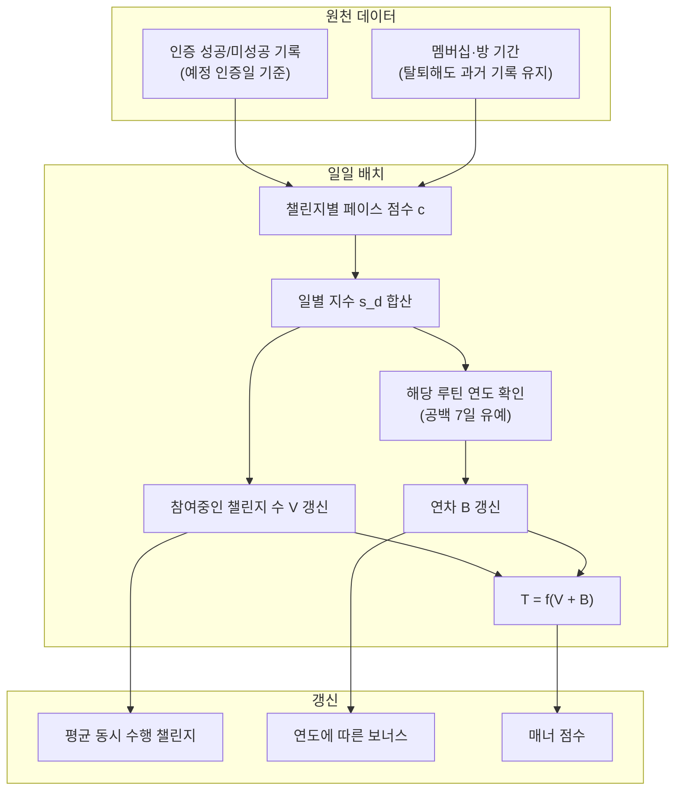
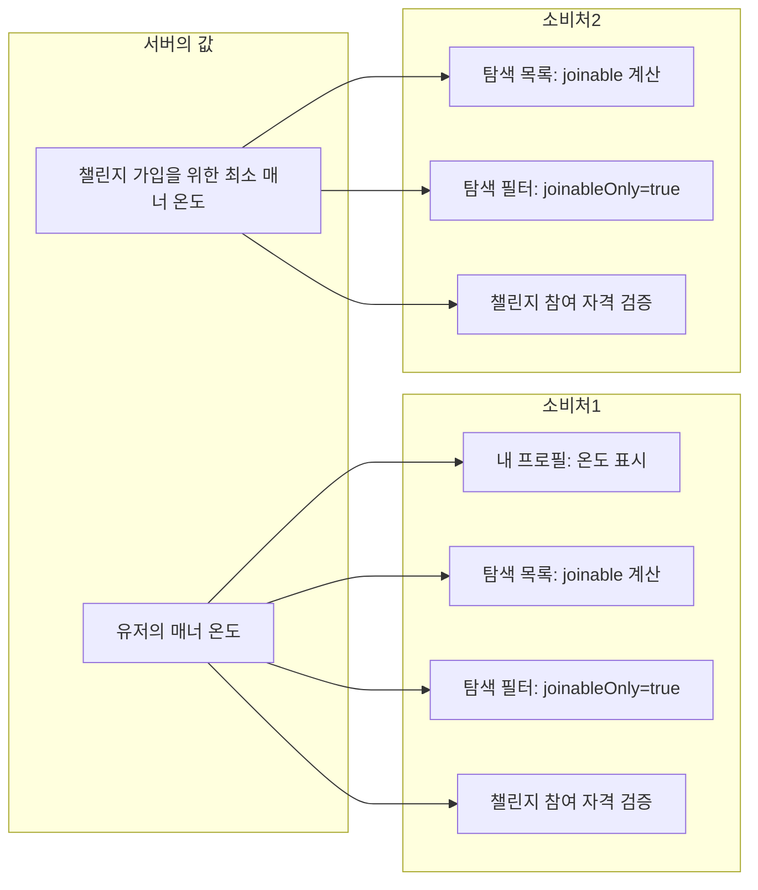

# 온도 계산 테크스펙 V1

## 요약 (Summary)

온도는 사용자의 챌린지 수행 신뢰도 점수입니다. **초기 36.5도, 도달 가능 범위 5~95** (0·100은 정의상 불가능). 핵심은 **갓생 지수 G = V + B** — V는 "지금 동시에 몇 개를 얼마나 잘 굴리는가"(볼륨, 약 1년 램프의 지수이동평균), B는 "잘 지키는 상태를 몇 년째 이어왔는가"(연차 보너스, 첫 1년 이후 +1/년 적립). 온도는 G의 밴드 매핑입니다. 이 구조에서 밴드 표의 모든 OR 등가(3개×1년 = 1개×3년 등)가 단일 규칙 **"동시 루틴 1개 추가 = 유지 1년 추가"** 로 환원되며, 상위 온도는 볼륨과 세월 중 어느 쪽으로도(또는 조합으로도) 도달할 수 있습니다.

---

## 목표 온도 밴드 (제품 요구 — 이 표가 스펙의 기준점)

| 온도 | 의미 |
| --- | --- |
| 0 | **불가능** (하한 5) |
| 5~10 | 사실상 참여만 걸어두고 인증은 안 하는 수준 |
| 10~20 | 1~2번만 인증하고 거의 인증 안 함 |
| 20~30 | 매우 못 지키는 편 — 노력도 안 하는 것 같음 |
| 30~35 | 노력은 하지만 잘 못 지키는 편 |
| **36.5** | **최초 진입값** |
| 36.5~40 | 잘 지킨다곤 못 해도 못 지키는 것도 아닌, 노력하는 사람 |
| 40~50 | 루틴을 적당히 지키는 편 |
| 50~60 | **1개** 정도의 루틴을 **1년 이상** 잘 지키는 편 |
| 60~70 | **2개** 정도를 **1년 이상** |
| 70~75 | **3개**를 **1년 이상** or **1개**를 **3년 이상** |
| 75~80 | **4개**를 **1년 이상** or **2개**를 **3년 이상** |
| 80~85 | **5개**를 **1년 이상** or **1개**를 **5년 이상** or **3개**를 **3년 이상** |
| 85~90 | **3개 이상**을 **5년 이상** |
| 90~9 | 루틴에 미친 사람 |
| 95+ | **불가능** (상한 95) |

### 표에 내재된 등가 규칙 (스펙의 핵심 발견)

위 표의 모든 OR 등가는 아래 식으로 정확히 환원된다 (m = 동시 루틴 수, y = 유지 연수):

$$
G = m + (y - 1)
$$

| 등가 그룹 | G 검산 |
| --- | --- |
| 3개×1년 = 1개×3년 | 3 + 0 = 1 + 2 = 3 ✓ |
| 4개×1년 = 2개×3년 | 4 + 0 = 2 + 2 = 4 ✓ |
| 5개×1년 = 1개×5년 = 3개×3년 | 5 + 0 = 1 + 4 = 3 + 2 = 5 ✓ |
| 3개×5년 | 3 + 4 = 7 (85~90 단독 최상위) ✓ |

**"동시 루틴 1개 추가 = 유지 1년 추가"** — 사용자 안내 문구로 그대로 쓸 수 있는 규칙이며, 아래 동역학은 이 규칙이 자연히 성립하도록 설계된다.

---

# 계획

## 1. 갓생 지수 G = V + B

### 1.1 방별 페이스 점수 c

방의 최근 성공률 r (예정 인증일 기준):

$$
r_i = \frac{\text{성공한 예정 인증일 수}}{\text{경과한 예정 인증일 수}}
$$

페이스 점수 (피벗 0.75, 구간 −1 ~ +1):

$$
c_i = \operatorname{clamp}\left(\frac{r_i - 0.75}{0.25},\ -1,\ +1\right)
$$

| r | c | 해석 |
| --- | --- | --- |
| 1.00 | +1 | 완벽 |
| 0.90 | +0.6 | 완주 커트라인("잘 지키는" 하한) |
| 0.85 | +0.4 | 적당히 지킴 |
| 0.78 | +0.12 | 노력하는 편 |
| 0.75 | 0 | 중립 피벗 |
| 0.60 | −0.6 | 노력하나 잘 못 지킴 |
| ≤ 0.50 | −1 | 방치/실패 |

판정 유예(예정 인증일 3일 경과 후 반영), 탈퇴 회피 차단(과거 기록 유지), 예정 인증일 = repeatDays 기준 — 유지

일별 지수 = 그날 활성인 방들의 페이스 합:

$$
s_d = \sum_{i \in \text{active}(d)} c_i(d)
$$

### 1.2 볼륨 항 V — "지금 몇 개를 얼마나 잘"

매일 1회 지수이동평균으로 갱신 (학습률 η_V = 1/150, 시간상수 150일, 튜닝 대상):

$$
V \leftarrow V + \eta_V \cdot (s_d - V)
$$

- m개 완벽 지속 시 V → m으로 수렴: 3개월 0.45m, 6개월 0.70m, **1년 0.91m**(사실상 도달), 2년 0.99m.
- 중단 시 같은 속도로 0으로 감쇠 — 현재 수준에 비례해 조금씩 하락.
- 실패 페이스 방은 s_d가 음수 → V가 음수로 — 하위 밴드는 V가 담당.

### 1.3 연차 보너스 B — "몇 년째 잘 지키는가"

- **적립 자격일**: s_d ≥ 0.6인 날 (= 최소 1개 루틴을 완주 커트라인 페이스 r ≥ 0.9로 유지). 루틴 전환 공백 **7일 이내**는 자격 연속으로 간주.
- **적립**: 자격 상태 **누적 1년 경과 후부터** 자격일마다 +1/365. 즉:

$$
B = \operatorname{clamp}(\text{자격 연수} - 1,\ 0,\ 6)
$$

- **감소**: 비자격일마다 −2/365 (6개월 방치 = 연차 1년 상실. 튜닝 대상). 하한 0.
- B는 **볼륨과 무관하게 +1/년** — 등가 표에서 도출된 성질(연차가 볼륨에 비례하면 3개×3년이 G = 9가 되어 표와 모순). 몇 개를 하든 "잘 지키는 세월"의 가치는 동일.

### 1.4 시간 곡선 검증

**루틴 1개 완벽 지속:**

| 경과 | V | B | G | T | 밴드 |
| --- | --- | --- | --- | --- | --- |
| 3개월 | 0.45 | 0 | 0.45 | 42.6 | 적당히 |
| 6개월 | 0.70 | 0 | 0.70 | 45.9 | 적당히 |
| 1년 | 0.91 | 0 | 0.91 | 48.8 | 적당히(상단) |
| **~1년 2개월** | 0.94 | 0.15 | **1.0+** | **50 진입** | **1개 1년 이상 ✓** |
| 2년 | 0.99 | 1 | 2.0 | 59.9 | 1개 밴드 상단 |
| 3년 | 1.00 | 2 | 3.0 | 70.0 | 1개 3년 ✓ |
| 5년 | 1.00 | 4 | 5.0 | 80.0 | 1개 5년 ✓ |

**루틴 4개 동시 완벽:** 1년에 V = 3.65 → 73.3도, 1년 2개월에 G = 4.0 → 75 진입("4개 1년 이상" ✓), 3년에 G = 6 → 85.

**중단(60도, G = 2에서 활동 0):** 3개월 후 V = 0.55, B = 0.5 → G = 1.05 → 50.5도. 6개월 후 → 45.0, 1년 후 → 40.0 — 현재 온도 대비 점진 하락 ✓, 최종 36.5 회귀.

**"적당히" 사용자(r = 0.85, c = 0.4):** V → 0.4, 자격 미달(s_d < 0.6)이라 B = 0 영구 → **G 상한 0.4 → 45.9도에서 정지**. 연차 보너스는 "잘 지키는" 사람 전용 — 40~50 밴드가 그들의 천장이 되는 게 표의 의도와 일치.

## 2. 밴드 매핑 T = f(G)

$$
f(G) = \begin{cases} \max(36.5 + 9G,\ 5) & G < 0 \ 36.5 + 13.5G & 0 \le G < 1 \ 50 + 10(G-1) & 1 \le G < 2 \ 60 + 10(G-2) & 2 \le G < 3 \ 70 + 5(G-3) & 3 \le G < 5 \ 80 + 5(G-5) & 5 \le G < 6 \ 85 + 2.5(G-6) & 6 \le G < 8 \ \min(90 + 1.5(G-8),\ 93) & G \ge 8 \end{cases}
$$

앵커(모든 경계 연속): f(0) = 36.5, f(1) = 50, f(2) = 60, f(3) = 70, f(4) = 75, f(5) = 80, f(6) = 85, f(7) = 87.5, f(8) = 90, 상한 93, 하한 5.

**밴드 재현 검증:**

| 프로필 | G | T | 목표 밴드 |
| --- | --- | --- | --- |
| 신규 / 장기 무활동 | 0 | 36.5 | 36.5 ✓ |
| 노력형(r = 0.78) | +0.12 | 38.1 | 36.5~40 ✓ |
| 적당히(r = 0.85) | +0.4 | 41.9 | 40~50 ✓ |
| 1개 × 1년+ | 1~2 | 50~60 | ✓ |
| 2개 × 1년+ | 2~3 | 60~70 | ✓ |
| 3개 × 1년 / 1개 × 3년 | 3 | 70 | 70~75 ✓ |
| 4개 × 1년 / 2개 × 3년 | 4 | 75 | 75~80 ✓ |
| 5개 × 1년 / 1개 × 5년 / 3개 × 3년 | 5 | 80 | 80~85 ✓ |
| 3개 × 5년 | 7 | 87.5 | 85~90 ✓ |
| 4개 × 5년 / 8개 × 1년 | 8+ | 90+ | 사실상 불가능 ✓ |
| 노력하나 못 지킴(r = 0.6) | −0.6 | 31.1 | 30~35 ✓ |
| 방 1개 방치 | −1 | 27.5 | 20~30 ✓ |
| 죽은 방 2개 | −2 | 18.5 | 10~20 ✓ |
| 죽은 방 3개+ | −3 | 9.5 | 5~10 ✓ |
| 하한 | ≤ −3.5 | 5 | 0 불가 ✓ |

음수 쪽도 V의 지수이동평균이라 즉시 추락하지 않는다 — 방치 3개월차 약 33도. 한 번의 실수에 관대, 습관적 방치에 엄격.

## 3. 설계 성질

- **두 개의 사다리**: 상위 온도로 가는 길이 볼륨(단기간 다수)과 세월(소수를 수년) 두 갈래 — 라이프스타일이 다른 사용자가 같은 온도 체계에서 공존한다. 등가 환율은 정확히 1루틴 = 1년.
- **연차 보너스가 곧 가속**: V는 1년이면 포화하지만 B가 그 뒤를 이어 무포화 상승 — "연속 참여 시 계속 올라간다"는 요구를 별도 가속 계수 없이 구조가 담당.
- **90+는 이중 극한**: G ≥ 8은 4개×5년 또는 8개 동시 — 어느 쪽이든 "미친 사람" 영역.
- **하락은 항상 완만**: V는 비례 감쇠, B는 정률 감소 — 급락 경로 없음. 무활동은 36.5 회귀일 뿐 감점이 아니다.
- **파밍 무효(승계)**: 짧은 챌린지 반복도 결국 매일의 s_d와 자격일을 채워야 하며, B는 세월 자체를 요구 — 시간을 압축할 편법이 없다.

## 4. 갱신 · 소비 흐름

### 내부 변화 (서버)

### 소비 (클라이언트 · 타 스펙)

## 5. 구현 규칙

- **상태 컬럼**: volume_index DECIMAL(7,4), tenure_bonus DECIMAL(6,4), qualifying_days INT(누적 자격일), last_qualifying_date DATE, manner_temperature DECIMAL(5,2), last_calculated_date DATE.
- **일일 배치**: ShedLock + last_calculated_date < today 멱등 가드. 사용자별 §4 순서로 계산.
- **누락일 보정**: 배치 누락 시 누락 일수만큼 일별 s_d를 재구성해 순차 적용(V·B 모두 하루 1스텝 원칙).
- **즉시 재계산 없음**: 하루 증분이 작아 이벤트 즉시 반영의 체감 이득 없음. 완주 순간 보상은 배지 등 별도 요소(열린 항목 #5).
- 상수(피벗 0.75, η_V, 자격 문턱 0.6, B 적립·감소율·상한 6, 매핑 기울기, 상한 93·하한 5, 유예 7일·3일)는 설정값으로 외부화 — 밴드 재조정 시 코드 변경 없이 대응.

## 6. API

- 서버 내부 로직으로 처리
- 매너 온도만 따로 조회하는 로직도 필요없을듯

---

## 7. 불변식 (Invariants)

- 온도 범위 5~935— 매핑 정의로 보장. 0·95·100 도달 불가
- 신규 사용자 36.5, 장기 무활동 시 36.5로 회귀(위에서든 아래에서든)
- f는 연속·단조 증가
- 등가 규칙: 수렴 기준 "동시 루틴 +1 = 유지 연수 +1 = 같은 온도"
- B ∈ [0, 6], B는 자격 상태(s_d ≥ 0.6)에서만 적립 — "적당히" 사용자의 천장은 50 미만
- 하락 경로에 가속 없음(V 비례 감쇠, B 정률 감소)
- 무활동은 회귀, 감점은 활성 방의 낮은 페이스에서만
- r은 예정 인증일(repeatDays) 기준
- 탈퇴는 과거 기록을 소급 삭제하지 않는다
- V·B 갱신은 사용자·일 단위 정확히 1회(멱등 가드)
- 온도는 클라이언트 입력으로 변경 불가