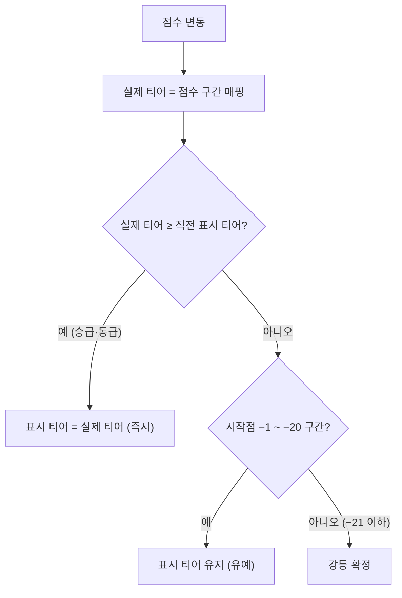
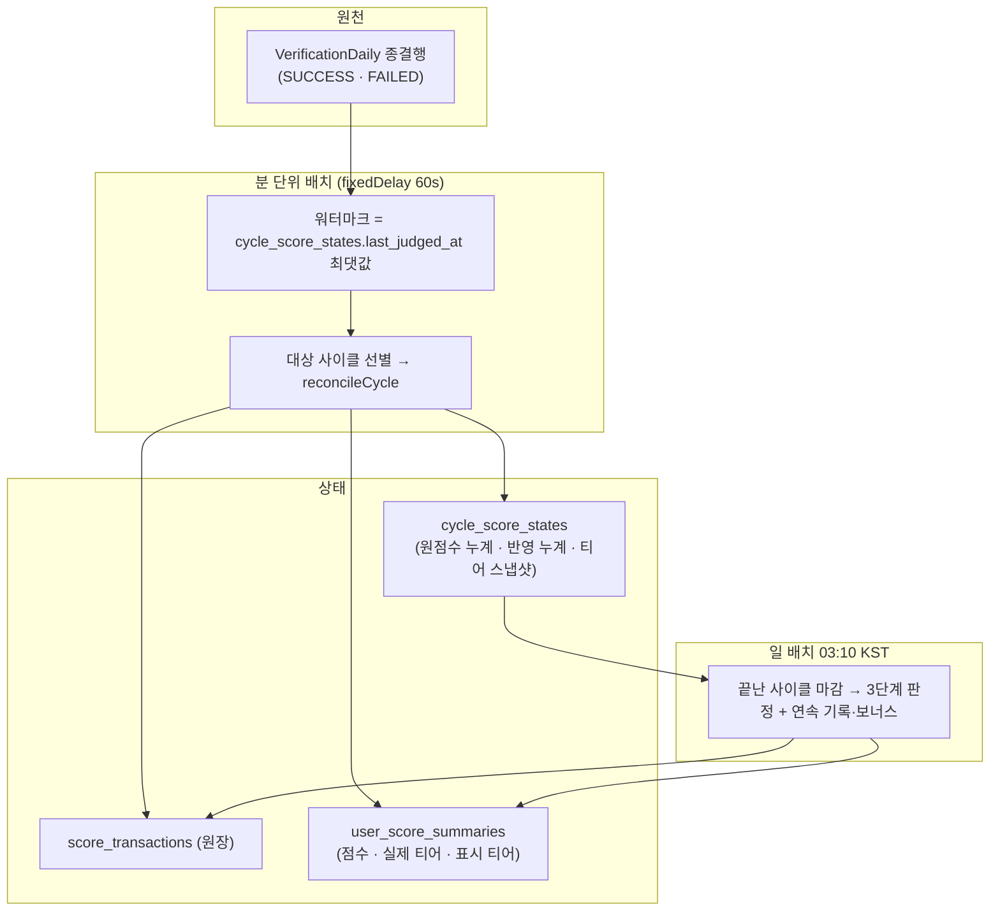
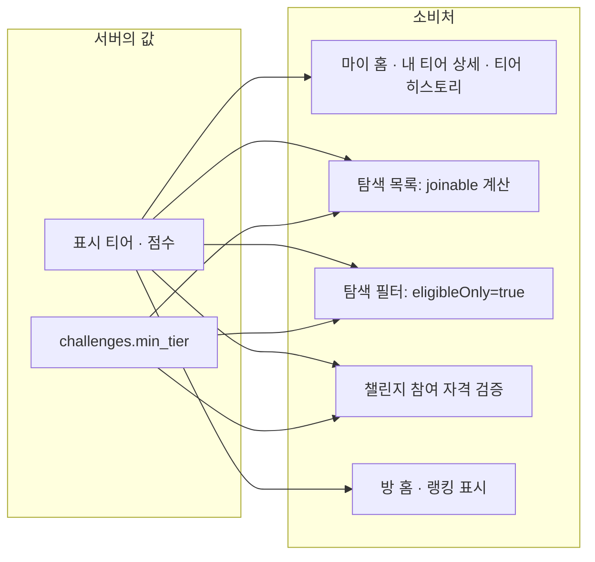

# 점수·티어 계산 테크스펙 (구 "온도 계산 V1")

> **현행 코드 기준 전면 개정.** 초안의 **매너 온도(36.5 시작 · 5~95 · 갓생 지수 G = V + B)** 모델은
> 구현되지 않았고, **점수·티어 엔진**으로 대체됐다(`V32__tier_scoring_engine.sql`, 2026-08-26 정책 개정).
> 온도의 EMA·연차 보너스·밴드 매핑은 **코드에 존재하지 않는다.** 아래는 실제로 도는 규칙이다.

## 요약 (Summary)

점수는 사용자의 챌린지 수행 신뢰도다. **가입 시 BRONZE 10점**에서 시작하고, **계정당 단일 축 0~2,000점**을 5개 티어에 매핑한다. 점수는 **주 단위 사이클(7일)** 로 정산되며, 티어가 높을수록 획득은 줄고 감점은 커진다 — 상위 티어를 유지하려면 거의 완주해야 한다.

핵심 설계는 세 가지다.

1. **단일 점수축** — 티어마다 0~99 로 끊지 않는다. 98점에서 +4 면 실버 102점이지 실버 2점이 아니다.
2. **정수 산식** — 주간 배점을 목표 횟수로 나눈 소수를 저장하지 않는다. `f(k) = ⌊(2·W·k + N) ÷ (2·N)⌋` 로 **반영 누계**를 정수로 직접 계산한다.
3. **이벤트가 아니라 재정산** — 판정 원본에서 카운트를 다시 세고 차이만 반영한다. 누락도 중복도 구조적으로 불가능하다.

---

## 1. 티어 구간과 표시 티어

| 티어 | 시작점 | 강등 확정선(시작점 −21) |
| --- | --- | --- |
| BRONZE | 0 | — (더 내려갈 곳 없음) |
| SILVER | 100 | 79 |
| GOLD | 300 | 279 |
| DIAMOND | 500 | 479 |
| RUBY | 1,000 | 979 |

- 점수 상한 **2,000**. 루비 안에서도 점수는 쌓이지만 여기서 멈춘다.
- `UNRANKED` 는 티어가 아니라 **요약 행이 아직 없는 상태**다.

### 1.1 강등에만 유예 20점

- **승급은 즉시, 강등만 유예**한다. 점수가 경계에서 진동할 때 표시 티어가 깜빡이면 **방 게이팅(입장 자격)까지 흔들리기** 때문이다.
- 큰 감점으로 유예 구간을 한 번에 관통하면 실제 티어까지 바로 내려간다. 유예는 진동을 막는 장치이지 강등을 미루는 장치가 아니다.
- **방 게이팅(`challenges.min_tier`) 판정도 표시 티어**를 쓴다.

---

## 2. 티어별 배점

| 티어 | 주간 획득 W⁺ (100% 달성) | 주간 감점 W⁻ (전량 미달) | 연속 성공 보너스 상한 |
| --- | --- | --- | --- |
| BRONZE | +10 | −4 | +5 |
| SILVER | +8 | −8 | +4 |
| GOLD | +6 | −14 | +3 |
| DIAMOND | +4 | −23 | +2 |
| RUBY | +2 | −38 | +1 |

- 손익분기 달성률이 브론즈 28.6% 에서 루비 95.0% 까지 올라간다.
- **배점 기준 티어는 사이클 시작 시점의 실제 티어로 고정**한다. 주중에 승급·강등이 나도 그 사이클의 배점·판정·보너스는 바뀌지 않는다.
- **표시 티어는 배점에 쓰지 않는다** — 유예 중인 사용자에게 과도한 불이익이 간다.

### 2.1 정수 산식

$$
f(k) = \left\lfloor \frac{2 W k + N}{2N} \right\rfloor
$$

- `W` = 해당 축의 주간 배점(양수), `N` = 주간 목표 횟수(1~7), `k` = 확정 카운트.
- `W×k÷N` 의 사사오입과 동치이면서 전부 정수 연산이다. 언어 기본 `round()` 는 은행가 반올림일 수 있고 `double` 은 재현성이 없다.
- 이번에 반영할 값은 언제나 **`f(현재 카운트) − f(직전 카운트)`** 다.
- `f(N) = W` 가 항상 성립하므로 **마감 보정이 없다** — 목표를 다 채우면 누계가 배점표와 정확히 일치한다.
- 오버플로 여유: `2·W·k` 최댓값은 루비 미달축 `2 × 38 × 7 = 532`.

### 2.2 성공 축과 미달 축

두 축은 **분리된 정수 카운트**다.

- 성공 카운트 = 사이클 안에서 확정된 `SUCCESS` 수(목표 상한).
- **미달 카운트 = `max(0, 목표 − 성공 − 남은 인증 가능일)`** — 실패 건수가 아니다. 주 5회 루틴에서 이틀 실패해도 남은 날로 만회할 수 있으면 0이다. 남은 인증 가능일은 사이클 7일 중 **아직 확정되지 않은** 날의 수다.
- **수동 인증(`VerifiedVia.MANUAL`)은 두 축 어디에도 넣지 않는다.** 성공만 빼고 인증 가능일에서는 소모된 것으로 세면 만회할 날이 줄어 미달이 확정된다 — 수동 인증이 감점으로 둔갑한다. 그래서 그 날 자체를 건너뛴다. 수동 인증 챌린지는 티어 점수가 움직이지 않고, 통계·랭킹에는 그대로 집계된다.
- 이의로 정정된 성공은 제외 대상이 아니다 — **정상 성공과 동일하게 복원**한다.

---

## 3. 사이클 판정과 연속 기록

| 판정 | 조건 | 연속 성공 | 연속 실패 |
| --- | --- | --- | --- |
| `SUCCESS` | 목표 100% 충족 | +1 | 0 |
| `PARTIAL` | 달성률 50% 초과 100% 미만 | 유지 | 0 |
| `FAILURE` | 달성률 **50% 이하** | 0 | +1 |

- 달성률 판정은 부동소수점 나눗셈을 쓰지 않는다 — `성공 × 2 > 목표` 정수 비교다. 정확히 50%는 실패다.
- **연속 성공 보너스**: 2사이클부터 붙고 사이클마다 +1 씩 오르되 티어별 천장에서 멈춘다(`min(연속−1, 천장)`). 상위 티어일수록 천장이 낮아 연속만으로 빠르게 오르지 못한다.
- **연속 실패 추가 감점**: 2사이클부터 `−min(연속−1, 3)`. **티어와 무관**하다 — 각 주의 루틴 점수에 이미 티어별 감점이 들어가 있어 여기까지 티어를 반영하면 이중으로 무거워진다.
- 사이클 실패 카운트는 방 내부 모듈의 **2사이클 경고 · 3사이클 강퇴** 입력이기도 하다. 정의는 점수 도메인이 원본이고 **집행은 저쪽**이다 — 점수 도메인은 강퇴를 직접 실행하지 않는다.

---

## 4. 사이클 순변동 한도 ±20

- **챌린지별 각 사이클**의 순변동을 ±20점으로 제한한다. 달력 주차도 계정 합산도 아니다 — 상태가 사이클 행 하나에 들어 있어 잠금과 정정 재계산이 단순하고, "어느 챌린지가 한도를 썼는지"를 설명할 수 있다.
- 여러 챌린지를 병행하면 계정 전체 하락이 한 주에 20점을 넘을 수 있다. **의도된 동작**이며 출시 후 모니터링 항목이다.
- 상승과 하락을 따로 세지 않는다. 사이클 **원점수 누계**를 클램핑한 값이 **반영 누계**이고, 각 이벤트의 반영분은 그 차분이다. 원점수 +25 → −5 면 순변동이 여전히 +20 이라 반영은 그대로고, +25 → −10 이면 +15 로 함께 내려온다.
- **반영 누계를 목표값으로 덮어쓰지 않는다.** 실제로 움직인 만큼만 전진시킨다 — 덮어쓰면 0점 계정에서 반영되지도 않은 감점이 한도를 소비하고, 이후 원점수가 회복될 때 **받은 적 없는 점수가 지급된다.**

---

## 5. 사건성 감점 (한도 밖)

| 사건 | 감점 | 비고 |
| --- | --- | --- |
| 부정행위 검출(`CHEAT_DETECTED`) | **−50** | 검출 1회로 해당 챌린지 강퇴·영구 차단 확정. 강퇴 감점 중복 부과 없음 |
| 권한 미허용 강퇴(`PERMISSION_KICK`) | **−15** | |
| 중도 탈퇴(`VOLUNTARY_LEAVE`) | **최대 −15** | `−⌈15 × (1 − 진행주간/52)⌉` — 1년(52주) 이상 진행했으면 **면제** |

- 사건성 감점은 **사이클 ±20 한도를 거치지 않고 즉시 전액 반영**하며, 연속 성공·실패 기록도 건드리지 않는다. 한도는 "한 주에 얼마나 움직일 수 있나"를 다루는 장치인데 부정행위는 주간 성과가 아니다.
- **연속 실패 강퇴에는 감점이 없다** — 각 주의 루틴 점수에 이미 실패분이 반영돼 있다. 계정 제재에 따른 자동 탈퇴 · 최소 티어 미달 자동 탈퇴 · 직권 폐쇄 · 휴면 처리 탈퇴도 감점을 만들지 않는다(중복 처벌이거나 귀책이 없다).
- 구 `KICK_REPORT`(신고 강퇴 −30)는 신고→강퇴 경로가 폐지되며 사라졌다. 신고 검토로 계정 제재를 받으면 전 챌린지에서 자동 탈퇴되지만 **감점은 없다.**

---

## 6. 저장 모델과 표기 모델

두 층은 **의도적으로 다르다.** 저장은 무엇이 일어났는지, 표기는 사용자에게 뭐라고 부를지다. 매핑은 읽는 쪽(`MeTierService`)이 한다.

| 저장(`ScoreLedgerReason`) | 표기(`ScoreReason`) |
| --- | --- |
| `DAILY_SUCCESS` · `STREAK_BONUS` | `CYCLE_SUCCESS` |
| `CONFIRMED_MISS` · `STREAK_PENALTY` | `CYCLE_FAIL` |
| `INCIDENT`(+ `IncidentType`) | `CHEAT` · `KICK_PERMISSION` · `LEAVE` |
| `REVERSAL` | `APPEAL_RESTORE` |

- `KICK_FAIL`(연속 실패 강퇴)은 **실제로 내려가지 않는다.** API 명세의 열거값이라 계약으로만 남긴다.

---

## 7. 갱신 흐름

- **왜 배치인가**: 정책은 "성공 확정 즉시 반영"을 요구하지만 성공에는 별도 도메인 이벤트가 없고 확정 경로가 여러 곳(sync 즉시 · 확정 배치 · 이의 정정)이다. 종결행을 한 곳에서 훑는 편이 누락 없이 단순하다. 다만 점수는 사용자에게 바로 보여야 하므로 일배치가 아니라 **분 단위**로 돈다.
- **워터마크는 별도 테이블이 아니다** — `cycle_score_states.last_judged_at` 의 최댓값이다. 정산 대상 자체에 "어디까지 봤나"가 적혀 있어 상태가 두 벌로 갈라지지 않는다. 경계행을 다시 훑어도 정산이 멱등이라 안전하다(중첩 5분).
- 최초 가동 시 소급 14일, 한 회차 상한 2,000건 — 밀리면 다음 회차가 이어받는다.
- **한 사용자의 실패가 배치 전체를 되돌리지 않는다.** 워터마크가 전진하지 않으므로 다음 회차가 다시 집는다.
- 마감은 사이클 7일이 끝나고 **마지막 날의 실패 확정(귀속일 + 2일)까지 지난 것만** 닫는다.

### 직렬화

같은 사용자의 점수 쓰기는 전부 `user_score_summaries` **행 잠금 뒤에서** 돈다. 그 다음 사이클 행을 잠근다. 잠금 순서를 **계정 → 사이클**로 전 경로에 고정해 교착을 피한다.

---

## 8. 소급 정정 (이의 인용)

- 이의가 인용되면 **카운트를 고쳐 같은 함수를 다시 부른다.** 역분개 원장을 따로 짜지 않는다.
- 반영 누계가 카운트만의 함수이므로 같은 이벤트를 두 번 처리해도 결과가 달라지지 않는다.
- 정정 이력은 `score_corrections` 에 남고, 원장에는 `REVERSAL` 로 기록된다.

---

## 9. 소비처

---

## 10. 불변식 (Invariants)

- 점수 ∈ [0, 2,000] — 경계에서 잘린 부분은 사이클 한도를 소비하지 않는다
- 가입 시 BRONZE 10점
- 실제 티어는 점수만의 함수. 표시 티어는 승급 시 즉시 따라가고, 강등은 시작점 −21 이하에서만 확정
- `f(N) = W` — 주간 목표를 다 채우면 누계가 배점표와 정확히 일치(마감 보정 불필요)
- 반영 누계는 카운트만의 함수 → 재정산·중복 처리에 대해 **멱등**
- 사이클 순변동 ∈ [−20, +20] (챌린지별·사이클별). 사건성 감점은 이 한도 밖
- 수동 인증 건은 성공·미달 두 축 어디에도 들어가지 않는다
- 연속 실패 강퇴·계정 제재 자동 탈퇴·최소 티어 미달 탈퇴·휴면 탈퇴는 감점 이벤트를 만들지 않는다
- 점수 쓰기 잠금 순서는 항상 계정 → 사이클
