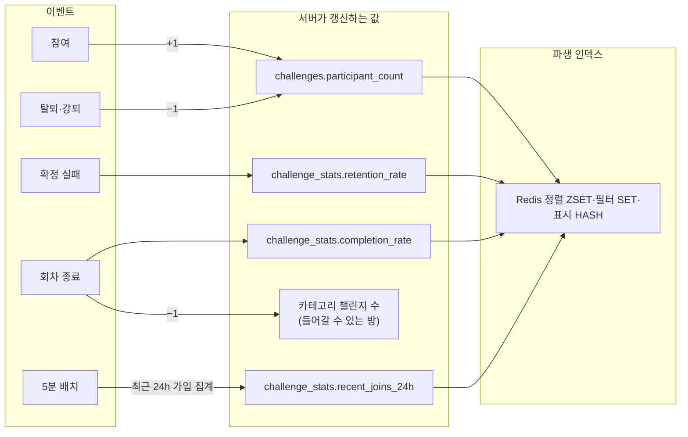
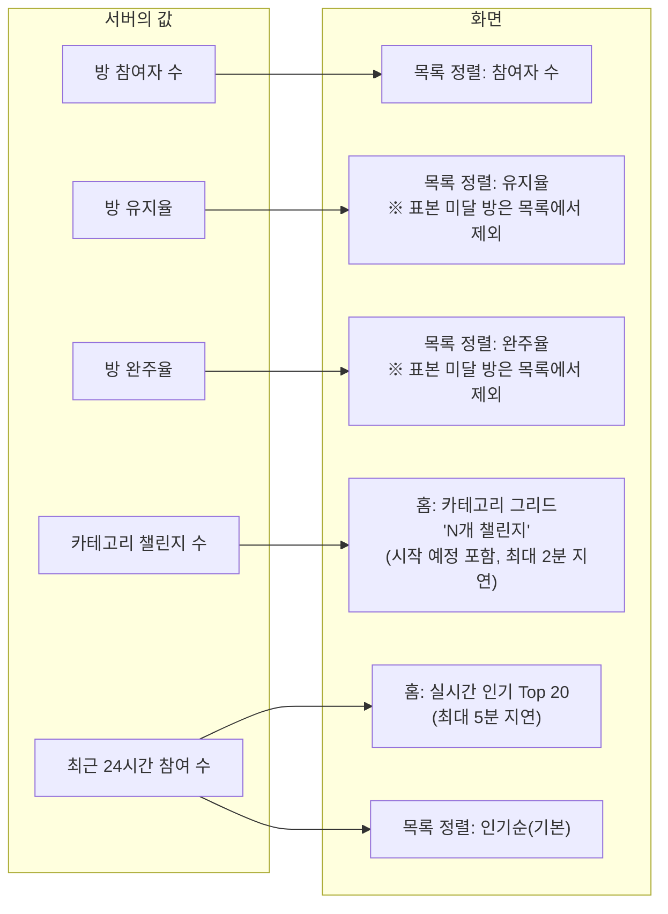

# 챌린지 탐색

마감 기한: 2026년 7월 8일 → 2026년 7월 14일
상태: 진행 중
QA 마감 기한: 2026년 7월 14일
개발 마감 기한: 2026년 7월 13일
디자인 마감 기한: 2026년 7월 8일
테크 스펙 마감 기한: 2026년 7월 9일
테크스펙 피드백 마감 기한: 2026년 7월 10일

## 요약 (Summary)

챌린지 탐색의 도메인 규칙과 API를 정의합니다. **키워드 검색은 제공하지 않으며**, 탐색은 홈(실시간 인기 + 카테고리 그리드)과 목록 화면(필터 + 정렬)의 두 화면으로 구성됩니다. 인기는 **최근 24시간 신규 참여 수**로 산정하고 필터를 적용하지 않으며 5분 배치로 갱신합니다. 목록 화면에서는 필터(카테고리 OR · 인증 방식 · 티어 자격)를 결합한 뒤 정렬 6종 중 하나를 적용합니다. 두 성공 지표는 스코프가 아니라 **표본 조건이 다릅니다** — 완주율은 판정이 충분히 쌓인 멤버 기준, 유지율은 방 전체 참여자 기준이며 둘 다 **방(챌린지) 단위**입니다. 정렬 키는 질의 시점 집계 없이 `challenge_stats` 파생 값으로 판단하고, 그 값은 배치가 원천에서 다시 계산합니다. 정상 경로의 정렬 원천은 **Redis 파생 인덱스**이고, Redis 가 없거나 죽으면 **MySQL keyset 으로 폴백**합니다.

---

## 결정 요약

- **키워드 검색 제거.** 탐색 = 인기 + 카테고리 + 필터 + 정렬
- **인기 = 최근 24시간 신규 참여 수**(`challenge_stats.recent_joins_24h`). 지수 감쇠·방 나이 가중치는 쓰지 않는다 — 동점은 마지막 참여 시각(`last_joined_at_24h`)으로 가른다
- 인기: 필터 미적용, 전체/카테고리별 산정, 5분 배치 갱신
- 신규 챌린지 노출은 목록 화면의 **최근 생성 정렬**이 담당 (인기 공식에 부스트 없음)
- **정렬 6종**: 인기순(기본) · 참여자 수 · 완주율 · 유지율(성공/실패) · 최근 생성 · 마감 기한. **템플릿 사용자 수 정렬은 두지 않는다** — 방을 고르는 화면에서 템플릿 인기는 방 선택 근거가 되지 못한다
- **완주율·유지율은 둘 다 방 단위**다(`challenge_stats`). 템플릿 누적 지표는 추천 도메인(`TemplateStats`)이 따로 가진다
- **표본 미달 방은 최하위가 아니라 목록에서 제외**한다 — "완주율 순"이라고 해 놓고 값 없는 방을 섞으면 그 약속이 깨진다
- 티어 컷 필터(`eligibleOnly`) = `min_tier ≤ 내 표시 티어` ("내가 들어갈 수 있는 것만"). 매너 온도가 아니라 **티어** 로 판단한다
- 마감 기한 정렬 = 종료일 오름차순 (종료 여유 없는 순)
- 목록·인기·그리드의 후보는 **공개(PUBLIC) + 그룹(GROUP) + (UPCOMING | ACTIVE) + 미삭제**. 솔로 방과 종료된 방은 어디에도 나오지 않는다
- **정원은 있다**(`challenges.capacity`). 정원이 찬 방도 목록에서 빼지 않고 `isFull` 로만 구분한다
- **`joined` 는 모든 방 표현(인기·목록·공개 상세)의 필수 필드.** 내가 이미 들어가 있는 방도 목록에서 빼지 않고 이 값으로만 구분한다 — 참여 버튼 노출 판단은 `joined` 하나로 한다
- 내가 차단한 방(`user_blocks.target_type = 'CHALLENGE'`)은 목록에서 제외한다
- 페이지네이션 = **커서 기반**(Base64 불투명 문자열), 보조 키 `challengeId`, `totalCount` 미제공

---

## 목표 (Goals)

- 홈에서 "지금 뜨는" 챌린지와 카테고리별 규모를 한눈에 보여준다.
- 카테고리·인증 방식·티어 자격을 조합해 목록을 좁힌다.
- 6종 정렬을 표본 조건까지 일관되게 정의한다.
- 집계 값의 정합성·신뢰도(표본 하한)를 유지한다.
- 탐색 API(홈 인기, 카테고리, 목록)를 확정한다.
- 인스턴스가 늘어도 **같은 순서**를 내려 커서 페이징이 깨지지 않게 한다.

## 목표가 아닌 것 (Non-Goals)

- **키워드 검색** (제목/설명/태그 매칭) — 디자인에 진입점 없음, Phase 1 제외
- 오타 교정·자동완성·연관 검색어·초성/형태소 검색
- 개인화 추천(ML)
- 그룹/솔로 필터 — 솔로 방은 애초에 탐색 후보가 아니다

---

## 화면

---

## 계획

## 1. 도메인 개념

| 개념 | 정의 |
| --- | --- |
| **템플릿(Template)** | 재사용 가능한 루틴 정의(`RoutineTemplate`). 여러 챌린지 인스턴스(방)의 원본 |
| **챌린지(Challenge / 방)** | 템플릿에서 파생된 실제 진행 단위. 그룹형은 다수 참여, 솔로형은 참여자 1명 |
| **정원(capacity)** | 그룹 방이 받을 수 있는 최대 인원. 가득 차도 목록에서 빼지 않고 `isFull` 로 표시한다 |
| **확정 판정** | 멤버의 하루 인증 결과가 성공/실패로 확정된 횟수(`success_days + fail_days`) |
| **완주** | 확정 판정이 10회 이상이면서 성공률이 80% 이상인 멤버 상태 |
| **확정 실패** | 남은 날을 다 성공해도 목표 달성이 불가능해진 멤버 상태 |
| **파생 통계(`challenge_stats`)** | 완주율·유지율·인기 점수를 담는 조회 전용 투영. 언제든 원천에서 다시 만들 수 있다 |

완주율과 유지율은 **둘 다 방에 붙는다**. 다른 것은 스코프가 아니라 표본 조건이다 — 완주율은 "판정이 쌓인 멤버"를, 유지율은 "방 전체 참여자"를 분모로 쓴다(§3.2).

---

## 2. 홈 화면

### 2.1 실시간 인기 (Trending)

인기 = "지금 빠르게 참여가 붙는" 챌린지

- **스코어**: `challenge_stats.recent_joins_24h` = 최근 24시간 안에 발생한 이 방의 신규 참여 수
    - 동점은 `last_joined_at_24h`(마지막 참여 시각) 내림차순으로 가른다.
    - **지수 감쇠·방 나이 보정은 쓰지 않는다.** 24시간 창 자체가 감쇠 역할을 하고, 가중치를 넣는 순간 값이 배치 시각에 의존해 폴백 경로(MySQL 컬럼)와 순서가 어긋난다.
    - 탈퇴·강퇴로 과거 참여 이벤트를 소급해 빼지 않는다 — 이미 일어난 참여는 그 시간대의 열기를 나타낸다.

**후보 자격**: 공개·그룹·`UPCOMING|ACTIVE`·미삭제 방. 정원이 찬 방도 후보에 남는다.

**필터 미적용**: 인기에는 카테고리 외의 필터(인증 방식·티어 자격)를 적용하지 않는다. 티어로 못 들어가는 방도 노출하고 `joinable` 로 잠금만 표시한다 — 사용자별 필터를 걸면 랭킹 캐시가 사용자 단위로 깨진다.

**스코프**: 전체 인기 / 카테고리별 인기 둘 다 산정. 상위 **20개**(`TOP_N`)를 내린다.

- **갱신 주기 = 5분 / 계산 방식**
    - `PopularityRefreshJob`(cron `0 */5 * * * *`, KST)이 `challenge_members.joined_at` 기준으로 최근 24시간 가입을 집계해 `challenge_stats` 를 500행 청크로 갱신한다.
    - 순위 원천은 **Redis ZSET**(`trending:*`)이고, `ExploreIndexJobs` 가 같은 5분 주기로 투영한다. Redis 가 죽으면 같은 값을 담은 MySQL 컬럼으로 폴백한다 — 이관이 아니라 **이중화**다.
    - 읽기 전용·멱등 집계이므로 ECS 다중 인스턴스에서 **ShedLock 불필요**.
    - 폴백 여부는 `trending_redis_serve_ratio`(1 미만이면 폴백 중)와 `popularity_last_success_age` 로 본다.

### 2.2 카테고리 그리드

- 카테고리별 **지금 들어갈 수 있는 방 수**를 표시한다.
- **집계 대상 = `PUBLIC` + `GROUP` + (`UPCOMING` | `ACTIVE`)** — 삭제된 방 제외.
    - **시작 예정(`UPCOMING`)을 포함한다.** 시작 전 방도 **가입할 수 있고** 인기·목록에도 이미 나오는데 그리드에서만 빠지면, 방을 만든 직후엔 어디에도 반영되지 않고 **다음 날 활성화 배치가 돌아야** 수가 오른다 — 사용자에겐 "카테고리 수가 갱신되지 않는다"로 보인다. 그리드·인기·목록의 후보 조건을 맞춘다.
    - 비공개 방은 **카운트로도 존재가 새면 안 되므로** 제외한다(존재 은닉).
    - 솔로 방과 종료(`COMPLETED`)된 방은 "들어갈 수 있는 방"이 아니므로 제외한다.
- 구현은 역정규화 컬럼이 아니라 `challenges` 의 `GROUP BY category` + Caffeine 캐시다(`challengeCategories`).
  카운터 컬럼은 증감 지점(생성·가입·탈퇴·강퇴·종료·삭제)마다 드리프트가 생기고 보정 배치가 또 필요한데,
  방 수는 만 단위라 매 갱신마다 다시 세는 편이 단순하고 정확하다.
- **갱신 시점**: 집계 대상이 실제로 바뀌는 지점에서 `ChallengeGridChanged` 이벤트로 캐시를 즉시 버린다
  (커밋 이후에 버린다 — 커밋 전에 버리면 그 틈의 조회가 옛 값을 다시 채운다).
    - 생성(공개 그룹) / `UPCOMING→ACTIVE` / `ACTIVE→COMPLETED` / 방 삭제
    - 가입·탈퇴로는 방 **수**가 변하지 않으므로 버리지 않는다(트래픽만큼 GROUP BY 가 돌게 된다).
- **캐시 TTL 1분은 백스톱**이다. Caffeine 은 인스턴스 로컬이라 evict 가 자기 인스턴스에만 닿는다 →
  다중 인스턴스에서 다른 인스턴스가 따라오는 속도가 곧 TTL 이다. 최대 지연 = 배치 주기(1분) + TTL(1분).

---

## 3. 목록 화면 ("전체 ›" 진입)

처리 순서: **① 노출 제외 → ② 필터 → ③ 정렬 → ④ 커서 페이지네이션**.

노출 제외를 가장 먼저 두는 이유는 비공개·솔로 방이 어떤 필터 조합으로도 새어 나오면 안 되기 때문이다. 후보 조건을 `WHERE` 최상단에 고정하면 뒤에 무엇이 붙어도 은닉이 깨지지 않는다.

### 3.0 노출 제외

| 제외 대상 | 조건 |
| --- | --- |
| 비공개 방 | `visibility <> 'PUBLIC'` |
| 솔로 방 | `mode <> 'GROUP'` |
| 종료·삭제된 방 | `status NOT IN ('UPCOMING','ACTIVE')` 또는 `deleted_at IS NOT NULL` |
| 내가 차단한 방 | `user_blocks(blocker_id = 나, target_type = 'CHALLENGE')` |

정원이 찬 방과 내가 이미 들어가 있는 방은 **빼지 않는다** — 각각 `isFull`, `joined` 로 구분한다.

### 3.1 필터

| 파라미터 | 대상 | 결합 | 규칙 |
| --- | --- | --- | --- |
| `categories` | `challenges.category` | 콤마 구분, **카테고리끼리 OR** | 미지정 시 전체 |
| `verifyType` | `challenges.verification_type` | AND | 동등 비교 |
| `eligibleOnly` | `challenges.min_tier` vs 내 표시 티어 | AND | `min_tier IS NULL OR min_tier ≤ 내 티어` |

티어 비교는 문자열이 아니라 **순서**(`BRONZE < SILVER < GOLD < DIAMOND < RUBY`)로 한다 — MySQL ENUM 을 문자열과 비교하면 사전순이 되어 `GOLD < SILVER` 같은 오판이 난다.

필터는 목록 화면에만 적용한다. 홈 인기 섹션에는 적용하지 않는다(§2.1).

### 3.2 정렬 (6종)

정렬은 파생 값으로만 판단한다(질의 시점 집계 없음). 한 번에 하나만 적용하고 기본은 인기순이다. 정의되지 않은 값은 400 이다.

| 정렬 키 | 1차 정렬 | 방향 | 동점 처리 |
| --- | --- | --- | --- |
| `POPULAR` (기본) | `challenge_stats.recent_joins_24h` | DESC | `last_joined_at_24h` DESC → `challenge_id` DESC |
| `PARTICIPANTS` | `challenges.participant_count` | DESC | `challenge_id` DESC |
| `COMPLETION_RATE` | `challenge_stats.completion_rate` | DESC | `challenge_id` DESC |
| `SUCCESS_FAIL_RATIO` | `challenge_stats.retention_rate` | DESC | `challenge_id` DESC |
| `RECENT` | `challenges.created_at` | DESC | `challenge_id` DESC |
| `DEADLINE` | `challenges.end_date` | ASC | `challenge_id` ASC |

#### 3.2.1 완주율 (`COMPLETION_RATE`)

- **정의**: `qualified_success_member_count / qualified_member_count`
    - 분모 = 확정 판정 **10회 이상**인 현재 멤버 수
    - 분자 = 그중 성공률 **80% 이상**인 멤버 수
- **표본 조건**: 분모 < 5 이거나 방이 `UPCOMING` 이면 `NULL`.
- `NULL` 인 방은 이 정렬에서 **목록에 나오지 않는다**(`completion_rate IS NOT NULL`).

#### 3.2.2 유지율 (`SUCCESS_FAIL_RATIO`)

- **정의**: `non_failed_member_count / participant_count` — 지금 이 방에서 확정 실패가 아닌 사람의 비율.
- **표본 조건**: 현재 멤버들의 확정 판정 합(`total_progress_count`)이 30 미만이거나 `participant_count = 0` 이거나 `UPCOMING` 이면 `NULL`.
- `NULL` 인 방은 이 정렬에서 **목록에 나오지 않는다**(`retention_rate IS NOT NULL`).

진행 초기 방은 확정 실패가 없어 값이 과대평가되므로, 판정이 충분히 쌓였을 때만 정렬에 반영한다.

#### 3.2.3 그 밖의 정렬

- `PARTICIPANTS`: 방의 현재 참여자 수. 정원과 무관하며, 가득 찬 방도 그대로 노출된다.
- `RECENT`: 방 생성 시각 내림차순. **신규 챌린지 노출은 이 정렬이 담당한다**(인기 공식에 신규 부스트 없음).
- `DEADLINE`: 종료일 오름차순 → 종료가 빠른 방이 상단.

#### 3.2.4 공통 규칙

- 동점 처리: 안정 정렬을 위해 `challengeId` 를 마지막 보조 키로 쓴다. 보조 키가 없으면 커서 페이징에서 같은 값끼리 순서가 흔들려 중복·누락이 생긴다.
- 보조 키의 방향은 1차 정렬과 **같다**(마감 임박만 ASC).
- 표본 미달 행: 최하위 배치가 아니라 **해당 정렬에서 제외**한다.
- 방향 고정: 각 정렬 키의 방향은 위 정의로 고정. 사용자에게 방향을 노출하지 않는다.

### 3.3 저장소 이중화 (Redis ↔ MySQL)

정렬 원천은 두 벌이다. **정상 경로는 Redis**, 장애·워밍업 전에는 **MySQL keyset** 이다.

| 구분 | Redis | MySQL |
| --- | --- | --- |
| 순서 | 정렬 ZSET 을 `ZRANGEBYLEX` 로 사전순 스캔 | `ORDER BY` + keyset 커서 |
| 노출 후보·카테고리·인증 방식 | 필터 SET 교차 | `WHERE` 절 |
| 차단·티어 자격 | **쓰지 않는다** | 항상 여기서 판정 |
| 최종 행 | 항상 MySQL 에서 읽는다 | 같은 쿼리 |

- 사용자별 값(차단 목록·티어)은 **보는 사람마다 다르므로** 공용 인덱스에 넣지 않는다. 넣으면 남의 화면에 새어 나간다. Redis 는 순서와 노출 후보까지만 정한다.
- 두 경로가 같은 순서를 내야 하므로 ZSET 멤버 인코딩(`SortKeyCodec`)이 `ORDER BY` 와 같은 전순서를 만들도록 맞춰 뒀다.
- **워밍업 전에는 Redis 를 쓰지 않는다**(`trending:warmed` 플래그). 반쯤 찬 인덱스로 목록을 내리면 방이 사라진 것처럼 보인다.
- 연속 실패가 임계치를 넘으면 회로차단기가 열려 30초 동안 MySQL 로만 간다(`explore_redis_circuit_open` 게이지). 커서를 든 요청이 중간에 실패하면 이어 붙일 수 없으므로 `CURSOR_INVALID` 로 첫 페이지부터 다시 받게 한다.
- Redis 경로는 차단·티어가 Redis 에서 걸러지지 않으므로 페이지가 찰 때까지 청크(100건)를 최대 10회 훑는다. 상한에 걸리면 **훑다 만 지점을 커서로 내려** 다음 요청이 이어받는다 — 모은 것만 내리고 끝내면 남은 방이 조용히 사라진다.

### 3.4 페이지네이션 (커서 기반)

- 커서 = 정렬 경로(Redis/MySQL)와 정렬 키가 함께 인코딩된 **Base64 불투명 문자열**. 경로가 바뀌면 커서의 의미가 달라지므로 경로를 먼저 정하고 그 경로의 커서만 받는다.
- 응답의 `nextCursor` 를 다음 요청 `cursor` 파라미터로 전달한다.
- 페이지 크기 **기본 10, 최대 20**. `totalCount` 는 제공하지 않는다(무한 스크롤).

---

## 4. 집계 값 유지 (이벤트 → 상태 → 화면)

#### 내부 변화 (서버)

#### 화면 변화 (클라이언트)

---

[5. API 스펙](%EC%B1%8C%EB%A6%B0%EC%A7%80%20%ED%83%90%EC%83%89/5%20API%20%EC%8A%A4%ED%8E%99%20397ad4145fb680f294b3fd81ddb176c9.csv)

---

## 6. 불변식 (Invariants)

- 탐색 후보 집합 = `{PUBLIC · GROUP · (UPCOMING|ACTIVE) · 미삭제}` — 인기·목록·그리드가 같은 집합을 본다
- `challenge.participantCount ≥ 0`, 솔로 = 1(솔로는 탐색 후보가 아니다)
- 정원이 있는 방: `participantCount ≤ capacity`, 가득 차도 목록에서 빠지지 않고 `isFull = true`
- `joined = true` ⟺ 그 방의 ACTIVE 멤버이거나 방장 ⟺ 가입 API 가 `ALREADY_JOINED` 로 막는 상태
- 완주율: `qualified_member_count ≥ 5` AND 방이 `UPCOMING` 이 아닐 때만 값 존재, `completion_rate ∈ [0,1]`
- 유지율: `total_progress_count ≥ 30` AND `participant_count > 0` AND 방이 `UPCOMING` 이 아닐 때만 값 존재, `retention_rate ∈ [0,1]`
- 완주율·유지율 정렬 결과 ∩ {해당 값이 `NULL` 인 방} = ∅
- `recent_joins_24h ≥ 0`, 최근 24시간 참여가 0이면 0
- Redis 경로와 MySQL 경로는 **같은 입력에 같은 순서**를 낸다 (`SortKeyCodec` ↔ `ORDER BY`)
- 워밍업 플래그(`trending:warmed`)가 없으면 Redis 를 읽지 않는다 — 반쯤 찬 인덱스는 목록에서 방을 지운 것처럼 보인다
- 목록/인기 결과 ∩ {종료·삭제·비공개·솔로·내가 차단한 방} = ∅

---
