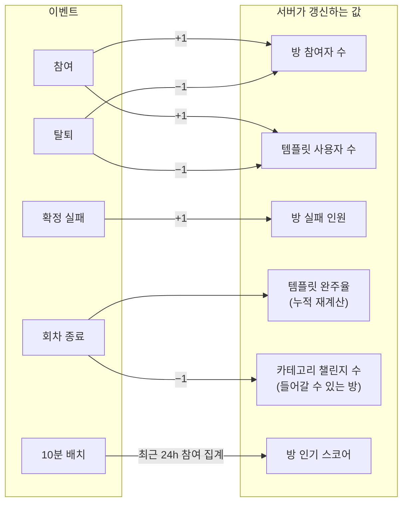
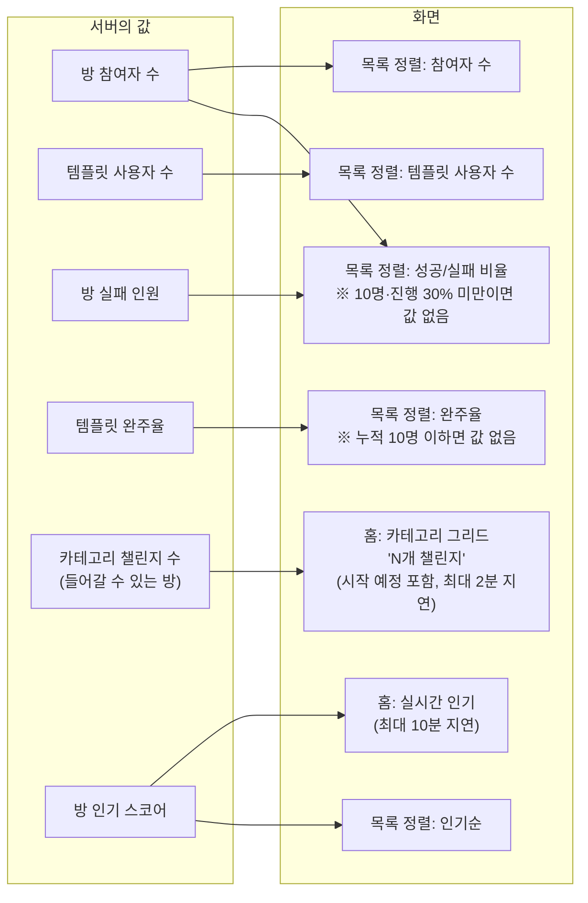

# 챌린지 탐색

마감 기한: 2026년 7월 8일 → 2026년 7월 14일
상태: 진행 중
QA 마감 기한: 2026년 7월 14일
개발 마감 기한: 2026년 7월 13일
디자인 마감 기한: 2026년 7월 8일
테크 스펙 마감 기한: 2026년 7월 9일
테크스펙 피드백 마감 기한: 2026년 7월 10일

## 요약 (Summary)

챌린지 탐색의 도메인 규칙과 API를 정의합니다. **키워드 검색은 제공하지 않으며**, 탐색은 홈(실시간 인기 + 카테고리 그리드)과 목록 화면(필터 + 정렬)의 두 화면으로 구성됩니다. 인기는 **순수 참여 속도**(최근 24시간 참여 이벤트의 지수 감쇠 합)로 산정하고 필터를 적용하지 않으며 신선도 SLA는 10분입니다. 목록 화면에서는 필터(카테고리·그룹/솔로·자동/수동 인증·매너 온도 컷)를 AND로 결합한 뒤 정렬 7종 중 하나를 적용합니다. 두 성공 지표는 스코프가 다릅니다 — **완주율은 템플릿 단위**(유형의 역대 완주 비율), **성공/실패 비율은 이 방 단위**(지금 이 방의 성공·실패 인원). 정렬 키는 질의 시점 집계 없이 역정규화 값으로 판단하고, 그 값은 참여/탈퇴/실패/종료 이벤트로 유지됩니다.

---

## 결정 요약

- **키워드 검색 제거.** 탐색 = 인기 + 카테고리 + 필터 + 정렬
- **인기 = 순수 참여 속도.** `score = Σ e^(−λ·Δt)`, 반감기 6시간, 방 나이 미반영
- 인기: 필터 미적용, 전체/카테고리별 산정, 신선도 SLA 10분
- 신규 챌린지 노출은 목록 화면의 **최근 생성 정렬**이 담당 (인기 공식에 부스트 없음)
- **정렬 7종**: 인기순 추가 (템플릿 사용자 수 · 방 참여자 수 · 완주율 · 성공/실패 비율 · 최근 생성 · 마감 기한 · **인기순**)
- 완주 = 챌린지 기간의 **90% 이상 날** 성공
- **완주율 = 템플릿 단위.** 누적 완료 참여자 10명 초과일 때만 값
- **성공/실패 비율 = 방 단위.** 방 참여자 10명 초과 AND 진행률 30% 이상일 때만 값
- 매너 온도 컷 필터 = `mannerCut ≤ 내 매너 온도` ("내가 들어갈 수 있는 것만")
- 마감 기한 정렬 = 종료 시각 오름차순 (종료 여유 없는 순)
- 솔로 = 참여자 1 고정, 정원 개념 없음
- 목록에서 종료된 챌린지(`now ≥ endAt`)만 제외
- **카테고리 그리드 = `PUBLIC` + `GROUP` + (`UPCOMING` | `ACTIVE`)** — 시작 예정 방도 가입 가능하므로 함께 센다(2026-08-11 변경)
- **`joined` 는 모든 방 표현(인기·목록·공개 상세)의 필수 필드.** 내가 이미 들어가 있는 방도 목록에서 빼지 않고 이 값으로만 구분한다 — 참여 버튼 노출 판단은 `joined` 하나로 한다
- 표본 부족 시 "아직 참여자가 적어 값을 낼 수 없어요" 안내 + 해당 정렬 최하위
- 페이지네이션 = **커서 기반**, 보조 키 `challengeId`

---

## 목표 (Goals)

- 홈에서 "지금 뜨는" 챌린지와 카테고리별 규모를 한눈에 보여준다.
- 카테고리·그룹/솔로·인증 방식·매너 온도 컷을 AND 조합으로 필터링한다.
- 7종 정렬을 스코프까지 일관되게 정의한다.
- 집계 값의 정합성·신뢰도(표본/진행률 하한)를 유지한다.
- 탐색 API(홈 인기, 카테고리, 목록)를 확정한다.

## 목표가 아닌 것 (Non-Goals)

- **키워드 검색** (제목/설명/태그 매칭) — 디자인에 진입점 없음, Phase 1 제외
- 오타 교정·자동완성·연관 검색어·초성/형태소 검색
- 개인화 추천(ML)

---

## 화면

---

## 계획

## 1. 도메인 개념

| 개념 | 정의 |
| --- | --- |
| **템플릿(Template)** | 재사용 가능한 챌린지 정의. 여러 챌린지 인스턴스(방)의 원본 |
| **챌린지(Challenge / 방)** | 템플릿에서 파생된 실제 진행 단위. 그룹형은 다수 참여, 솔로형은 참여자 1명. 정원 없음 |
| **회차** | 하나의 템플릿에서 파생되어 시작·종료된 챌린지 실행 단위(= 방) |
| **완주** | 참여자가 챌린지 기간 중 90% 이상의 날을 성공(인증)한 상태 |
| **확정 실패** | 참여 중인 방에서 남은 날을 다 성공해도 90% 날 달성이 불가능해진 상태 |
| **진행률** | `(now − startAt) / (endAt − startAt)`. 방이 기간상 얼마나 진행됐는지 |

완주율은 템플릿에, 성공/실패는 방(챌린지)에 붙는다 — 스코프가 다르므로 정렬 순서도 독립이다(§3.2).

---

## 2. 홈 화면

### 2.1 실시간 인기 (Trending)

인기 = "지금 빠르게 참여가 붙는" 챌린지

- **스코어 (Hacker News 인기순 공식 참고)**
    
    $$
    	score = Σ e^(−λ·Δt)
    $$
    
    - 합산 대상: 최근 24시간 내 발생한 이 챌린지의 각 참여(join) 이벤트
    - `Δt`: 각 참여 이벤트 이후 경과 시간 (시간 단위)
    - `λ = ln2 / H`, 반감기 `H = 6시간` (초기값, 실데이터 튜닝) → 6시간 전 참여는 방금 참여의 절반 가중치
    - **방 나이(age)는 공식에 없다.** 3주 된 방이라도 오늘 참여가 몰리면 인기에 오른다.

**후보 자격**: `now < endAt`인 챌린지. 정원이 없으므로 인원에 의한 제외는 없다.

**필터 미적용**: 인기에는 필터(카테고리 제외 — 카테고리별 인기는 별도 산정, 그룹/솔로·인증·매너 온도 컷)를 적용하지 않는다. 매너 온도 컷도 미반영이므로 사용자가 못 들어가는 챌린지가 노출될 수 있다(무방). 사용자별 필터를 걸면 랭킹 캐시가 사용자 단위로 깨지기 때문이기도 하다.

**스코프**: 전체 인기 / 카테고리별 인기 둘 다 산정.

- **신선도 SLA = 10분 / 계산 방식**
    - `@Scheduled`(10분 주기)로 `participation` 테이블에서 최근 24시간 join 레코드를 챌린지별 집계 → `trendingScore` 산출 → **Caffeine 캐시**에 랭킹 적재.
    - 읽기 전용·멱등 집계이므로 ECS 다중 인스턴스에서 **ShedLock 불필요** — 각 인스턴스가 독립적으로 계산해 자기 캐시를 채운다. (인스턴스 간 최대 10분 이내의 순위 미세 차이는 허용)
    - 별도의 실시간 카운터(`recent_joins_24h`) 유지가 필요 없어 참여/탈퇴 이벤트 핸들러가 단순해진다.
    - 목록 화면 인기순 정렬(§3.2.7)을 위해 산출된 스코어를 `challenge.trendingScore` 컬럼에도 배치 갱신한다.

### 2.2 카테고리 그리드

- 카테고리별 **지금 들어갈 수 있는 방 수**를 표시한다.
- **집계 대상 = `PUBLIC` + `GROUP` + (`UPCOMING` | `ACTIVE`)** — 삭제된 방 제외.
    - **시작 예정(`UPCOMING`)을 포함한다**(2026-08-11 변경. 이전 기준은 `ACTIVE` 만).
      시작 전 방도 **가입할 수 있고** 인기·목록에도 이미 나오는데 그리드에서만 빠지면,
      방을 만든 직후엔 어디에도 반영되지 않고 **다음 날 활성화 배치가 돌아야** 수가 오른다 —
      사용자에겐 "카테고리 수가 갱신되지 않는다"로 보인다. 그리드·인기·목록의 후보 조건을 맞춘다.
    - 비공개 방은 **카운트로도 존재가 새면 안 되므로** 제외한다(존재 은닉).
    - 솔로 방과 종료(`COMPLETED`)된 방은 "들어갈 수 있는 방"이 아니므로 제외한다.
- 구현은 역정규화 컬럼이 아니라 `challenges` 의 `GROUP BY category` + Caffeine 캐시다.
  카운터 컬럼은 증감 지점(생성·가입·탈퇴·강퇴·종료·삭제)마다 드리프트가 생기고 보정 배치가 또 필요한데,
  방 수는 만 단위라 매 갱신마다 다시 세는 편이 단순하고 정확하다.
- **갱신 시점**: 집계 대상이 실제로 바뀌는 지점에서 `ChallengeGridChanged` 이벤트로 캐시를 즉시 버린다
  (커밋 이후에 버린다 — 커밋 전에 버리면 그 틈의 조회가 옛 값을 다시 채운다).
    - 생성(공개 그룹) / `UPCOMING→ACTIVE` / `ACTIVE→COMPLETED` / 방 삭제
    - 가입·탈퇴로는 방 **수**가 변하지 않으므로 버리지 않는다(트래픽만큼 GROUP BY 가 돌게 된다).
- **캐시 TTL 1분은 백스톱**이다. Caffeine 은 인스턴스 로컬이라 evict 가 자기 인스턴스에만 닿는다 →
  다중 인스턴스에서 다른 인스턴스가 따라오는 속도가 곧 TTL 이다. 최대 지연 = 배치 주기(1분) + TTL(1분).

---

## 3. 목록 화면 ("전체 ›" 진입)

처리 순서: **① 공통 제외 → ② 필터(AND) → ③ 정렬 → ④ 커서 페이지네이션**.

### 3.0 공통 제외

종료된 챌린지(`now ≥ endAt`)만 제외한다. 정원 개념이 없으므로 인원에 의한 마감/제외는 없다.

### 3.1 필터 (AND 결합)

| 필터 | 대상 | 값 | 규칙 |
| --- | --- | --- | --- |
| 카테고리 | `template.categoryId` | 카테고리 ID | 동등 비교 (미지정 시 전체) |
| 그룹/솔로 | `challenge.participation` | `GROUP` | `SOLO` | 동등 비교 |
| 자동/수동 인증 | `challenge.verification` | `AUTO` | `MANUAL` | 동등 비교 |
| 매너 온도 컷 | `challenge.mannerCut` vs 사용자 매너 온도 | on/off | `mannerCut ≤ 사용자 매너 온도`인 챌린지만 ("내가 들어갈 수 있는 것") |

필터는 목록 화면에만 적용한다. 홈 인기 섹션에는 적용하지 않는다(§2.1).

### 3.2 정렬 (7종)

정렬은 역정규화 값으로만 판단한다(질의 시점 집계 없음). **완주율(§3.2.3)은 템플릿 단위, 성공/실패 비율(§3.2.4)은 이 방 단위**로 서로 다른 대상을 재므로 정렬 순서가 독립이다.

#### 3.2.1 템플릿 사용자 수 (`TEMPLATE_USAGE`, 내림차순)

이 템플릿에서 파생된 모든 챌린지의 현재 참여자 수 합 = `template.usageCount`. 참여 시 +1, 탈퇴 시 −1.

#### 3.2.2 챌린지 참여자 수 (`PARTICIPANTS`, 내림차순)

해당 챌린지 방의 현재 참여자 수 = `challenge.participantCount`. 솔로는 1로 고정되어 모든 솔로가 값 1로 동일하며, 보조 정렬 키(§3.2.8)로만 순서가 정해진다.

#### 3.2.3 완주율 (`COMPLETION_RATE`, 내림차순) — 템플릿 단위

- **정의**: 이 챌린지의 템플릿 기준. 템플릿의 완료된 모든 회차를 통틀어 완주자 수 / 총 참여자 수 = `template.completionRate`. "이 챌린지 종류가 역대 얼마나 완주됐나."
- **완주 기준**: 참여자가 챌린지 기간의 90% 이상 날 성공.
- **표시 조건**: 템플릿 누적 완료 참여자(`completedParticipants`) > 10일 때만 값을 낸다. 10 이하면 안내 문구 + 완주율 정렬 최하위.

#### 3.2.4 성공/실패 비율 (`SUCCESS_FAIL_RATIO`, 내림차순) — 방 단위

- **정의**: 지금 이 챌린지 방 하나의 성공 인원 : 실패 인원. "이 그룹이 지금 얼마나 잘 굴러가나."
    - 실패 = 확정 실패 인원 = `challenge.failCount`
    - 성공 = `participantCount − failCount`
    - 정렬 값 = 성공률 = `(participantCount − failCount) / participantCount` 내림차순
- **표시 조건 (둘 다 충족)**:
    1. 방 참여자 수(`participantCount`) > 10
    2. 방 진행률 ≥ 30% (기간의 30% 이상 경과, 조정 가능)
    
    하나라도 미충족이면 값을 내지 않고 안내 문구 + 성공/실패 정렬 최하위. 진행 초기 방은 확정 실패가 없어 성공률이 과대평가되므로, 표본과 진행이 충분할 때만 정렬에 반영한다. (솔로 방은 참여자 1이라 항상 값 없음)
    

#### 3.2.5 최근 생성 (`RECENT`, 내림차순)

챌린지 인스턴스 `createdAt` 내림차순. **신규 챌린지 노출은 이 정렬이 담당한다** (인기 공식에 신규 부스트 없음).

#### 3.2.6 마감 기한 (`DEADLINE`, 오름차순)

챌린지 종료 시각 `endAt` 름림차순 → 종료가 빠른(남은 기간 적은) 챌린지가 상단. 급하게 참여 결정이 필요한 챌린지를 위로 올린다(혹은 빠르게 시작할 수 있는)

#### 3.2.7 인기순 (`TRENDING`, 내림차순)

`challenge.trendingScore`(§2.1에서 10분 주기 배치 갱신) 내림차순. 홈 인기 섹션과 달리 **필터 적용 후의 인기순**이다 — "운동 카테고리에서 자동 인증만, 지금 뜨는 순으로" 같은 탐색을 지원한다. 스코어가 이미 역정규화 컬럼에 있으므로 추가 비용이 거의 없다. 최근 24시간 참여가 0인 챌린지는 스코어 0으로 동점 → 보조 키로 정렬.

#### 3.2.8 공통 규칙

- 동점 처리: 안정 정렬을 위해 `challengeId`를 보조 정렬 키로 사용.
- 값 없음(표본 부족) 행: `ORDER BY sortValue IS NULL ASC, sortValue DESC, challengeId DESC` 패턴으로 최하위 배치.
- 방향 고정: 각 정렬 키의 방향은 위 정의로 고정. 사용자에게 방향을 노출하지 않는다.

### 3.3 페이지네이션 (커서 기반)

- 커서 = `(정렬 값, challengeId)` 복합 커서. 목록 진행 중 값이 바뀌어도 중복/누락이 오프셋 방식보다 적다.
- 응답의 `nextCursor`(불투명 문자열, Base64 인코딩)를 다음 요청 `cursor` 파라미터로 전달.
- 페이지 크기 기본 5, 최대 10.

---

## 4. 집계 값 유지 (이벤트 → 상태 → 화면)

#### 내부 변화 (서버)

#### 화면 변화 (클라이언트)

---

[5. API 스펙](%EC%B1%8C%EB%A6%B0%EC%A7%80%20%ED%83%90%EC%83%89/5%20API%20%EC%8A%A4%ED%8E%99%20397ad4145fb680f294b3fd81ddb176c9.csv)

---

## 6. 불변식 (Invariants)

- `challenge.participantCount ≥ 0`(그룹, 상한 없음), 솔로 = 1
- `0 ≤ challenge.failCount ≤ challenge.participantCount`, 성공 인원 = `participantCount − failCount`
- `template.usageCount = Σ(파생 챌린지들의 participantCount)`
- 카테고리 그리드 수 = `|{PUBLIC · GROUP · (UPCOMING|ACTIVE) · 미삭제 · 해당 카테고리}|`
  (상태 변경 시 즉시 무효화, 인스턴스 간 최대 지연 = 배치 주기 1분 + 캐시 TTL 1분)
- 인기·목록·그리드의 후보 집합은 같다 — 세 화면에서 같은 방이 보이거나 함께 사라진다
- `joined = true` ⟺ 그 방의 ACTIVE 멤버이거나 방장 ⟺ 가입 API 가 `ALREADY_JOINED` 로 막는 상태
- 완주율(템플릿): `completedParticipants > 10`일 때만 값 존재, `completionRate ∈ [0,1]`
- 성공/실패 비율(방): `participantCount > 10` AND 진행률 ≥ 30%일 때만 값 존재
- 완주율(템플릿 스코프)과 성공/실패(방 스코프)는 정렬 순서가 독립
- `trendingScore ≥ 0`, 최근 24시간 참여 0이면 0
- 인기 후보 집합 = 목록 후보 집합 = {`now < endAt`인 챌린지}
- 목록/인기 결과 ∩ {종료된 챌린지} = ∅

---