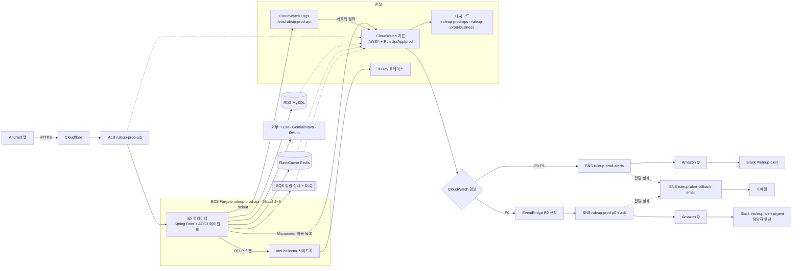

# 인프라 · 모니터링 구조

노션 「RuleUp 모니터링」의 구성을 그림으로 옮긴 것. prod 기준이고 stg 도 모양은 같다(태스크 1개, P0 긴급 채널 없음, 사용자 지표·대시보드 없이 `ruleup-stg-ops` 만).

> 트레이스는 2026-10-05 에 stg·prod 모두 켰다(`tracing/enable_tracing.py`). Application Signals 는 조직 SCP 가 막아 X-Ray 로 보낸다.
> 끄기: `python3 infra/monitoring/tracing/enable_tracing.py <env> --disable`
> 샘플링: `/api/*` 전부 · 헬스체크 0 · 그 밖(배치·지표 전송·고아 DB 쿼리) 1%. 배치 트레이스는 이름이 `LockableRunnable.run` 으로만 보인다(ShedLock 래퍼).

## 장애 확인 흐름 (노션 4절)

| 단계 | 어디서 |
|---|---|
| 1. 감지 | CloudWatch 경보 (`alerting/p0_p1.py`, `alerting/alarms.py`) |
| 2. 전달 | P0 → 긴급 채널 멘션 + 운영 채널 / P1 → 운영 채널 |
| 3. 영향 범위 | 대시보드 `ruleup-prod-ops`(서버) · `ruleup-prod-business`(사용자) |
| 4. 병목 구간 | X-Ray 트레이스(CloudWatch 콘솔 → X-Ray traces, 그룹 `ruleup-<env>-api` 를 고르면 API 만) — 서비스 `ruleup-api-<env>`, API 는 주석 `http_route`·`http_request_method`·`http_response_status_code` 로 거른다. 요청 하나의 API → DB/Redis → 외부 API 구간별 소요 |
| 5. 원인 | CloudWatch Logs `/ecs/ruleup-<env>-api`(Logs Insights·Live Tail) — 로그 줄의 `[requestId traceId]` 로 트레이스와 잇는다. traceId `abcd1234…`(32자) 는 X-Ray 에서 `1-abcd1234-…` |

대시보드 `ruleup-<env>-ops` 상단에 로그·트레이스 바로가기가 있고, 맨 아래에 최근 ERROR 로그 50줄이 있다.
